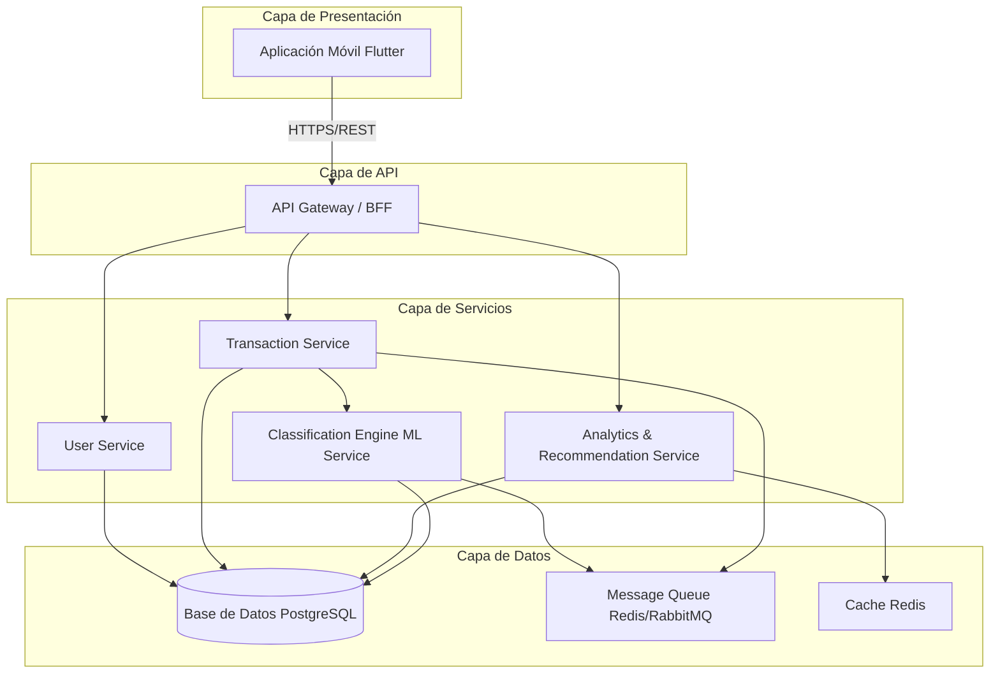
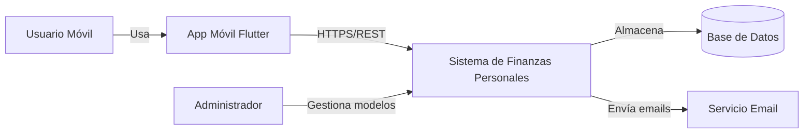
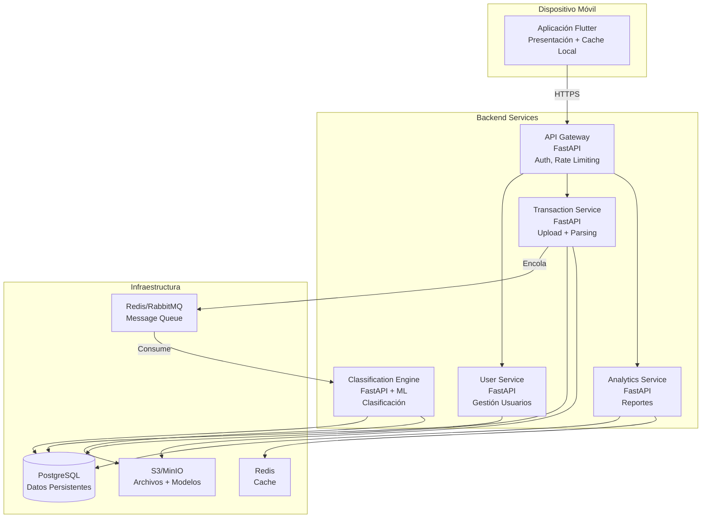
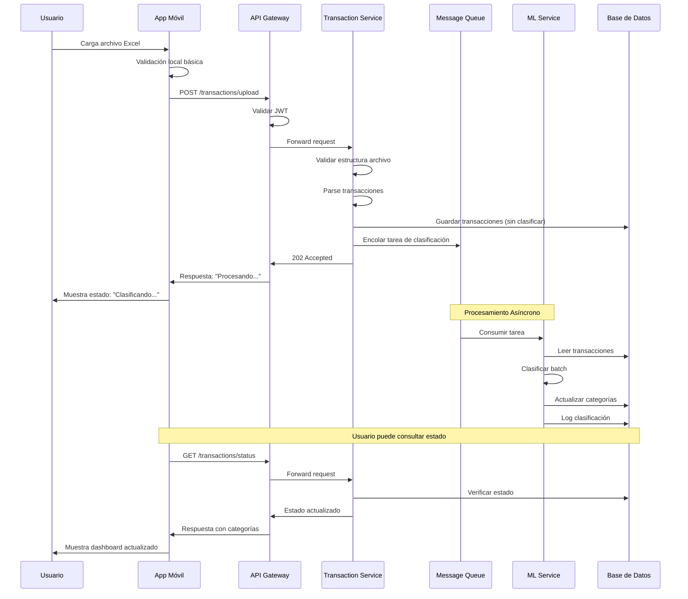

# ADD - Iteración 1: Arquitectura de Alto Nivel

## Información del Proyecto

**Nombre:** Sistema de Gestión de Finanzas Personales  
**Tipo:** Aplicación Móvil  
**Alcance:** MVP con 3 fases planificadas  
**Fecha:** Octubre 2025

---

## Paso 1: Revisar las Entradas (Inputs)

### Propósito del Sistema

Aplicación móvil de finanzas personales que clasifica automáticamente transacciones bancarias mediante Machine Learning y genera reportes y recomendaciones personalizadas basadas en patrones de gasto del usuario.

### Problema que Resuelve

Mejora la gestión de las finanzas personales minimizando las tareas manuales al momento de cargar y analizar gastos mensuales.

### Stakeholders Principales

- **Usuarios finales:** Personas con dispositivos móviles interesadas en gestionar sus gastos mensuales
- **Equipo de desarrollo:** Desarrolladores encargados de implementar y mantener el sistema

### Requisitos Funcionales por Fase

#### Fase 1: Fundamentos y Adquisición de Datos

**Objetivo:** Obtener datos de transacciones de forma segura y estructurada

- Pantalla de registro/login
- Extracción de transacciones vía cargue de archivos Excel
- Validación y almacenamiento inicial en base de datos

#### Fase 2: Clasificación de Transacciones (ML)

**Objetivo:** Categorizar las transacciones automáticamente con IA

- Modelo ML entrenado para clasificación de transacciones
- Pipeline de clasificación (FastAPI + DB)
- Etiquetado automático al almacenar transacciones
- Dashboard simple con gastos por categoría

#### Fase 3: Recomendaciones y Dashboard Final

**Objetivo:** Analizar comportamiento y brindar recomendaciones personalizadas

- Motor de recomendaciones basado en categorías e historial
- Dashboard final con:
  - Recomendaciones personalizadas
  - Balance financiero
  - Gastos categorizados y tendencias
- Ajustes visuales de interfaz Flutter

### Atributos de Calidad Prioritarios

#### 1. Seguridad (Crítico)

**Escenarios:**
- Información sensible: datos personales de usuarios, transacciones bancarias (destinatario, valor)
- Recuperación de contraseña: habilitada
- Autenticación de dos factores: No (fuera del alcance del MVP)
- Archivos Excel: solo permitir archivos con estructura concreta según banco emisor

#### 2. Performance (Alto)

**Escenarios:**
- Transacciones por usuario: hasta 1000 por mes
- Tiempo de clasificación de archivos: segundos
- Usuarios concurrentes (MVP): mínimo 50
- Carga de dashboard: delay máximo de 1 segundo

#### 3. Modificabilidad (Alto)

**Escenarios:**
- Funcionalidades futuras:
  - Integración con APIs de bancos (cuando open banking esté disponible)
  - Modificación del modelo de clasificación
  - Actualización del motor de recomendaciones
  - Soporte para múltiples formatos de archivo (PDF, CSV, respuestas de API)
- Modelo ML y motor de recomendaciones: componentes intercambiables sin afectar el resto del sistema

### Restricciones

- **Plataforma:** Aplicación móvil
- **Stack tecnológico identificado:** Flutter (frontend), FastAPI (backend), Machine Learning
- Sin restricciones adicionales de infraestructura, presupuesto o tecnología

---

## Paso 2: Establecer el Objetivo de la Iteración

**Objetivo de Iteración 1:**

Definir la arquitectura de alto nivel del sistema completo, estableciendo los estilos arquitectónicos principales y la estructura general que soporte los atributos de calidad críticos: Seguridad, Performance y Modificabilidad.

---

## Paso 3: Elegir Elementos del Sistema a Refinar

**Elemento seleccionado:** El sistema completo (vista de contexto general)

Esta primera iteración se enfoca en la arquitectura global para establecer las bases sobre las cuales se construirán iteraciones posteriores más detalladas.

---

## Paso 4: Elegir Conceptos de Diseño que Satisfagan los Drivers

### Estilo Arquitectónico Principal

**Arquitectura en Capas + Microservicios Ligeros**

**Justificación:**
- **Modificabilidad:** Permite aislar componentes intercambiables (ML, motor de recomendaciones, parsers de archivos)
- **Performance:** Facilita el procesamiento asíncrono para clasificación sin bloquear la interfaz de usuario
- **Seguridad:** Proporciona separación clara de responsabilidades y límites de confianza

### Patrones Arquitectónicos Aplicados

1. **API Gateway / Backend for Frontend (BFF):** Punto único de entrada, autenticación centralizada
2. **Strategy Pattern:** Para parsers de diferentes bancos y modelos ML intercambiables
3. **Repository Pattern:** Abstracción de acceso a datos
4. **Message Queue Pattern:** Procesamiento asíncrono de tareas pesadas
5. **Model Registry Pattern:** Versionado y gestión de modelos ML

---

## Paso 5: Instanciar Elementos Arquitectónicos y Asignar Responsabilidades

### Diagrama de Arquitectura de Alto Nivel



### Componentes Principales

#### 1. Aplicación Móvil (Flutter)

**Responsabilidades:**
- Interfaz de usuario (login, carga de archivos, dashboards)
- Gestión de estado local (Provider/Riverpod/Bloc)
- Cache local de datos (SQLite/Hive)
- Validación de formularios en cliente
- Manejo seguro de tokens JWT

**Tácticas de Atributos de Calidad:**
- **Seguridad:** Almacenamiento seguro de tokens mediante flutter_secure_storage
- **Performance:** Cache local para reducir llamadas al backend

---

#### 2. API Gateway / BFF

**Tecnología:** FastAPI (Python) o NestJS (Node.js)

**Responsabilidades:**
- Punto único de entrada desde la aplicación móvil
- Autenticación y autorización JWT
- Validación de permisos de usuario
- Rate limiting (protección contra abuso)
- Orquestación de llamadas a microservicios
- Transformación de respuestas para consumo móvil optimizado

**Tácticas de Atributos de Calidad:**
- **Seguridad:**
  - JWT con expiración corta (15 minutos) + refresh tokens
  - HTTPS obligatorio en todas las comunicaciones
  - Validación de schemas con Pydantic
- **Performance:**
  - Rate limiting por usuario
  - Compresión de respuestas (gzip)
  - Caching de respuestas frecuentes

---

#### 3. User Service

**Tecnología:** Springboot

**Responsabilidades:**
- Registro de nuevos usuarios
- Autenticación (login/logout)
- Recuperación de contraseña (email con token temporal)
- Gestión de perfil de usuario
- Hash seguro de contraseñas (bcrypt/argon2)

**Tácticas de Atributos de Calidad:**
- **Seguridad:**
  - Hash + salt de contraseñas
  - Tokens de recuperación con expiración (30 minutos)
  - Validación de formato de email
  - Protección contra enumeración de usuarios

---

#### 4. Transaction Service

**Tecnología:** FastAPI

**Responsabilidades:**
- Recepción de archivos Excel desde móvil
- Validación de estructura específica por banco (Strategy Pattern)
- Parsing de archivos (pandas/openpyxl)
- Sanitización y normalización de datos
- Almacenamiento de transacciones en base de datos
- Trigger de proceso de clasificación asíncrona

**Tácticas de Atributos de Calidad:**
- **Seguridad:**
  - Validación estricta de formato Excel
  - Límite de tamaño de archivo (5MB máximo)
  - Escaneo de macros maliciosas
  - Sanitización de datos (prevención de SQL injection)
- **Performance:**
  - Procesamiento asíncrono con cola de mensajes
  - Streaming de archivos grandes
  - Validación temprana (fail-fast)
- **Modificabilidad:**
  - Strategy Pattern para parsers de diferentes bancos
  - Interface BankFileParser con implementaciones concretas por banco

**Diseño de Parser (Strategy Pattern):**

```python
from abc import ABC, abstractmethod
from typing import List

class BankFileParser(ABC):
    @abstractmethod
    def validate_structure(self, file) -> bool:
        pass
    
    @abstractmethod
    def parse(self, file) -> List[Transaction]:
        pass

class BancolombiaParser(BankFileParser):
    def validate_structure(self, file) -> bool:
        # Validación estructura específica Bancolombia
        pass
    
    def parse(self, file) -> List[Transaction]:
        # Lógica específica Bancolombia
        pass

class DaviviendaParser(BankFileParser):
    def validate_structure(self, file) -> bool:
        # Validación estructura específica Davivienda
        pass
    
    def parse(self, file) -> List[Transaction]:
        # Lógica específica Davivienda
        pass

class ParserFactory:
    @staticmethod
    def get_parser(bank_code: str) -> BankFileParser:
        parsers = {
            'bancolombia': BancolombiaParser(),
            'davivienda': DaviviendaParser(),
        }
        return parsers.get(bank_code)
```

---

#### 5. Classification Engine (ML Service)

**Tecnología:** FastAPI + scikit-learn/TensorFlow

**Responsabilidades:**
- Servir modelo de clasificación de transacciones
- Clasificar transacciones de forma batch (consumir desde cola)
- Gestión de versionado de modelos
- Logging de predicciones para futuro reentrenamiento
- Soporte para A/B testing de modelos (futuro)

**Tácticas de Atributos de Calidad:**
- **Performance:**
  - Modelo cargado en memoria al iniciar servicio
  - Batch processing (clasificar múltiples transacciones juntas)
  - Workers asíncronos (Celery/RQ)
  - Warm-up del modelo al desplegar
- **Modificabilidad:**
  - Model Registry Pattern: modelos versionados en S3/MinIO
  - Hot-swapping de modelos sin reiniciar servicio
  - Interface ClassificationModel para intercambiar algoritmos

**Diseño de Modelo (Strategy Pattern):**

```python
from abc import ABC, abstractmethod

class ClassificationModel(ABC):
    @abstractmethod
    def load_model(self, version: str):
        pass
    
    @abstractmethod
    def predict(self, transaction_text: str) -> tuple[str, float]:
        # Retorna (categoría, confianza)
        pass
    
    @abstractmethod
    def predict_batch(self, transactions: List[str]) -> List[tuple[str, float]]:
        pass

class RandomForestClassifier(ClassificationModel):
    # Implementación actual con RandomForest
    def load_model(self, version: str):
        # Cargar desde S3/MinIO
        pass
    
    def predict(self, transaction_text: str) -> tuple[str, float]:
        # Predicción individual
        pass
    
    def predict_batch(self, transactions: List[str]) -> List[tuple[str, float]]:
        # Predicción por lote (más eficiente)
        pass

class TransformerClassifier(ClassificationModel):
    # Futuro modelo más avanzado basado en transformers
    pass

class ModelRegistry:
    def get_model(self, model_type: str, version: str) -> ClassificationModel:
        # Retorna modelo específico según tipo y versión
        pass
```

---

#### 6. Analytics & Recommendation Service

**Tecnología:** FastAPI

**Responsabilidades:**
- Agregación de datos para dashboard
- Cálculo de métricas (gastos por categoría, tendencias temporales)
- Generación de recomendaciones personalizadas
- Cache de reportes frecuentes
- Exportación de datos (futuro)

**Tácticas de Atributos de Calidad:**
- **Performance:**
  - Cache de reportes en Redis (TTL 5 minutos)
  - Pre-agregación de datos (materialized views en DB)
  - Paginación de resultados
  - Query optimization con índices apropiados
- **Modificabilidad:**
  - Strategy Pattern para motores de recomendaciones
  - Sistema de plugins para nuevos tipos de análisis
  - Separación de lógica de agregación y presentación

**Diseño de Motor de Recomendaciones (Strategy Pattern):**

```python
from abc import ABC, abstractmethod

class RecommendationEngine(ABC):
    @abstractmethod
    def generate_recommendations(self, user_id: str) -> List[Recommendation]:
        pass

class RuleBasedEngine(RecommendationEngine):
    # Implementación basada en reglas (MVP)
    def generate_recommendations(self, user_id: str) -> List[Recommendation]:
        # Reglas: "Gastas X% más en Y que promedio"
        pass

class MLBasedEngine(RecommendationEngine):
    # Futuro: recomendaciones con ML
    def generate_recommendations(self, user_id: str) -> List[Recommendation]:
        # Predicciones personalizadas
        pass
```

---

#### 7. Base de Datos

**Tecnología:** PostgreSQL

**Responsabilidades:**
- Almacenamiento persistente de datos
- Garantizar integridad referencial
- Control de concurrencia
- Respaldo y recuperación

**Esquema Preliminar:**

```sql
-- Usuarios
CREATE TABLE users (
    id UUID PRIMARY KEY DEFAULT gen_random_uuid(),
    email VARCHAR(255) UNIQUE NOT NULL,
    password_hash VARCHAR(255) NOT NULL,
    full_name VARCHAR(255),
    created_at TIMESTAMP DEFAULT CURRENT_TIMESTAMP,
    updated_at TIMESTAMP DEFAULT CURRENT_TIMESTAMP
);

-- Transacciones
CREATE TABLE transactions (
    id UUID PRIMARY KEY DEFAULT gen_random_uuid(),
    user_id UUID REFERENCES users(id) ON DELETE CASCADE,
    transaction_date DATE NOT NULL,
    amount DECIMAL(15, 2) NOT NULL,
    description TEXT,
    recipient VARCHAR(255),
    category_id INTEGER REFERENCES categories(id),
    source_file VARCHAR(255),
    bank_code VARCHAR(50),
    confidence_score DECIMAL(3, 2),
    created_at TIMESTAMP DEFAULT CURRENT_TIMESTAMP,
    INDEX idx_user_date (user_id, transaction_date),
    INDEX idx_category (category_id)
);

-- Categorías
CREATE TABLE categories (
    id SERIAL PRIMARY KEY,
    name VARCHAR(100) NOT NULL,
    parent_id INTEGER REFERENCES categories(id),
    color VARCHAR(7),
    icon VARCHAR(50)
);

-- Logs de clasificación (para auditoría y reentrenamiento)
CREATE TABLE classification_logs (
    id UUID PRIMARY KEY DEFAULT gen_random_uuid(),
    transaction_id UUID REFERENCES transactions(id),
    model_version VARCHAR(50),
    predicted_category INTEGER,
    confidence DECIMAL(3, 2),
    processing_time_ms INTEGER,
    timestamp TIMESTAMP DEFAULT CURRENT_TIMESTAMP
);

-- Tokens de recuperación de contraseña
CREATE TABLE password_reset_tokens (
    id UUID PRIMARY KEY DEFAULT gen_random_uuid(),
    user_id UUID REFERENCES users(id) ON DELETE CASCADE,
    token VARCHAR(255) UNIQUE NOT NULL,
    expires_at TIMESTAMP NOT NULL,
    used BOOLEAN DEFAULT FALSE,
    created_at TIMESTAMP DEFAULT CURRENT_TIMESTAMP
);
```

**Tácticas de Atributos de Calidad:**
- **Seguridad:**
  - Encriptación en reposo (PostgreSQL Transparent Data Encryption)
  - Conexiones SSL obligatorias
  - Row-level security: usuarios solo ven sus propios datos
  - Auditoría de accesos
- **Performance:**
  - Índices en user_id, transaction_date, category
  - Particionado por fecha para transacciones antiguas
  - Materialized views para reportes frecuentes
  - Connection pooling

---

#### 8. Message Queue

**Tecnología:** Redis (con RQ) o RabbitMQ

**Responsabilidades:**
- Cola de tareas de clasificación de transacciones
- Desacoplamiento entre carga de archivo y clasificación
- Gestión de reintentos en caso de fallo
- Dead letter queue para errores persistentes

**Tácticas de Atributos de Calidad:**
- **Performance:**
  - Procesamiento asíncrono (no bloquear API durante clasificación)
  - Retry con backoff exponencial
  - Priorización de tareas
- **Modificabilidad:**
  - Desacoplamiento entre productores y consumidores
  - Fácil escalamiento horizontal de workers

---

## Paso 6: Bosquejar Vistas y Registrar Decisiones de Diseño

### Vista de Contexto



### Vista de Contenedores (C4)



### Flujo de Procesamiento de Transacciones



### Decisiones Arquitectónicas Clave

| ID | Decisión | Justificación | Alternativas Consideradas | Atributos de Calidad Impactados |
|----|----------|---------------|---------------------------|----------------------------------|
| AD-001 | Arquitectura de microservicios ligeros | Permite aislar componentes ML y parsers como módulos intercambiables. Facilita escalamiento independiente. | Monolito modular (descartado por dificultad de intercambiar componentes ML) | Modificabilidad, Escalabilidad |
| AD-002 | Procesamiento asíncrono con colas de mensajes | Clasificar 1000 transacciones puede tomar varios segundos. No se puede bloquear la API. | Procesamiento síncrono (descartado por timeout), webhooks (más complejo) | Performance, Usabilidad |
| AD-003 | Strategy Pattern para parsers de bancos | Cada banco tiene formato Excel diferente. Necesitamos agregar bancos fácilmente. | If/else gigante (no escalable), configuración JSON (menos flexible) | Modificabilidad, Mantenibilidad |
| AD-004 | JWT con refresh tokens | Balance entre seguridad (tokens cortos) y UX (no re-login constante). | Sesiones en servidor (no escalable), OAuth2 (overkill para MVP) | Seguridad, Usabilidad |
| AD-005 | Cache en múltiples niveles | Dashboard debe cargar en <1 segundo con miles de transacciones. | Solo cache de DB (insuficiente), sin cache (muy lento) | Performance |
| AD-006 | Model Registry Pattern con versionado | Modelos ML mejoran con el tiempo. Necesitamos cambiarlos sin downtime. | Modelos hardcodeados (no evolucionan), deploy completo por cambio (disruptivo) | Modificabilidad, Disponibilidad |
| AD-007 | PostgreSQL con row-level security | Datos financieros sensibles. Usuarios solo deben ver sus datos. | NoSQL (menos garantías ACID), confianza solo en capa aplicación (riesgoso) | Seguridad |
| AD-008 | Validación estricta de estructura Excel | Prevenir archivos malformados o maliciosos. | Confianza en usuario (inseguro), sanitización básica (insuficiente) | Seguridad, Confiabilidad |
| AD-009 | FastAPI para todos los servicios | Consistencia tecnológica. Excelente soporte async. Documentación automática (OpenAPI). | Mix de tecnologías (más complejidad operativa), Node.js (menos maduro para ML) | Mantenibilidad, Productividad |
| AD-010 | Flutter para app móvil | Única codebase para iOS y Android. Performance nativo. | Nativo puro (doble esfuerzo), React Native (rendimiento inferior) | Costo, Performance |

### Trade-offs Identificados

| Trade-off | Decisión Tomada | Consecuencia |
|-----------|-----------------|--------------|
| Complejidad arquitectónica vs Modificabilidad | Microservicios ligeros | Mayor complejidad operativa inicial, pero más fácil evolucionar componentes |
| Consistencia eventual vs Performance | Procesamiento asíncrono | Usuario ve transacciones sin clasificar brevemente, pero no hay timeouts |
| Seguridad vs Usabilidad | JWT corto + refresh token | Usuario raramente necesita re-login, pero más lógica de manejo de tokens |
| Costo de infraestructura vs Performance | Cache en múltiples niveles | Mayor costo en Redis/memoria, pero mejor experiencia de usuario |
| Generalidad vs Simplicidad | Strategy Pattern para parsers | Más código boilerplate, pero fácil agregar bancos nuevos |

---

## Paso 7: Analizar el Diseño Actual y Revisar el Objetivo de la Iteración

### Evaluación de Atributos de Calidad

#### Seguridad

**Cumplimiento:**
- JWT con expiración corta para autenticación
- HTTPS obligatorio en todas las comunicaciones
- Hash + salt de contraseñas con bcrypt/argon2
- Validación estricta de estructura de archivos Excel
- Row-level security en base de datos
- Sanitización de datos de entrada
- Tokens de recuperación con expiración temporal

**Riesgos Residuales:**
- Autenticación de dos factores no incluida (fuera de alcance MVP)
- Encriptación end-to-end no implementada
- Auditoría de accesos a implementar en fases posteriores

**Métricas de Éxito:**
- 0 vulnerabilidades críticas en auditoría de seguridad
- 100% de comunicaciones sobre HTTPS
- Tiempo máximo de validez de JWT: 15 minutos

---

#### Performance

**Cumplimiento:**
- Procesamiento asíncrono para clasificación de transacciones
- Batch processing en ML Service (clasificar múltiples transacciones juntas)
- Cache en tres niveles: app móvil, Redis, materialized views DB
- Índices optimizados en queries frecuentes
- Connection pooling en base de datos
- Compresión de respuestas HTTP
- Paginación de resultados

**Riesgos Residuales:**
- Escalamiento horizontal no definido (asumir servidor único en MVP)
- Monitoreo de performance a implementar

**Métricas de Éxito:**
- Tiempo de clasificación: <5 segundos para 1000 transacciones
- Carga de dashboard: <1 segundo
- Soporte para 50 usuarios concurrentes sin degradación
- API response time p95: <200ms

---

#### Modificabilidad

**Cumplimiento:**
- Strategy Pattern para parsers de bancos (agregar nuevos bancos)
- Strategy Pattern para modelos ML (intercambiar algoritmos)
- Strategy Pattern para motores de recomendaciones
- Model Registry Pattern (versionar y cambiar modelos sin deploy)
- Arquitectura de microservicios (cambios aislados por servicio)
- Interfaces claramente definidas entre componentes
- Separación de responsabilidades

**Riesgos Residuales:**
- Contratos de API no versionados aún
- Testing de integración entre servicios a definir

**Métricas de Éxito:**
- Agregar nuevo parser de banco: <4 horas de desarrollo
- Cambiar modelo ML: <30 minutos (sin rebuild completo)
- Agregar nuevo tipo de análisis: <8 horas de desarrollo
- Cobertura de tests unitarios: >80%

---

### Cobertura de Requisitos Funcionales

#### Fase 1: Fundamentos y Adquisición de Datos

- **Registro/Login:** Cubierto por User Service
- **Cargue de archivos Excel:** Cubierto por Transaction Service con Strategy Pattern
- **Validación y almacenamiento:** Cubierto por Transaction Service + PostgreSQL

**Estado:** Arquitectura completa para Fase 1

---

#### Fase 2: Clasificación de Transacciones

- **Modelo ML:** Cubierto por Classification Engine con Model Registry
- **Pipeline de clasificación:** Cubierto por Message Queue + ML Service
- **Etiquetado automático:** Cubierto por flujo asíncrono
- **Dashboard básico:** Cubierto por Analytics Service

**Estado:** Arquitectura completa para Fase 2

---

#### Fase 3: Recomendaciones y Dashboard Final

- **Motor de recomendaciones:** Cubierto por Analytics Service con Strategy Pattern
- **Dashboard completo:** Cubierto por Analytics Service + Cache
- **Balance financiero:** Cubierto por agregaciones en Analytics Service

**Estado:** Arquitectura completa para Fase 3

---

### Riesgos Arquitectónicos Identificados

| ID | Riesgo | Probabilidad | Impacto | Mitigación Propuesta |
|----|--------|--------------|---------|----------------------|
| R-001 | Cuellos de botella en clasificación ML con carga alta | Media | Alto | Implementar auto-scaling de workers ML, monitoreo de cola |
| R-002 | Cambios en formato Excel de bancos rompen parsers | Alta | Medio | Tests automatizados con archivos reales, versionado de parsers |
| R-003 | Base de datos única es punto único de fallo | Media | Alto | Implementar réplicas de lectura, backups automáticos |
| R-004 | Modelo ML degrada en precisión con el tiempo | Alta | Medio | Pipeline de reentrenamiento periódico, logging de feedback usuarios |
| R-005 | Costos de infraestructura cloud escalan rápido | Baja | Alto | Monitoreo de costos, auto-scaling con límites |
| R-006 | Archivos Excel muy grandes causan timeout | Media | Medio | Límite de tamaño estricto (5MB), procesamiento por streaming |

---

### Decisiones Pendientes para Siguientes Iteraciones

1. **Infraestructura Cloud:**
   - Proveedor: AWS, GCP, Azure, on-premise
   - Estrategia de deployment: Kubernetes, Docker Compose, serverless
   - CI/CD pipeline

2. **Monitoreo y Observabilidad:**
   - Logging centralizado (ELK, CloudWatch)
   - Métricas (Prometheus, Grafana)
   - Tracing distribuido (Jaeger, OpenTelemetry)

3. **Detalles de ML Pipeline:**
   - Entrenamiento: online vs batch
   - Feature engineering
   - Estrategia de reentrenamiento
   - Evaluación de modelos

4. **Seguridad Avanzada:**
   - Encriptación de datos sensibles en base de datos
   - Key management
   - Auditoría de accesos
   - Penetration testing

5. **Gestión de Archivos:**
   - Storage de archivos Excel originales
   - Retención de datos
   - Política de eliminación

6. **Notificaciones:**
   - Sistema de emails transaccionales
   - Notificaciones push móviles
   - Alertas de procesamiento

---

### Conclusiones de Iteración 1

**Logros:**
- Arquitectura de alto nivel definida que soporta las 3 fases del proyecto
- Identificación clara de componentes y sus responsabilidades
- Patrones arquitectónicos seleccionados para cumplir atributos de calidad
- Estrategia de modificabilidad mediante Strategy Pattern
- Separación de concerns para facilitar evolución del sistema

**Estado de Atributos de Calidad:**
- **Seguridad:** Fundamentos establecidos, mecanismos principales identificados
- **Performance:** Arquitectura asíncrona definida, estrategias de cache establecidas
- **Modificabilidad:** Componentes desacoplados, interfaces claras, patrones de diseño aplicados
