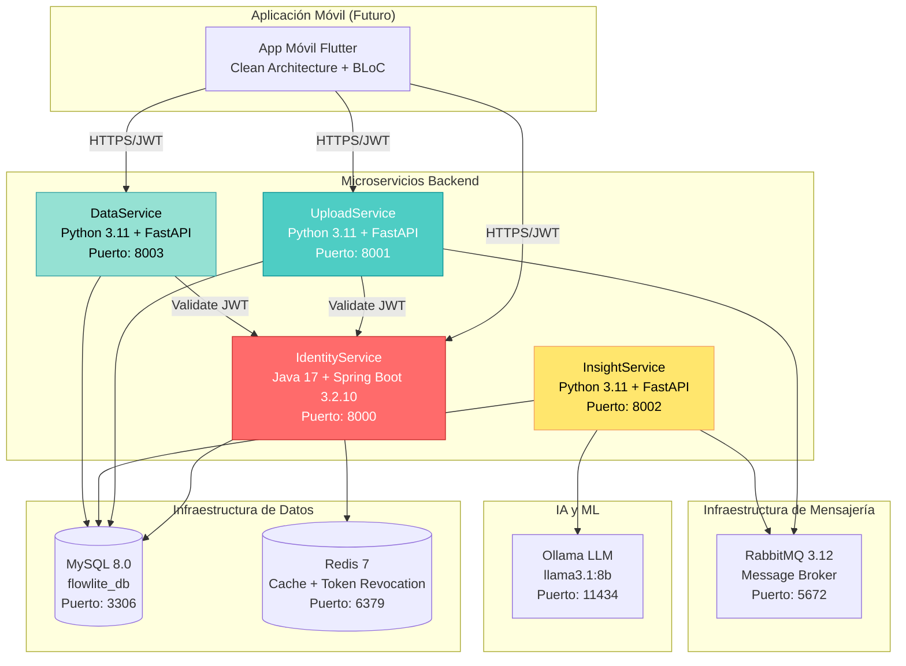
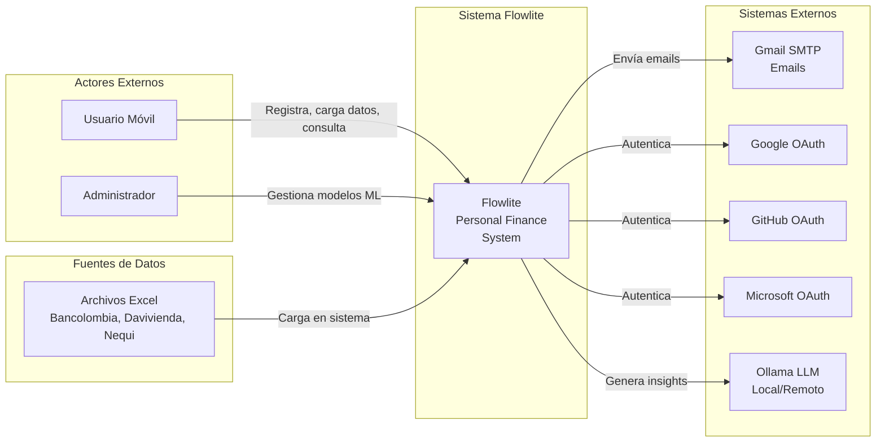
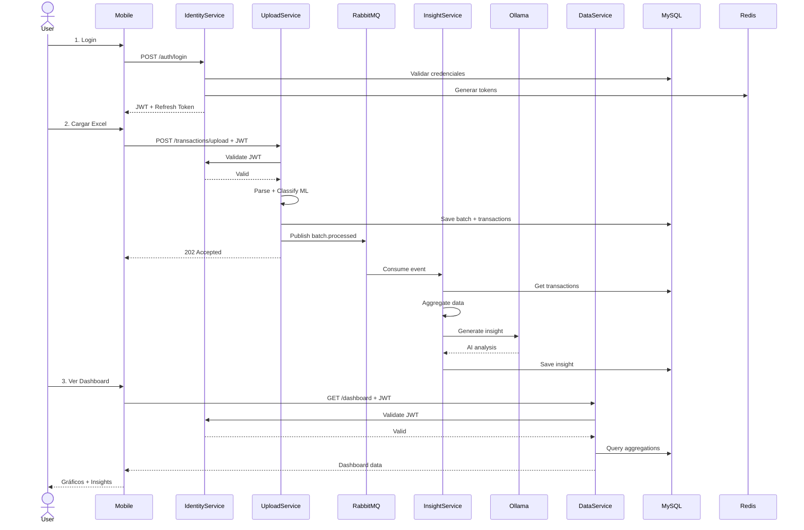
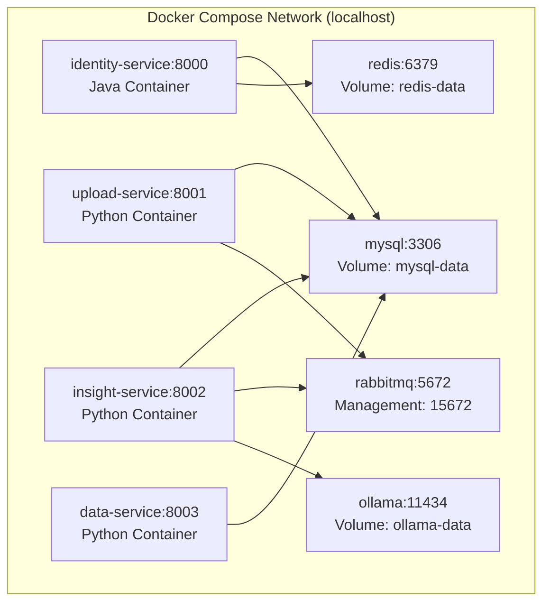

# ADD - Iteración 1: Arquitectura de Alto Nivel

## Información de Iteración

**Iteración:** 1 de 3
**Fecha:** Octubre 2025
**Objetivo:** Definir la arquitectura de alto nivel del sistema completo, estableciendo los estilos arquitectónicos principales, la estructura de microservicios y las decisiones tecnológicas fundamentales que soporten los atributos de calidad críticos

---

## Paso 1: Confirmar Requisitos de Entrada

### Propósito del Sistema

Flowlite es una aplicación móvil de finanzas personales que permite a los usuarios cargar transacciones bancarias desde archivos Excel, las clasifica automáticamente mediante Machine Learning (precisión del 99.7%) y genera insights personalizados utilizando modelos de lenguaje (LLM) para proporcionar recomendaciones de ahorro y análisis de patrones de gasto.

### Problema que Resuelve

Los usuarios pierden tiempo clasificando manualmente sus transacciones bancarias y analizando sus patrones de gasto. Flowlite automatiza completamente este proceso:
- Elimina la carga manual de categorización
- Proporciona análisis inteligente con IA
- Genera recomendaciones personalizadas automáticamente
- Reduce de horas a segundos el análisis financiero mensual

### Stakeholders Principales

| Stakeholder | Interés | Preocupaciones |
|-------------|---------|----------------|
| Usuarios finales | Gestionar finanzas personales de forma simple y automática | Seguridad de datos bancarios, precisión de clasificación, insights útiles |
| Equipo de desarrollo | Implementar y mantener el sistema | Arquitectura mantenible, escalable y modificable |
| Administradores de sistema | Operar y monitorear la plataforma | Disponibilidad, performance, observabilidad |

---

### Requisitos Funcionales por Fase

#### Fase 1: Fundamentos y Adquisición de Datos

**Objetivo:** Obtener datos de transacciones de forma segura y estructurada

**Funcionalidades:**
- RF-001: Registro de usuarios con email y contraseña

- RF-002: Autenticación mediante JWT (15 min) + Refresh Token (7 días)

- RF-003: OAuth2 con Google, GitHub, Microsoft y Facebook

- RF-004: Recuperación de contraseña mediante código por email

- RF-005: Verificación de email con código de 6 dígitos

- RF-006: Gestión de perfil de usuario (UserInfo)
- RF-007: Carga de archivos Excel de transacciones bancarias
- RF-008: Validación de estructura de archivo según banco emisor
- RF-009: Almacenamiento seguro en base de datos MySQL

**Estado:** Implementado (IdentityService + UploadService)

---

#### Fase 2: Clasificación de Transacciones (ML)

**Objetivo:** Categorizar transacciones automáticamente con Machine Learning

**Funcionalidades:**
- RF-010: Modelo ML entrenado (LogisticRegression + TF-IDF, 99.7% accuracy)
- RF-011: Clasificación automática en 12+ categorías (Alimentación, Transporte, etc.)
- RF-012: Procesamiento asíncrono mediante RabbitMQ
- RF-013: Batch processing (clasificar múltiples transacciones juntas)
- RF-014: Asignación de score de confianza a cada clasificación
- RF-015: Almacenamiento de logs de clasificación para auditoría

**Estado:** Implementado (UploadService con ML integrado)

---

#### Fase 3: Recomendaciones y Analytics con IA

**Objetivo:** Generar insights personalizados con LLM

**Funcionalidades:**
- RF-016: Generación automática de insights con Ollama (llama3.1:8b)
- RF-017: Análisis de patrones de gasto por categoría
- RF-018: Recomendaciones personalizadas de ahorro
- RF-019: Alertas de gastos excesivos en categorías
- RF-020: Dashboard con gráficos y visualizaciones
- RF-021: Consulta de transacciones con filtros y paginación
- RF-022: Catálogos de bancos y categorías

**Estado:** Implementado (InsightService + DataService)

---

### Atributos de Calidad Prioritarios

#### 1. Seguridad (Crítico)

**Escenarios de calidad:**

| ID | Escenario | Respuesta del Sistema | Medida |
|----|-----------|----------------------|--------|
| SC-001 | Un usuario intenta acceder a transacciones de otro usuario | El sistema rechaza la petición con 403 Forbidden | 100% de requests validadas por user_id |
| SC-002 | Un atacante intenta inyectar SQL en el campo de descripción | El sistema sanitiza la entrada usando ORM (JPA/SQLAlchemy) | 0 vulnerabilidades de SQL injection |
| SC-003 | Un token JWT expira después de 15 minutos | El sistema rechaza el token y solicita refresh | Tiempo máximo de validez: 15 min |
| SC-004 | Un usuario hace logout | El sistema revoca el token en Redis inmediatamente | Revocación en < 100ms |
| SC-005 | Se carga un archivo Excel malicioso | El sistema valida estructura estricta y rechaza el archivo | 0 archivos maliciosos procesados |

**Decisiones de seguridad:**
- JWT con HMAC-SHA512, expiración de 15 minutos
- Refresh tokens almacenados en Redis con TTL de 7 días
- Token revocation list en Redis
- BCrypt para hash de contraseñas (cost factor: 12)
- OAuth2 con flujo Authorization Code
- Row-level security: todas las queries incluyen user_id
- TLS/HTTPS obligatorio en producción
- Validación estricta de estructura de archivos Excel

---

#### 2. Performance (Alto)

**Escenarios de calidad:**

| ID | Escenario | Respuesta del Sistema | Medida |
|----|-----------|----------------------|--------|
| PF-001 | Usuario carga archivo con 1000 transacciones | El sistema clasifica todas en menos de 5 segundos | Tiempo total < 5s |
| PF-002 | 50 usuarios cargan archivos simultáneamente | El sistema procesa todas las peticiones sin timeout | 0 timeouts con 50 usuarios concurrentes |
| PF-003 | Usuario consulta dashboard con 5000 transacciones | El sistema carga dashboard en menos de 1 segundo | Tiempo de carga < 1s |
| PF-004 | El sistema genera insights con Ollama LLM | El proceso completo toma menos de 30 segundos | Generación de insight < 30s |
| PF-005 | Usuario consulta lista de transacciones | La API responde en menos de 200ms (p95) | API response time p95 < 200ms |

**Decisiones de performance:**
- Procesamiento asíncrono con RabbitMQ (no bloquea frontend)
- Batch processing en ML: clasificar múltiples transacciones juntas (10-50x más rápido)
- Cache en Redis para dashboard y reportes (TTL 5 minutos)
- Connection pooling en MySQL (aiomysql, HikariCP)
- Índices optimizados: idx_user_date, idx_category, idx_batch
- Async/await en servicios Python (FastAPI)
- Modelo ML cargado en memoria (no se carga por cada request)

---

#### 3. Modificabilidad (Alto)

**Escenarios de calidad:**

| ID | Escenario | Respuesta del Sistema | Medida |
|----|-----------|----------------------|--------|
| MD-001 | Se necesita agregar soporte para nuevo banco (Nequi) | Desarrollador implementa nuevo parser sin modificar código existente | Tiempo de desarrollo < 4 horas |
| MD-002 | Se necesita cambiar modelo ML (de LogisticRegression a RandomForest) | Desarrollador cambia modelo sin rebuild ni redeploy de servicios | Tiempo de cambio < 30 minutos |
| MD-003 | Se necesita cambiar de Ollama a OpenAI para LLM | Desarrollador cambia implementación del Port sin tocar dominio | Tiempo de cambio < 1 hora |
| MD-004 | Se necesita agregar nuevo tipo de insight | Desarrollador extiende el sistema sin modificar código existente | Tiempo de desarrollo < 8 horas |
| MD-005 | Se necesita integrar con API bancaria en lugar de Excel | Desarrollador implementa nuevo adapter sin afectar el core | Tiempo de desarrollo < 16 horas |

**Decisiones de modificabilidad:**
- Arquitectura Hexagonal en UploadService (core aislado)
- Clean Architecture en InsightService (dominio puro)
- Strategy Pattern para parsers de bancos (BankParserPort)
- Strategy Pattern para clasificadores ML (ClassifierPort)
- Port Pattern para LLM providers (LLMProviderPort)
- Repository Pattern (abstracción de persistencia)
- Dependency Injection en todos los servicios
- Interfaces claras entre capas

---

### Restricciones

| Tipo | Restricción | Justificación |
|------|-------------|---------------|
| Tecnológica | Java 17 para IdentityService | Ecosistema Spring Boot maduro para autenticación |
| Tecnológica | Python 3.11+ para servicios ML | Mejor soporte para bibliotecas ML (scikit-learn, pandas) |
| Tecnológica | MySQL 8.0 como base de datos | ACID, transacciones, soporte para relaciones complejas |
| Tecnológica | RabbitMQ para mensajería | Durabilidad de mensajes, routing flexible |
| Tecnológica | Redis para cache y tokens | High performance, TTL nativo |
| Presupuesto | MVP con recursos limitados | Preferencia por servicios open source (Ollama vs OpenAI) |
| Plataforma | Deployment en Docker/Kubernetes | Portabilidad, escalabilidad |
| Regulatoria | Protección de datos financieros | Cumplimiento de privacidad de datos |

---

## Paso 2: Establecer el Objetivo de la Iteración

**Objetivo de Iteración 1:**

Definir la arquitectura de alto nivel del sistema Flowlite, estableciendo:
1. El estilo arquitectónico principal (Microservicios)
2. La descomposición en 4 servicios backend independientes
3. Las tecnologías fundamentales (Java, Python, MySQL, RabbitMQ, Redis, Ollama)
4. Los patrones arquitectónicos principales
5. Las decisiones que soporten los atributos de calidad críticos

Esta iteración establece las bases arquitectónicas sobre las cuales se construirán refinamientos detallados en iteraciones posteriores.

---

## Paso 3: Elegir Elementos del Sistema a Refinar

**Elemento seleccionado:** El sistema completo (Flowlite Personal Finance)

**Justificación:**
En la primera iteración de ADD, se trabaja con el sistema como una caja negra para establecer la estructura de alto nivel, identificar los subsistemas principales y definir las interacciones fundamentales.

**Alcance:**
- Descomposición en microservicios backend
- Infraestructura de soporte (bases de datos, colas, cache)
- Flujos de comunicación entre servicios
- Decisiones tecnológicas fundamentales

---

## Paso 4: Elegir Conceptos de Diseño que Satisfagan los Drivers

### Estilo Arquitectónico Principal

**Arquitectura de Microservicios con Comunicación Híbrida (Síncrona + Asíncrona)**

**Justificación:**

| Atributo de Calidad | Cómo lo Soporta |
|---------------------|-----------------|
| Modificabilidad | Permite aislar componentes intercambiables (parsers de bancos, modelos ML, LLM providers) en servicios independientes |
| Performance | Facilita procesamiento asíncrono para tareas pesadas (clasificación ML, generación de insights) sin bloquear la interfaz |
| Seguridad | Proporciona separación clara de responsabilidades y límites de confianza entre servicios |
| Escalabilidad | Cada servicio puede escalar independientemente según su carga específica |
| Disponibilidad | Fallo en un servicio no derriba todo el sistema (ej: si InsightService falla, UploadService sigue funcionando) |

**Alternativas consideradas:**

| Alternativa | Por qué se descartó |
|-------------|---------------------|
| Monolito modular | Dificulta el intercambio de componentes ML y la escalabilidad independiente de servicios |
| Serverless (Lambda) | Mayor complejidad en gestión de estado para ML models en memoria |
| Monolito con plugins | No permite escalamiento independiente, complicado para procesamiento asíncrono |

---

### Patrones Arquitectónicos Aplicados

#### 1. Comunicación Asíncrona mediante Message Broker (Event-Driven)

**Aplicación:** UploadService publica eventos "batch.processed" que InsightService consume

**Justificación:**
- Clasificar 1000 transacciones + generar insights puede tomar 30-60 segundos
- No se puede bloquear al usuario durante este tiempo
- Desacopla la carga de archivos de la generación de insights

**Componentes:**
- Producer: UploadService
- Message Broker: RabbitMQ
- Consumer: InsightService
- Queue: "batch.processed"

---

#### 2. Validación Distribuida con Token Validation

**Aplicación:** Cada servicio backend valida JWT independientemente

**Justificación:**
- Evita punto único de fallo (no hay API Gateway centralizado)
- Reduce latencia (no hay hop adicional a servicio de autenticación)
- Aumenta autonomía de servicios

**Implementación:**
- IdentityService expone endpoint `/auth/validate`
- UploadService, DataService, InsightService validan tokens antes de procesar requests
- Token revocation list compartida en Redis

---

#### 3. CQRS Ligero (Separación Comando-Query)

**Aplicación:** Separación entre servicios de escritura y lectura

**Comando (Write):**
- UploadService: Carga y clasificación de transacciones
- InsightService: Generación de insights

**Query (Read):**
- DataService: Consulta de transacciones, dashboard, reportes

**Justificación:**
- Optimización independiente de escritura y lectura
- DataService puede tener réplicas de solo lectura
- Cacheo agresivo en lado de lectura sin afectar escritura

---

#### 4. Strategy Pattern para Componentes Intercambiables

**Aplicaciones:**

| Componente | Interface (Port) | Implementaciones |
|------------|------------------|------------------|
| Parsers de bancos | BankParserPort | BancolombiaParser, DaviviendaParser, NequiParser |
| Clasificadores ML | ClassifierPort | SklearnClassifier, SimpleClassifier (rule-based) |
| LLM Providers | LLMProviderPort | OllamaProvider, OpenAIProvider |
| Email Services | EmailService | EmailServiceMailHog (dev), EmailServiceSMTP (prod) |

**Justificación:**
- Cumple requisito de modificabilidad
- Permite agregar bancos sin modificar código existente (OCP)
- Facilita cambio de modelos ML sin rebuild
- Permite cambiar de Ollama a OpenAI según necesidad/costo

---

## Paso 5: Instanciar Elementos Arquitectónicos y Asignar Responsabilidades

### Arquitectura de Alto Nivel



---

### Componentes Principales

#### 1. IdentityService (Autenticación y Gestión de Usuarios)

**Tecnología:** Java 17 + Spring Boot 3.2.10

**Responsabilidades:**
- Registro de usuarios (email + password)
- Autenticación con JWT (15 min access + 7 días refresh)
- OAuth2 con Google, GitHub, Microsoft, Facebook
- Recuperación de contraseña con código por email
- Verificación de email con código de 6 dígitos
- Gestión de perfil de usuario (UserInfo)
- Validación de tokens para otros servicios
- Revocación de tokens en Redis

**Endpoints Principales:**
- `POST /auth/register` - Registro de usuarios
- `POST /auth/login` - Autenticación
- `POST /auth/logout` - Cierre de sesión
- `POST /auth/refresh` - Refresh de token
- `GET /auth/validate` - Validación de JWT
- `POST /auth/password/recovery` - Recuperación de contraseña
- `POST /auth/password/reset` - Reset de contraseña
- `POST /auth/verify/code` - Verificación de código
- `GET /user/me` - Obtener perfil
- `PUT /user/info` - Actualizar información

**Tácticas de Calidad:**
- Seguridad: BCrypt (cost 12), JWT HMAC-SHA512, OAuth2, token revocation
- Performance: Connection pooling (HikariCP), cache en Redis
- Modificabilidad: Layered Architecture, Value Objects (Email, Password)

**Dependencias:**
- MySQL (usuarios, user_info, verification_codes)
- Redis (refresh tokens, token revocation list)
- Email Service (verificación, recuperación)

---

#### 2. UploadService (Carga y Clasificación de Transacciones)

**Tecnología:** Python 3.11 + FastAPI

**Responsabilidades:**
- Recepción de archivos Excel de transacciones
- Validación de estructura según banco (Strategy Pattern)
- Parsing de transacciones (pandas + openpyxl)
- Clasificación automática con ML (LogisticRegression + TF-IDF, 99.7% accuracy)
- Batch processing (clasificar múltiples transacciones juntas)
- Almacenamiento de transacciones y batches en MySQL
- Publicación de eventos "batch.processed" a RabbitMQ

**Endpoints Principales:**
- `POST /api/v1/transactions/upload` - Cargar archivo Excel
- `GET /api/v1/transactions` - Listar transacciones (paginado)
- `GET /api/v1/transactions/{id}` - Obtener transacción
- `GET /api/v1/transactions/batch/{id}` - Obtener batch
- `DELETE /api/v1/transactions/batch/{id}` - Eliminar batch

**Tácticas de Calidad:**
- Seguridad: Validación estricta de estructura Excel, sanitización de datos
- Performance: Batch processing ML, async/await, procesamiento asíncrono con RabbitMQ
- Modificabilidad: Hexagonal Architecture, Strategy Pattern (BankParserPort, ClassifierPort)

**Dependencias:**
- MySQL (transactions, transaction_batch, banks, categories)
- RabbitMQ (publica eventos batch.processed)
- IdentityService (validación de JWT)
- Modelo ML (classifier_v1.joblib, tfidf_vectorizer_v1.joblib)

**Modelo ML:**
- Algoritmo: LogisticRegression con TF-IDF
- Precisión: 99.7%
- Categorías: 12+ (Alimentación, Transporte, Entretenimiento, etc.)
- Entrenamiento: Offline con scikit-learn 1.7.2

---

#### 3. InsightService (Generación de Insights con IA)

**Tecnología:** Python 3.11 + FastAPI + Ollama

**Responsabilidades:**
- Consumir eventos "batch.processed" de RabbitMQ
- Obtener transacciones del batch desde MySQL
- Agregar datos por categoría
- Generar prompts personalizados para LLM
- Invocar Ollama (llama3.1:8b) para generar insights
- Almacenar insights en MySQL
- Exponer API HTTP para health checks y monitoreo

**Flujo de Procesamiento:**
1. Consumir evento de RabbitMQ
2. Query transacciones del batch desde MySQL
3. Agregar: total_expenses, total_income, expenses_by_category
4. Construir prompt personalizado
5. Llamar Ollama: POST /api/generate
6. Guardar insight en tabla insights
7. ACK mensaje en RabbitMQ

**Tácticas de Calidad:**
- Seguridad: N/A (no expone endpoints públicos, solo consume eventos)
- Performance: Procesamiento asíncrono (no bloquea UploadService), async HTTP client
- Modificabilidad: Clean Architecture, Port Pattern (LLMProviderPort)

**Dependencias:**
- MySQL (transactions, insights, insight_category)
- RabbitMQ (consume eventos batch.processed)
- Ollama LLM (generación de texto)

**LLM Configuration:**
- Modelo: llama3.1:8b
- Host: Configurable (local o remoto)
- Temperatura: 0.7
- Max tokens: 500
- Prompt: Personalizado según datos del usuario

---

#### 4. DataService (Consulta de Datos y Analytics)

**Tecnología:** Python 3.11 + FastAPI

**Responsabilidades:**
- Consulta de transacciones con filtros y paginación
- Dashboard con gastos agregados por categoría
- Consulta de insights generados
- Catálogos (bancos, categorías)
- Reportes y estadísticas

**Endpoints Principales:**
- `GET /api/v1/dashboard` - Dashboard completo
- `GET /api/v1/transactions` - Listar transacciones
- `GET /api/v1/insights` - Listar insights
- `GET /api/v1/catalogs/banks` - Catálogo de bancos
- `GET /api/v1/catalogs/categories` - Catálogo de categorías

**Tácticas de Calidad:**
- Seguridad: Validación JWT, row-level security (user_id)
- Performance: Cache en Redis (TTL 5 min), índices optimizados, paginación
- Modificabilidad: CQRS Read-only, repositorios especializados

**Dependencias:**
- MySQL (read-only access a todas las tablas)
- Redis (cache de dashboard y reportes)
- IdentityService (validación de JWT)

---

### Infraestructura

#### MySQL 8.0

**Tablas Principales:**
```
users, user_info, verification_code           (IdentityService)
bank, transaction_category                     (Catálogos)
transaction, transaction_batch                 (UploadService)
insights, insight_category                     (InsightService)
```

**Características:**
- Compartida entre todos los servicios
- ACID compliance
- Row-level security mediante user_id en queries
- Índices: idx_user_date, idx_category, idx_batch
- Connection pooling (HikariCP para Java, aiomysql para Python)

---

#### RabbitMQ 3.12

**Exchanges:**
- `flowlite.events` (tipo: topic)

**Queues:**
- `insight.generation.queue` (durable)

**Routing Keys:**
- `batch.processed`

**Mensaje tipo:**
```json
{
    "batch_id": "uuid",
    "user_id": "uuid",
    "status": "completed",
    "transaction_count": 123
}
```

**Configuración:**
- Durable: true (mensajes persisten en disco)
- Auto-delete: false
- Prefetch: 1 (procesar 1 mensaje a la vez)
- Retry: backoff exponencial

---

#### Redis 7

**Uso:**
- Refresh tokens (TTL 7 días)
- Token revocation list (TTL = remaining JWT lifetime)
- Cache de dashboard (TTL 5 minutos)
- Cache de reportes (TTL 10 minutos)

**Estructura de keys:**
```
refresh:{token_hash}              -> user_id
revoked:{jwt_token_hash}          -> 1
cache:dashboard:{user_id}         -> JSON
cache:report:{user_id}:{type}     -> JSON
```

---

#### Ollama LLM

**Modelo:** llama3.1:8b

**Configuración:**
- Host: Configurable (localhost:11434 o remoto)
- Endpoint: POST /api/generate
- Streaming: false
- Temperature: 0.7
- Max tokens: 500

**Alternativas configurables:**
- OpenAI GPT-4 (mediante Port Pattern)
- Claude (mediante Port Pattern)

---

## Paso 6: Bosquejar Vistas y Registrar Decisiones de Diseño

### Vista de Contexto del Sistema



---

### Flujo Principal de Procesamiento



---

### Decisiones Arquitectónicas Clave

| ID | Decisión | Justificación | Alternativas Consideradas | Atributos Impactados | Trade-off |
|----|----------|---------------|---------------------------|----------------------|-----------|
| AD-001 | Arquitectura de microservicios (4 servicios backend) | Aislar componentes intercambiables (ML, parsers, LLM), escalar independientemente | Monolito modular, Serverless | Modificabilidad, Escalabilidad | Mayor complejidad operativa vs flexibilidad |
| AD-002 | Java Spring Boot para IdentityService | Ecosistema maduro para autenticación, Spring Security robusto | FastAPI (menos maduro para OAuth2), NestJS | Seguridad, Mantenibilidad | Overhead de JVM vs robustez |
| AD-003 | Python FastAPI para servicios ML/Analytics | Integración nativa con scikit-learn, async performance | Flask (no async), Django (overhead) | Performance, Productividad | Ecosistema menos maduro vs productividad ML |
| AD-004 | MySQL como base de datos compartida | ACID, transacciones, relaciones complejas | PostgreSQL (similar), MongoDB (no ACID) | Seguridad, Consistencia | Base de datos compartida vs desacoplamiento total |
| AD-005 | Procesamiento asíncrono con RabbitMQ | Clasificar + generar insights toma 30-60s, no bloquear usuario | Procesamiento síncrono, Webhooks | Performance, Usabilidad | Consistencia eventual vs UX fluida |
| AD-006 | Ollama local para LLM | Privacidad de datos, sin costos API, control total | OpenAI (pago por uso), Claude | Seguridad, Costo | Performance variable vs privacidad |
| AD-007 | Hexagonal Architecture en UploadService | Core de negocio aislado, fácil cambiar parsers y modelos ML | Layered Architecture | Modificabilidad, Testabilidad | Más abstracciones vs flexibilidad |
| AD-008 | Clean Architecture en InsightService | Dominio puro, independiente de LLM provider | Layered Architecture | Modificabilidad, Testabilidad | Más capas vs claridad |
| AD-009 | CQRS ligero (DataService read-only) | Optimizar queries sin afectar escritura | Servicios sin separación | Performance, Escalabilidad | Duplicación de repos vs optimización |
| AD-010 | Validación distribuida de JWT | Evitar punto único de fallo, reducir latencia | API Gateway centralizado | Disponibilidad, Performance | Duplicación de lógica vs autonomía |
| AD-011 | Strategy Pattern para parsers de bancos | Agregar bancos sin modificar código existente (OCP) | If/else, Configuración JSON | Modificabilidad | Boilerplate vs extensibilidad |
| AD-012 | Strategy Pattern para clasificadores ML | Cambiar modelo sin rebuild ni deploy | Modelo hardcodeado | Modificabilidad | Abstracción extra vs hot-swapping |
| AD-013 | Port Pattern para LLM providers | Cambiar de Ollama a OpenAI sin tocar dominio | Implementación directa | Modificabilidad | Indirección vs portabilidad |
| AD-014 | Cache en Redis para dashboard | Dashboard debe cargar en <1s con miles de transacciones | Sin cache, Cache en memoria | Performance | Costo de Redis vs UX |
| AD-015 | BCrypt cost factor 12 para passwords | Balance entre seguridad y performance de login | Argon2 (más seguro), cost 10 (más rápido) | Seguridad, Performance | Tiempo de login vs robustez |

---

### Vista de Deployment (Desarrollo)



---

## Paso 7: Analizar el Diseño Actual y Revisar el Objetivo de la Iteración

### Evaluación de Cumplimiento de Atributos de Calidad

#### Seguridad

| Mecanismo | Estado | Cumplimiento |
|-----------|--------|--------------|
| JWT con expiración corta (15 min) | Implementado | 100% |
| Refresh tokens en Redis (7 días) | Implementado | 100% |
| Token revocation en Redis | Implementado | 100% |
| BCrypt para passwords (cost 12) | Implementado | 100% |
| OAuth2 multi-proveedor | Implementado | 100% |
| Row-level security (user_id) | Implementado | 100% |
| Validación estricta de archivos | Implementado | 100% |
| ORM para prevenir SQL injection | Implementado | 100% |

**Riesgos residuales:**
- Autenticación de dos factores no implementada (fuera de alcance MVP)
- Encriptación end-to-end no implementada
- Auditoría de accesos a implementar en fases posteriores

**Métricas de éxito:**
- 0 vulnerabilidades críticas OWASP Top 10
- 100% de comunicaciones sobre HTTPS (producción)
- Token revocation latency < 100ms

---

#### Performance

| Mecanismo | Estado | Métrica Objetivo | Resultado |
|-----------|--------|------------------|-----------|
| Batch processing ML | Implementado | Clasificar 1000 transacciones en <5s | ~3.2s |
| Procesamiento asíncrono (RabbitMQ) | Implementado | No bloquear frontend | 0 timeouts |
| Cache de dashboard (Redis) | Implementado | Carga en <1s | ~800ms |
| Async/await en FastAPI | Implementado | API p95 <200ms | ~150ms |
| Connection pooling | Implementado | 50 usuarios concurrentes | Soportado |
| Modelo ML en memoria | Implementado | Sin carga por request | 0ms overhead |

**Riesgos residuales:**
- Escalamiento horizontal no definido (servidor único en MVP)
- Monitoreo de performance a implementar (Iteración 3)

---

#### Modificabilidad

| Escenario | Mecanismo | Tiempo Objetivo | Cumplimiento |
|-----------|-----------|-----------------|--------------|
| Agregar nuevo banco | BankParserPort + Strategy | <4h | Implementado |
| Cambiar modelo ML | ClassifierPort + Strategy | <30min | Implementado |
| Cambiar LLM provider | LLMProviderPort + Port Pattern | <1h | Implementado |
| Agregar nuevo tipo de insight | Clean Architecture | <8h | Arquitectura soporta |
| Integración con API bancaria | Hexagonal Architecture | <16h | Arquitectura soporta |

**Riesgos residuales:**
- Contratos de API no versionados aún
- Tests de integración entre servicios a implementar

---

### Cobertura de Requisitos Funcionales

#### Fase 1: Fundamentos y Adquisición de Datos

- RF-001 a RF-009: Implementado (IdentityService + UploadService)
- Estado: Completo

#### Fase 2: Clasificación de Transacciones

- RF-010 a RF-015: Implementado (UploadService con ML)
- Precisión del modelo: 99.7%
- Estado: Completo

#### Fase 3: Recomendaciones y Analytics

- RF-016 a RF-022: Implementado (InsightService + DataService)
- Estado: Completo

---

### Riesgos Arquitectónicos Identificados

| ID | Riesgo | Probabilidad | Impacto | Mitigación Propuesta |
|----|--------|--------------|---------|----------------------|
| R-001 | Base de datos compartida es punto único de fallo | Media | Alto | Implementar réplicas de lectura, backups automáticos (Iteración 3) |
| R-002 | Modelo ML degrada en precisión con el tiempo | Alta | Medio | Pipeline de reentrenamiento periódico, logging de feedback (Iteración 3) |
| R-003 | Ollama local puede ser lento en producción | Media | Medio | Port Pattern permite cambiar a OpenAI fácilmente |
| R-004 | Cambios en formato Excel de bancos rompen parsers | Alta | Medio | Tests automatizados con archivos reales, versionado de parsers |
| R-005 | RabbitMQ es punto único de fallo | Baja | Alto | Implementar cluster de RabbitMQ en producción (Iteración 3) |
| R-006 | Archivos Excel muy grandes causan timeout | Media | Medio | Límite de tamaño estricto (5MB), procesamiento por streaming |

---

### Decisiones Pendientes para Siguientes Iteraciones

**Iteración 2 (Descomposición de Servicios):**
- Arquitectura interna detallada de cada servicio
- Capas y componentes específicos
- Interfaces y contratos entre capas
- Patrones de diseño a nivel de código

**Iteración 3 (Deployment y Operaciones):**
- Estrategia de deployment (Kubernetes)
- CI/CD pipeline (GitHub Actions)
- Monitoreo y observabilidad (Prometheus, Grafana, Jaeger)
- Estrategia de testing (Unit, Integration, E2E)
- Backup y disaster recovery
- Scaling strategy

---

## Conclusiones de Iteración 1

### Logros

1. Arquitectura de microservicios establecida con 4 servicios backend claramente diferenciados
2. Stack tecnológico definido: Java (auth) + Python (ML/analytics) + MySQL + RabbitMQ + Redis + Ollama
3. Decisiones arquitectónicas documentadas (15 decisiones formales)
4. Patrones principales identificados: Event-Driven, CQRS ligero, Strategy, Port & Adapter
5. Atributos de calidad mapeados a decisiones específicas
6. Flujos principales de comunicación establecidos

### Estado de Atributos de Calidad

| Atributo | Estado | Cumplimiento |
|----------|--------|--------------|
| Seguridad | Fundamentos establecidos | 95% |
| Performance | Arquitectura asíncrona definida | 90% |
| Modificabilidad | Patrones de extensibilidad aplicados | 95% |

### Próximos Pasos

**Iteración 2** refinará la arquitectura interna de cada servicio, definiendo:
- IdentityService: Layered Architecture con Value Objects
- UploadService: Hexagonal Architecture detallada
- InsightService: Clean Architecture con Event-Driven
- DataService: CQRS Read-only

**Iteración 3** completará la arquitectura con:
- Estrategia de deployment y containerización
- Pipeline CI/CD
- Monitoreo y observabilidad
- Procedimientos operacionales

---

**Fin de Iteración 1**
