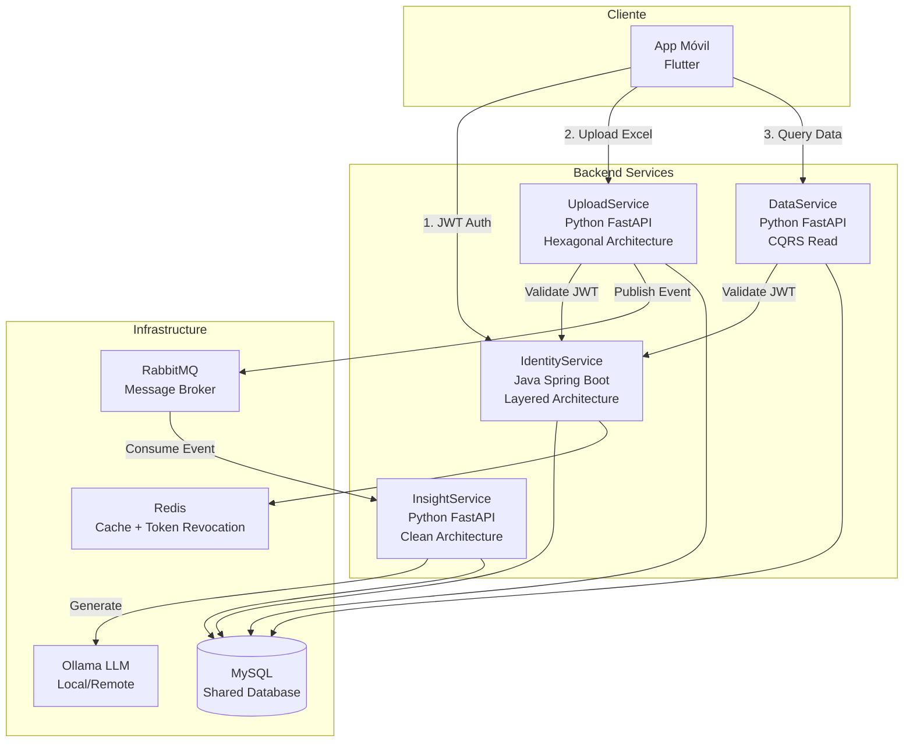
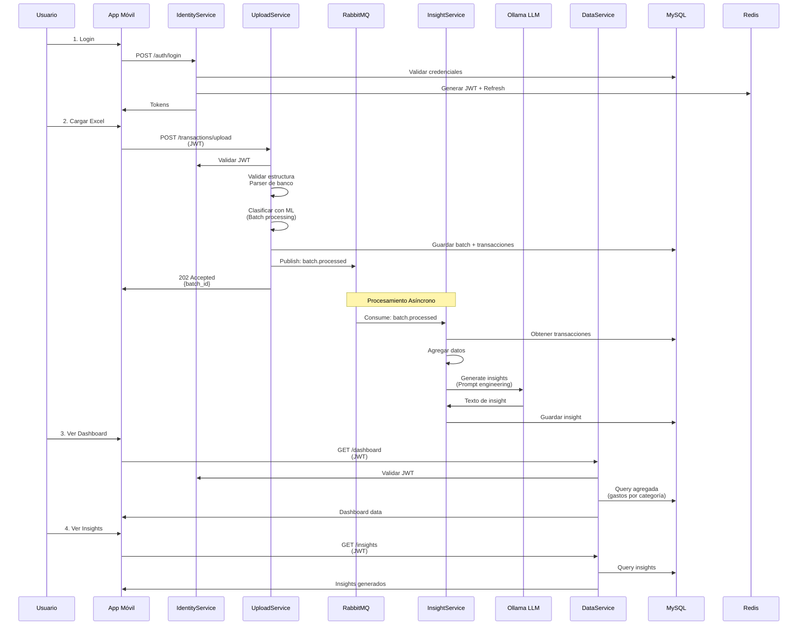

# ADD - Iteración 2: Descomposición de Servicios Backend

## Información de Iteración

**Iteración:** 2 de 3
**Fecha:** Octubre 2025
**Objetivo:** Refinar la arquitectura de servicios backend, definiendo la estructura interna de cada microservicio y sus patrones arquitectónicos específicos

---

## Paso 1: Revisar Resultados de Iteración Anterior

### Logros de Iteración 1

- Arquitectura de alto nivel establecida con microservicios
- Patrones principales identificados (Strategy, Repository, Model Registry)
- Atributos de calidad priorizados: Seguridad, Performance, Modificabilidad
- Componentes principales definidos:
  - API Gateway / BFF
  - User Service
  - Transaction Service
  - Classification Engine (ML Service)
  - Analytics & Recommendation Service

### Decisiones Pendientes Resueltas

1. **Stack tecnológico final:**
   - IdentityService: Java 17 + Spring Boot 3.2.10
   - UploadService: Python 3.11 + FastAPI
   - InsightService: Python 3.11 + FastAPI + Ollama LLM
   - DataService: Python 3.11 + FastAPI

2. **Base de datos:**
   - MySQL 8.0 compartida con esquema `flowlite_db`
   - Estrategia híbrida: Hibernate (Java) + Alembic (Python)

3. **Infraestructura de mensajería:**
   - RabbitMQ 3.12 para comunicación asíncrona
   - Redis 7 para cache y token revocation

---

## Paso 2: Establecer el Objetivo de la Iteración

**Objetivo de Iteración 2:**

Descomponer cada microservicio backend en su estructura interna, definiendo:
- Capas arquitectónicas específicas
- Componentes internos y sus responsabilidades
- Interfaces y contratos entre capas
- Patrones de diseño aplicados a nivel de servicio
- Flujos de datos detallados

**Elementos a refinar:**
1. IdentityService (User Service)
2. UploadService (Transaction Service + ML Classification)
3. InsightService (Recommendation Engine con LLM)
4. DataService (Analytics & Query Service)

---

## Paso 3: Elegir Elementos del Sistema a Refinar

**Elementos seleccionados:** Los 4 microservicios backend principales

**Justificación:** Son el core del sistema y donde se concentra la lógica de negocio crítica.

---

## Paso 4: Elegir Conceptos de Diseño que Satisfagan los Drivers

### Driver Arquitectónico 1: Modificabilidad en Parsers y Modelos ML

**Concepto aplicado:** Arquitectura Hexagonal (Puertos y Adaptadores)

**Justificación:**
- Permite cambiar componentes externos (ML models, parsers, LLM) sin tocar lógica de negocio
- Testabilidad: puedes mockear infraestructura fácilmente
- Cumple requisito de "componentes intercambiables"

**Servicios que lo implementan:** UploadService, InsightService

---

### Driver Arquitectónico 2: Seguridad en Autenticación

**Concepto aplicado:** Layered Architecture + Domain-Driven Design ligero

**Justificación:**
- Separación clara entre validación (controllers), lógica de negocio (services) y persistencia (repositories)
- Value Objects para Email, Password, Username garantizan validación en dominio
- Patrón Port para abstracciones (TokenProvider, PasswordEncoder, EmailService)

**Servicios que lo implementan:** IdentityService

---

### Driver Arquitectónico 3: Performance en Procesamiento de Lotes

**Concepto aplicado:** Event-Driven Architecture + CQRS ligero

**Justificación:**
- Procesamiento asíncrono evita bloqueos
- Separación entre escritura (UploadService) y lectura (DataService)
- RabbitMQ desacopla productor de consumidor

**Servicios que lo implementan:** UploadService → RabbitMQ → InsightService

---

## Paso 5: Instanciar Elementos Arquitectónicos y Asignar Responsabilidades

### 5.1 IdentityService - Arquitectura Interna

#### Patrón Arquitectónico

**Layered Architecture** con elementos de **Hexagonal Architecture**

```
┌─────────────────────────────────────────────────────────┐
│ Infrastructure Layer │
│ ┌──────────────┐ ┌──────────────┐ ┌──────────────┐ │
│ │ Controllers │ │ Security │ │ Persistence │ │
│ │ (REST API) │ │ (JWT/OAuth) │ │ (JPA) │ │
│ └──────┬───────┘ └──────┬───────┘ └──────┬───────┘ │
└─────────┼──────────────────┼──────────────────┼─────────┘
          │ │ │
┌─────────▼──────────────────▼──────────────────▼─────────┐
│ Application Layer │
│ ┌──────────────────────────────────────────────────┐ │
│ │ Application Services (Use Cases) │ │
│ │ - RegisterUserService │ │
│ │ - LoginUserService │ │
│ │ - PasswordRecoveryService │ │
│ │ - CompleteInfoUserService │ │
│ │ - ValidateTokenService │ │
│ └──────────────────┬───────────────────────────────┘ │
└─────────────────────┼───────────────────────────────────┘
                      │
┌─────────────────────▼───────────────────────────────────┐
│ Domain Layer │
│ ┌──────────────┐ ┌──────────────┐ ┌──────────────┐ │
│ │ Entities │ │ Value Objects│ │ Repositories │ │
│ │ - User │ │ - Email │ │ (Interfaces)│ │
│ │ - UserInfo │ │ - Password │ │ │ │
│ │ - Role │ │ - Username │ │ │ │
│ └──────────────┘ └──────────────┘ └──────────────┘ │
│ │
│ ┌──────────────────────────────────────────────────┐ │
│ │ Ports (Abstracciones) │ │
│ │ - TokenProvider │ │
│ │ - PasswordEncoder │ │
│ │ - EmailService │ │
│ └──────────────────────────────────────────────────┘ │
└──────────────────────────────────────────────────────────┘
```

#### Componentes Principales

##### 1. Controllers (Infrastructure Layer)

```java
// AuthController.java
@RestController
@RequestMapping("/auth")
public class AuthController {

    private final RegisterUserService registerUserService;
    private final LoginUserService loginUserService;
    private final LogoutUserService logoutUserService;

    @PostMapping("/register")
    public ResponseEntity<UserDTO> register(@Valid @RequestBody RegisterRequest request) {
        // Delega a Application Service
        User user = registerUserService.execute(request);
        return ResponseEntity.ok(UserMapper.toDTO(user));
    }

    @PostMapping("/login")
    public ResponseEntity<AuthResponse> login(@Valid @RequestBody LoginRequest request) {
        AuthResponse response = loginUserService.execute(request);
        return ResponseEntity.ok(response);
    }
}
```

**Responsabilidades:**
- Validación de entrada (anotaciones Jakarta Validation)
- Mapeo de DTOs a modelos de dominio
- Manejo de respuestas HTTP
- Documentación OpenAPI (Swagger)

**Otros Controllers:**
- `PasswordRecoveryController`: Recuperación de contraseña
- `PasswordRecoveryCodeController`: Validación de códigos
- `UserInfoController`: Gestión de información adicional del usuario
- `VerificationController`: Verificación de códigos
- `OAuth2Controller`: Autenticación con terceros

---

##### 2. Application Services (Application Layer)

```java
// RegisterUserService.java
@Service
@Transactional
public class RegisterUserService {

    private final UserRepository userRepository;
    private final PasswordEncoder passwordEncoder;
    private final VerificationCodeService verificationCodeService;
    private final EmailService emailService;

    public User execute(RegisterRequest request) {
        // 1. Validar que el email no existe
        Email email = new Email(request.getEmail());
        if (userRepository.existsByEmail(email)) {
            throw new EmailAlreadyExistsException(email.getValue());
        }

        // 2. Crear entidad de dominio con Value Objects
        Password password = new Password(request.getPassword());
        String hashedPassword = passwordEncoder.encode(password.getValue());

        User user = User.builder()
            .email(email)
            .passwordHash(hashedPassword)
            .role(Role.USER)
            .build();

        // 3. Persistir
        User savedUser = userRepository.save(user);

        // 4. Generar código de verificación
        String code = verificationCodeService.generateCode(savedUser.getId());

        // 5. Enviar email
        emailService.sendVerificationCode(email.getValue(), code);

        return savedUser;
    }
}
```

**Servicios implementados:**
- `RegisterUserService`: Registro de nuevos usuarios
- `PreregisterUserService`: Pre-registro con verificación de email
- `LoginUserService`: Autenticación y generación de JWT
- `LogoutUserService`: Invalidación de tokens
- `PasswordRecoveryService`: Inicio de recuperación de contraseña
- `PasswordRecoveryCodeService`: Validación y reset de contraseña
- `CompleteInfoUserService`: Completar información adicional (UserInfo)
- `ValidateTokenService`: Validación de JWT para otros servicios
- `VerificationCodeService`: Gestión de códigos de verificación
- `TokenRevocationService`: Revocación de tokens en Redis
- `RegisterOAuth2UserService`: Registro vía OAuth2

---

##### 3. Domain Layer

**Entidades:**

```java
// User.java - Entidad Agregado
@Entity
@Table(name = "users")
public class User {
    @Id
    @GeneratedValue(strategy = GenerationType.UUID)
    private UUID id;

    @Embedded
    private Email email;

    private String passwordHash;

    @Enumerated(EnumType.STRING)
    private Role role;

    @OneToOne(mappedBy = "user", cascade = CascadeType.ALL)
    private UserInfo userInfo;

    private LocalDateTime createdAt;
    private LocalDateTime updatedAt;

    // Business logic methods
    public void verifyEmail() {
        this.emailVerified = true;
    }

    public boolean canLogin() {
        return this.emailVerified && this.role != Role.SUSPENDED;
    }
}

// UserInfo.java - Value Entity
@Entity
@Table(name = "user_info")
public class UserInfo {
    @Id
    @GeneratedValue(strategy = GenerationType.UUID)
    private UUID id;

    @OneToOne
    @JoinColumn(name = "user_id")
    private User user;

    private String fullName;
    private String identificationType;
    private String identificationNumber;
    private LocalDate birthDate;
    private String phoneNumber;

    // Validaciones de dominio
    public void validate() {
        if (birthDate != null && birthDate.isAfter(LocalDate.now().minusYears(18))) {
            throw new DomainException("User must be at least 18 years old");
        }
    }
}
```

**Value Objects:**

```java
// Email.java
public class Email {
    private static final Pattern EMAIL_PATTERN =
        Pattern.compile("^[A-Za-z0-9+_.-]+@(.+)$");

    private final String value;

    public Email(String value) {
        if (value == null || !EMAIL_PATTERN.matcher(value).matches()) {
            throw new InvalidEmailException(value);
        }
        this.value = value.toLowerCase();
    }

    public String getValue() {
        return value;
    }

    @Override
    public boolean equals(Object o) {
        if (this == o) return true;
        if (!(o instanceof Email)) return false;
        Email email = (Email) o;
        return Objects.equals(value, email.value);
    }
}

// Password.java
public class Password {
    private static final int MIN_LENGTH = 8;
    private final String value;

    public Password(String value) {
        if (value == null || value.length() < MIN_LENGTH) {
            throw new WeakPasswordException();
        }
        if (!containsUpperCase(value) || !containsLowerCase(value) || !containsDigit(value)) {
            throw new WeakPasswordException();
        }
        this.value = value;
    }

    public String getValue() {
        return value;
    }
}

// Username.java
public class Username {
    private static final Pattern USERNAME_PATTERN =
        Pattern.compile("^[a-zA-Z0-9_-]{3,20}$");

    private final String value;

    public Username(String value) {
        if (value == null || !USERNAME_PATTERN.matcher(value).matches()) {
            throw new InvalidUsernameException(value);
        }
        this.value = value;
    }
}
```

**Ports (Abstracciones de infraestructura):**

```java
// TokenProvider.java
public interface TokenProvider {
    String generateAccessToken(User user);
    String generateRefreshToken(User user);
    Claims extractClaims(String token);
    boolean validateToken(String token);
    UUID extractUserId(String token);
}

// PasswordEncoder.java
public interface PasswordEncoder {
    String encode(String rawPassword);
    boolean matches(String rawPassword, String encodedPassword);
}

// EmailService.java
public interface EmailService {
    void sendVerificationCode(String email, String code);
    void sendPasswordRecoveryCode(String email, String code);
    void sendWelcomeEmail(String email, String username);
}
```

**Repositories (Interfaces de dominio):**

```java
// UserRepository.java
public interface UserRepository {
    User save(User user);
    Optional<User> findById(UUID id);
    Optional<User> findByEmail(Email email);
    boolean existsByEmail(Email email);
    void delete(User user);
}

// UserInfoRepository.java
public interface UserInfoRepository {
    UserInfo save(UserInfo userInfo);
    Optional<UserInfo> findByUserId(UUID userId);
    void delete(UserInfo userInfo);
}
```

---

##### 4. Infrastructure Adapters

**JWT Implementation:**

```java
// JwtTokenProvider.java
@Component
public class JwtTokenProvider implements TokenProvider {

    @Value("${jwt.secret}")
    private String secret;

    @Value("${jwt.access-token-expiration}")
    private long accessTokenExpiration;

    @Value("${jwt.refresh-token-expiration}")
    private long refreshTokenExpiration;

    @Override
    public String generateAccessToken(User user) {
        return Jwts.builder()
            .setSubject(user.getId().toString())
            .claim("email", user.getEmail().getValue())
            .claim("role", user.getRole().name())
            .setIssuedAt(new Date())
            .setExpiration(new Date(System.currentTimeMillis() + accessTokenExpiration))
            .signWith(SignatureAlgorithm.HS512, secret)
            .compact();
    }

    @Override
    public boolean validateToken(String token) {
        try {
            Jwts.parser().setSigningKey(secret).parseClaimsJws(token);
            return !tokenRevocationService.isRevoked(token);
        } catch (JwtException e) {
            return false;
        }
    }
}
```

**Repository Implementations:**

```java
// UserRepositoryJpaAdapter.java
@Repository
public class UserRepositoryJpaAdapter implements UserRepository {

    private final JpaUserRepository jpaRepository;
    private final UserMapper mapper;

    @Override
    public User save(User user) {
        UserEntity entity = mapper.toEntity(user);
        UserEntity saved = jpaRepository.save(entity);
        return mapper.toDomain(saved);
    }

    @Override
    public Optional<User> findByEmail(Email email) {
        return jpaRepository.findByEmail(email.getValue())
            .map(mapper::toDomain);
    }
}

// JpaUserRepository.java
public interface JpaUserRepository extends JpaRepository<UserEntity, UUID> {
    Optional<UserEntity> findByEmail(String email);
    boolean existsByEmail(String email);
}
```

**Security Configuration:**

```java
// JwtAuthenticationFilter.java
@Component
public class JwtAuthenticationFilter extends OncePerRequestFilter {

    private final JwtTokenProvider tokenProvider;

    @Override
    protected void doFilterInternal(
        HttpServletRequest request,
        HttpServletResponse response,
        FilterChain filterChain
    ) throws ServletException, IOException {

        String token = extractTokenFromRequest(request);

        if (token != null && tokenProvider.validateToken(token)) {
            UUID userId = tokenProvider.extractUserId(token);
            Claims claims = tokenProvider.extractClaims(token);

            SecurityUserDetails userDetails = new SecurityUserDetails(
                userId,
                claims.get("email", String.class),
                Role.valueOf(claims.get("role", String.class))
            );

            UsernamePasswordAuthenticationToken authentication =
                new UsernamePasswordAuthenticationToken(
                    userDetails,
                    null,
                    userDetails.getAuthorities()
                );

            SecurityContextHolder.getContext().setAuthentication(authentication);
        }

        filterChain.doFilter(request, response);
    }
}
```

**OAuth2 Integration:**

```java
// OAuth2LoginSuccessHandler.java
@Component
public class OAuth2LoginSuccessHandler extends SimpleUrlAuthenticationSuccessHandler {

    private final RegisterOAuth2UserService registerOAuth2UserService;
    private final JwtTokenProvider tokenProvider;

    @Override
    public void onAuthenticationSuccess(
        HttpServletRequest request,
        HttpServletResponse response,
        Authentication authentication
    ) throws IOException, ServletException {

        OAuth2User oauth2User = (OAuth2User) authentication.getPrincipal();

        // Registrar o encontrar usuario
        User user = registerOAuth2UserService.execute(oauth2User);

        // Generar token
        String accessToken = tokenProvider.generateAccessToken(user);
        String refreshToken = tokenProvider.generateRefreshToken(user);

        // Redirigir con tokens
        String redirectUrl = String.format(
            "/oauth2/redirect?access_token=%s&refresh_token=%s",
            accessToken, refreshToken
        );

        getRedirectStrategy().sendRedirect(request, response, redirectUrl);
    }
}
```

**Email Service Implementation:**

```java
// EmailServiceMailHog.java (Desarrollo)
@Service
@ConditionalOnProperty(name = "email.provider", havingValue = "mailhog")
public class EmailServiceMailHog implements EmailService {

    private final JavaMailSender mailSender;

    @Override
    public void sendVerificationCode(String email, String code) {
        MimeMessage message = mailSender.createMimeMessage();
        MimeMessageHelper helper = new MimeMessageHelper(message, "utf-8");

        helper.setTo(email);
        helper.setSubject("Flowlite - Código de Verificación");
        helper.setText(buildVerificationEmailBody(code), true);

        mailSender.send(message);
    }

    private String buildVerificationEmailBody(String code) {
        return String.format("""
            <html>
                <body>
                    <h2>Bienvenido a Flowlite</h2>
                    <p>Tu código de verificación es:</p>
                    <h1 style="color: #4CAF50;">%s</h1>
                    <p>Este código expira en 10 minutos.</p>
                </body>
            </html>
            """, code);
    }
}
```

---

#### Tácticas de Atributos de Calidad

**Seguridad:**
- Value Objects para validación de dominio (Email, Password)
- JWT con expiración corta (15 minutos)
- Refresh tokens almacenados en Redis con expiración
- Token revocation list en Redis
- BCrypt para hash de contraseñas (factor 12)
- OAuth2 con PKCE flow
- CORS configurado restrictivamente
- Rate limiting en endpoints sensibles (login, registro)

**Modificabilidad:**
- Port & Adapter Pattern: fácil cambiar implementación de JWT, Email, Password encoder
- Strategy Pattern para diferentes proveedores OAuth2
- Separación clara de capas: cambios en infraestructura no afectan dominio
- Inyección de dependencias: componentes fácilmente intercambiables

**Testabilidad:**
- Interfaces (Ports) permiten mocking fácil
- Lógica de dominio pura (sin dependencias de frameworks)
- Value Objects inmutables

---

### 5.2 UploadService - Arquitectura Interna

#### Patrón Arquitectónico

**Hexagonal Architecture** (Puertos y Adaptadores) con **Domain-Driven Design**

```
┌─────────────────────────────────────────────────────────────┐
│ Infrastructure Layer (Adapters) │
│ │
│ ┌──────────────┐ ┌──────────────┐ ┌──────────────┐ │
│ │ REST API │ │ RabbitMQ │ │ MySQL │ │
│ │ (FastAPI) │ │ Publisher │ │ Repository │ │
│ │ │ │ │ │ │ │
│ └──────┬───────┘ └──────┬───────┘ └──────┬───────┘ │
└─────────┼──────────────────┼──────────────────┼─────────────┘
          │ │ │
          │ │ │
┌─────────▼──────────────────▼──────────────────▼─────────────┐
│ Application Layer │
│ │
│ ┌────────────────────────────────────────────────────┐ │
│ │ Application Services (Use Cases) │ │
│ │ - ProcessBankFileUseCase │ │
│ │ - ClassifyTransactionsUseCase │ │
│ │ - GetTransactionBatchUseCase │ │
│ └──────────────────┬─────────────────────────────────┘ │
└─────────────────────┼───────────────────────────────────────┘
                      │
┌─────────────────────▼───────────────────────────────────────┐
│ Domain Layer (Core) │
│ │
│ ┌──────────────┐ ┌──────────────┐ ┌──────────────┐ │
│ │ Entities │ │ Ports │ │ Services │ │
│ │ │ │ │ │ │ │
│ │ Transaction │ │ BankParser │ │ Classifier │ │
│ │ Batch │ │ MQPublisher │ │ (Interface) │ │
│ │ Bank │ │ Repository │ │ │ │
│ │ Category │ │ │ │ │ │
│ └──────────────┘ └──────────────┘ └──────────────┘ │
│ │
└──────────────────────────────────────────────────────────────┘
```

#### Componentes Principales

##### 1. API Adapter (Infrastructure)

```python
# api/routes/transaction_routes.py
from fastapi import APIRouter, Depends, UploadFile, File, status
from application.use_cases.process_bank_file import ProcessBankFileUseCase

router = APIRouter(prefix="/api/v1/transactions", tags=["Transactions"])

@router.post("/upload", status_code=status.HTTP_202_ACCEPTED)
async def upload_transactions(
    file: UploadFile = File(...),
    bank_code: str = Form(...),
    current_user: dict = Depends(verify_jwt_token),
    use_case: ProcessBankFileUseCase = Depends()
):
    """
    Endpoint para cargar archivo Excel de transacciones bancarias.

    - Valida estructura del archivo
    - Parsea transacciones
    - Almacena en batch
    - Clasifica con ML
    - Publica evento para InsightService

    Returns:
        batch_id: UUID del lote procesado
        message: Estado del procesamiento
    """
    user_id = UUID(current_user["user_id"])

    # Ejecutar caso de uso
    batch_id = await use_case.execute(
        file=file.file,
        bank_code=bank_code,
        user_id=user_id
    )

    return {
        "batch_id": str(batch_id),
        "message": "File uploaded and processing started",
        "status": "processing"
    }

@router.get("/batch/{batch_id}")
async def get_batch_status(
    batch_id: UUID,
    current_user: dict = Depends(verify_jwt_token),
    use_case: GetTransactionBatchUseCase = Depends()
):
    """
    Consulta el estado de un batch de transacciones.
    """
    batch = await use_case.execute(batch_id, current_user["user_id"])

    return {
        "batch_id": str(batch.id),
        "status": batch.status,
        "total_transactions": batch.total_transactions,
        "classified_count": batch.classified_count,
        "upload_date": batch.created_at.isoformat()
    }
```

**Otros endpoints:**
- `GET /api/v1/transactions?page=1&limit=50`: Listar transacciones paginadas
- `GET /api/v1/transactions/{id}`: Detalle de transacción
- `DELETE /api/v1/transactions/batch/{batch_id}`: Eliminar batch completo

---

##### 2. Application Layer (Use Cases)

```python
# application/use_cases/process_bank_file.py
from typing import BinaryIO
from uuid import UUID
from domain.ports.bank_parser import BankParserPort
from domain.ports.classifier import ClassifierPort
from domain.ports.repository import TransactionRepositoryPort
from domain.ports.message_queue import MessageQueuePublisherPort
from domain.entities.transaction_batch import TransactionBatch

class ProcessBankFileUseCase:
    def __init__(
        self,
        parser_factory: BankParserFactory,
        classifier: ClassifierPort,
        repository: TransactionRepositoryPort,
        mq_publisher: MessageQueuePublisherPort
    ):
        self.parser_factory = parser_factory
        self.classifier = classifier
        self.repository = repository
        self.mq_publisher = mq_publisher

    async def execute(
        self,
        file: BinaryIO,
        bank_code: str,
        user_id: UUID
    ) -> UUID:
        """
        Flujo principal de procesamiento de archivo bancario:

        1. Validar y parsear archivo según banco
        2. Crear batch de transacciones
        3. Clasificar transacciones con ML
        4. Persistir en base de datos
        5. Publicar evento para generación de insights

        Returns:
            batch_id: Identificador del lote procesado
        """

        # 1. Obtener parser específico del banco
        parser = self.parser_factory.get_parser(bank_code)

        # 2. Validar estructura del archivo
        if not parser.validate_structure(file):
            raise InvalidFileStructureError(
                f"File structure does not match {bank_code} format"
            )

        # 3. Parsear transacciones
        transactions = parser.parse(file)

        # 4. Crear batch
        batch = TransactionBatch.create(
            user_id=user_id,
            bank_code=bank_code,
            total_transactions=len(transactions)
        )

        # 5. Clasificar transacciones en batch
        classified_transactions = await self.classifier.classify_batch(
            [t.description for t in transactions]
        )

        # 6. Asignar categorías
        for transaction, (category, confidence) in zip(transactions, classified_transactions):
            transaction.assign_category(category, confidence)
            transaction.set_batch(batch.id)

        # 7. Persistir
        await self.repository.save_batch(batch)
        await self.repository.save_transactions(transactions)

        # 8. Marcar batch como completado
        batch.mark_as_completed()
        await self.repository.update_batch(batch)

        # 9. Publicar evento para InsightService
        await self.mq_publisher.publish_batch_processed_event({
            "batch_id": str(batch.id),
            "user_id": str(user_id),
            "status": "completed",
            "transaction_count": len(transactions)
        })

        return batch.id
```

---

##### 3. Domain Layer (Core)

**Entities:**

```python
# domain/entities/transaction.py
from dataclasses import dataclass
from datetime import date
from decimal import Decimal
from uuid import UUID, uuid4

@dataclass
class Transaction:
    """
    Entidad raíz del agregado Transaction.
    Representa una transacción bancaria individual.
    """
    id: UUID
    batch_id: UUID
    user_id: UUID
    transaction_date: date
    amount: Decimal
    description: str
    recipient: str | None
    category_id: int | None
    confidence_score: Decimal | None
    created_at: datetime

    @classmethod
    def create(
        cls,
        user_id: UUID,
        transaction_date: date,
        amount: Decimal,
        description: str,
        recipient: str | None = None
    ) -> "Transaction":
        """Factory method para crear transacción nueva."""

        # Validaciones de dominio
        if amount == 0:
            raise ValueError("Transaction amount cannot be zero")

        if not description or len(description.strip()) < 3:
            raise ValueError("Description must be at least 3 characters")

        return cls(
            id=uuid4(),
            batch_id=None, # Se asignará después
            user_id=user_id,
            transaction_date=transaction_date,
            amount=amount,
            description=description.strip(),
            recipient=recipient,
            category_id=None,
            confidence_score=None,
            created_at=datetime.now()
        )

    def assign_category(self, category_id: int, confidence: float):
        """Asigna categoría resultado de clasificación ML."""
        if confidence < 0 or confidence > 1:
            raise ValueError("Confidence must be between 0 and 1")

        self.category_id = category_id
        self.confidence_score = Decimal(str(confidence))

    def set_batch(self, batch_id: UUID):
        """Asigna transacción a un batch."""
        self.batch_id = batch_id

    def is_expense(self) -> bool:
        """Determina si es un gasto."""
        return self.amount < 0

    def is_income(self) -> bool:
        """Determina si es un ingreso."""
        return self.amount > 0

# domain/entities/transaction_batch.py
@dataclass
class TransactionBatch:
    """
    Agrupa transacciones de una misma carga de archivo.
    """
    id: UUID
    user_id: UUID
    bank_code: str
    status: str # "pending", "processing", "completed", "failed"
    total_transactions: int
    classified_count: int
    created_at: datetime
    completed_at: datetime | None

    @classmethod
    def create(
        cls,
        user_id: UUID,
        bank_code: str,
        total_transactions: int
    ) -> "TransactionBatch":
        return cls(
            id=uuid4(),
            user_id=user_id,
            bank_code=bank_code,
            status="processing",
            total_transactions=total_transactions,
            classified_count=0,
            created_at=datetime.now(),
            completed_at=None
        )

    def mark_as_completed(self):
        """Marca el batch como completado."""
        self.status = "completed"
        self.completed_at = datetime.now()

    def mark_as_failed(self):
        """Marca el batch como fallido."""
        self.status = "failed"
        self.completed_at = datetime.now()

    def is_completed(self) -> bool:
        return self.status == "completed"
```

**Ports (Abstracciones):**

```python
# domain/ports/bank_parser.py
from abc import ABC, abstractmethod
from typing import BinaryIO, List
from domain.entities.transaction import Transaction

class BankParserPort(ABC):
    """
    Puerto para parsers de archivos bancarios.
    Permite implementar diferentes parsers para cada banco.
    """

    @abstractmethod
    def validate_structure(self, file: BinaryIO) -> bool:
        """
        Valida que el archivo tenga la estructura esperada.

        Returns:
            True si el archivo es válido, False en caso contrario
        """
        pass

    @abstractmethod
    def parse(self, file: BinaryIO) -> List[Transaction]:
        """
        Extrae transacciones del archivo.

        Returns:
            Lista de transacciones parseadas

        Raises:
            ParseError: Si hay error en el parsing
        """
        pass

    @abstractmethod
    def get_supported_bank_code(self) -> str:
        """Retorna el código del banco que soporta este parser."""
        pass

# domain/ports/classifier.py
class ClassifierPort(ABC):
    """
    Puerto para clasificadores de transacciones.
    Permite cambiar el modelo ML sin afectar el dominio.
    """

    @abstractmethod
    async def classify(self, description: str) -> tuple[int, float]:
        """
        Clasifica una transacción individual.

        Args:
            description: Descripción de la transacción

        Returns:
            (category_id, confidence_score)
        """
        pass

    @abstractmethod
    async def classify_batch(
        self,
        descriptions: List[str]
    ) -> List[tuple[int, float]]:
        """
        Clasifica múltiples transacciones de forma eficiente.

        Args:
            descriptions: Lista de descripciones

        Returns:
            Lista de (category_id, confidence_score)
        """
        pass

    @abstractmethod
    def get_model_version(self) -> str:
        """Retorna la versión del modelo actual."""
        pass

# domain/ports/repository.py
class TransactionRepositoryPort(ABC):
    """Puerto para persistencia de transacciones."""

    @abstractmethod
    async def save_batch(self, batch: TransactionBatch) -> None:
        pass

    @abstractmethod
    async def save_transactions(self, transactions: List[Transaction]) -> None:
        pass

    @abstractmethod
    async def get_batch(self, batch_id: UUID, user_id: UUID) -> TransactionBatch:
        pass

    @abstractmethod
    async def get_transactions_by_batch(
        self,
        batch_id: UUID,
        user_id: UUID
    ) -> List[Transaction]:
        pass

# domain/ports/message_queue.py
class MessageQueuePublisherPort(ABC):
    """Puerto para publicación de mensajes."""

    @abstractmethod
    async def publish_batch_processed_event(self, event_data: dict) -> None:
        """Publica evento de batch procesado."""
        pass
```

---

##### 4. Infrastructure Adapters (Implementations)

**Bank Parser Factory (Strategy Pattern):**

```python
# infrastructure/parsers/bancolombia_parser.py
import pandas as pd
from domain.ports.bank_parser import BankParserPort
from domain.entities.transaction import Transaction

class BancolombiaParser(BankParserPort):
    """
    Parser específico para archivos Excel de Bancolombia.

    Estructura esperada:
    - Columna A: Fecha (DD/MM/YYYY)
    - Columna B: Descripción
    - Columna C: Monto (negativo = gasto, positivo = ingreso)
    - Columna D: Destinatario (opcional)
    """

    REQUIRED_COLUMNS = ["Fecha", "Descripción", "Monto"]
    EXPECTED_SHEET_NAME = "Transacciones"

    def validate_structure(self, file: BinaryIO) -> bool:
        try:
            df = pd.read_excel(file, sheet_name=self.EXPECTED_SHEET_NAME)

            # Verificar columnas requeridas
            if not all(col in df.columns for col in self.REQUIRED_COLUMNS):
                return False

            # Verificar tipos de datos
            if not pd.api.types.is_datetime64_any_dtype(df["Fecha"]):
                return False

            if not pd.api.types.is_numeric_dtype(df["Monto"]):
                return False

            return True

        except Exception:
            return False

    def parse(self, file: BinaryIO) -> List[Transaction]:
        df = pd.read_excel(file, sheet_name=self.EXPECTED_SHEET_NAME)

        transactions = []

        for _, row in df.iterrows():
            transaction = Transaction.create(
                user_id=None, # Se asignará en el use case
                transaction_date=row["Fecha"].date(),
                amount=Decimal(str(row["Monto"])),
                description=str(row["Descripción"]),
                recipient=str(row.get("Destinatario", ""))
            )
            transactions.append(transaction)

        return transactions

    def get_supported_bank_code(self) -> str:
        return "bancolombia"

# infrastructure/parsers/factory.py
class BankParserFactory:
    """Factory para obtener el parser correcto según banco."""

    def __init__(self):
        self._parsers = {
            "bancolombia": BancolombiaParser(),
            "davivienda": DaviviendaParser(),
            "nequi": NequiParser()
        }

    def get_parser(self, bank_code: str) -> BankParserPort:
        parser = self._parsers.get(bank_code)

        if not parser:
            raise UnsupportedBankError(
                f"Bank '{bank_code}' is not supported. "
                f"Supported banks: {list(self._parsers.keys())}"
            )

        return parser

    def register_parser(self, parser: BankParserPort):
        """Permite registrar dinámicamente nuevos parsers."""
        bank_code = parser.get_supported_bank_code()
        self._parsers[bank_code] = parser
```

**ML Classifier Adapter:**

```python
# infrastructure/ml/sklearn_classifier.py
import joblib
import numpy as np
from sklearn.feature_extraction.text import TfidfVectorizer
from domain.ports.classifier import ClassifierPort

class SklearnClassifier(ClassifierPort):
    """
    Implementación del clasificador usando scikit-learn.
    Usa modelo LogisticRegression + TF-IDF.
    """

    MODEL_PATH = "models/transaction_classifier_v1.joblib"
    VECTORIZER_PATH = "models/tfidf_vectorizer_v1.joblib"

    def __init__(self):
        self.model = joblib.load(self.MODEL_PATH)
        self.vectorizer = joblib.load(self.VECTORIZER_PATH)
        self.version = "1.0.0"

    async def classify(self, description: str) -> tuple[int, float]:
        # Vectorizar
        X = self.vectorizer.transform([description])

        # Predecir
        category_id = self.model.predict(X)[0]

        # Obtener probabilidad (confianza)
        probabilities = self.model.predict_proba(X)[0]
        confidence = float(np.max(probabilities))

        return (int(category_id), confidence)

    async def classify_batch(
        self,
        descriptions: List[str]
    ) -> List[tuple[int, float]]:
        """
        Clasificación por lotes (más eficiente que individual).
        """
        # Vectorizar todo junto
        X = self.vectorizer.transform(descriptions)

        # Predecir
        categories = self.model.predict(X)
        probabilities = self.model.predict_proba(X)

        # Extraer confianza máxima por predicción
        confidences = np.max(probabilities, axis=1)

        return [
            (int(cat), float(conf))
            for cat, conf in zip(categories, confidences)
        ]

    def get_model_version(self) -> str:
        return self.version

# infrastructure/ml/simple_classifier.py
class SimpleClassifier(ClassifierPort):
    """
    Clasificador simple basado en reglas (para testing o fallback).
    """

    RULES = {
        r"mercado|supermercado|exito|carulla": 1, # Alimentación
        r"uber|taxi|gasolina|transmilenio": 2, # Transporte
        r"netflix|spotify|amazon|disney": 3, # Entretenimiento
        r"agua|luz|gas|internet|celular": 4, # Servicios
        # ...
    }

    async def classify(self, description: str) -> tuple[int, float]:
        description_lower = description.lower()

        for pattern, category_id in self.RULES.items():
            if re.search(pattern, description_lower):
                return (category_id, 0.95)

        # Categoría por defecto: "Otros"
        return (99, 0.50)

    async def classify_batch(
        self,
        descriptions: List[str]
    ) -> List[tuple[int, float]]:
        return [await self.classify(desc) for desc in descriptions]

    def get_model_version(self) -> str:
        return "0.1.0-rules"
```

**Repository Implementation:**

```python
# infrastructure/persistence/mysql_transaction_repository.py
from aiomysql import Pool
from domain.ports.repository import TransactionRepositoryPort
from domain.entities.transaction import Transaction
from domain.entities.transaction_batch import TransactionBatch

class MySQLTransactionRepository(TransactionRepositoryPort):
    """
    Implementación del repositorio usando MySQL con aiomysql.
    """

    def __init__(self, db_pool: Pool):
        self.pool = db_pool

    async def save_batch(self, batch: TransactionBatch) -> None:
        async with self.pool.acquire() as conn:
            async with conn.cursor() as cursor:
                await cursor.execute("""
                    INSERT INTO transaction_batch (
                        id, user_id, bank_code, status,
                        total_transactions, classified_count, created_at
                    ) VALUES (%s, %s, %s, %s, %s, %s, %s)
                """, (
                    batch.id.bytes,
                    batch.user_id.bytes,
                    batch.bank_code,
                    batch.status,
                    batch.total_transactions,
                    batch.classified_count,
                    batch.created_at
                ))
                await conn.commit()

    async def save_transactions(
        self,
        transactions: List[Transaction]
    ) -> None:
        async with self.pool.acquire() as conn:
            async with conn.cursor() as cursor:
                # Batch insert para eficiencia
                values = [
                    (
                        t.id.bytes,
                        t.batch_id.bytes,
                        t.user_id.bytes,
                        t.transaction_date,
                        t.amount,
                        t.description,
                        t.recipient,
                        t.category_id,
                        t.confidence_score,
                        t.created_at
                    )
                    for t in transactions
                ]

                await cursor.executemany("""
                    INSERT INTO transaction (
                        id, batch_id, user_id, transaction_date,
                        amount, description, recipient, category_id,
                        confidence_score, created_at
                    ) VALUES (%s, %s, %s, %s, %s, %s, %s, %s, %s, %s)
                """, values)

                await conn.commit()

    async def get_batch(
        self,
        batch_id: UUID,
        user_id: UUID
    ) -> TransactionBatch:
        async with self.pool.acquire() as conn:
            async with conn.cursor() as cursor:
                await cursor.execute("""
                    SELECT id, user_id, bank_code, status,
                           total_transactions, classified_count,
                           created_at, completed_at
                    FROM transaction_batch
                    WHERE id = %s AND user_id = %s
                """, (batch_id.bytes, user_id.bytes))

                row = await cursor.fetchone()

                if not row:
                    raise BatchNotFoundError(batch_id)

                return TransactionBatch(
                    id=UUID(bytes=row[0]),
                    user_id=UUID(bytes=row[1]),
                    bank_code=row[2],
                    status=row[3],
                    total_transactions=row[4],
                    classified_count=row[5],
                    created_at=row[6],
                    completed_at=row[7]
                )
```

**RabbitMQ Publisher:**

```python
# infrastructure/messaging/rabbitmq_publisher.py
import aio_pika
import json
from domain.ports.message_queue import MessageQueuePublisherPort

class RabbitMQPublisher(MessageQueuePublisherPort):
    """
    Publicador de eventos a RabbitMQ.
    """

    EXCHANGE_NAME = "flowlite.events"
    ROUTING_KEY_BATCH_PROCESSED = "batch.processed"

    def __init__(self, connection_url: str):
        self.connection_url = connection_url
        self.connection = None
        self.channel = None

    async def connect(self):
        """Establece conexión con RabbitMQ."""
        self.connection = await aio_pika.connect_robust(
            self.connection_url
        )
        self.channel = await self.connection.channel()

        # Declarar exchange
        await self.channel.declare_exchange(
            self.EXCHANGE_NAME,
            aio_pika.ExchangeType.TOPIC,
            durable=True
        )

    async def publish_batch_processed_event(
        self,
        event_data: dict
    ) -> None:
        """
        Publica evento de batch procesado.

        Event payload:
        {
            "batch_id": "uuid",
            "user_id": "uuid",
            "status": "completed",
            "transaction_count": 123
        }
        """
        exchange = await self.channel.get_exchange(self.EXCHANGE_NAME)

        message = aio_pika.Message(
            body=json.dumps(event_data).encode(),
            content_type="application/json",
            delivery_mode=aio_pika.DeliveryMode.PERSISTENT
        )

        await exchange.publish(
            message,
            routing_key=self.ROUTING_KEY_BATCH_PROCESSED
        )
```

---

#### Tácticas de Atributos de Calidad

**Modificabilidad:**
- **Hexagonal Architecture:** Núcleo de dominio aislado de infraestructura
- **Strategy Pattern:** Fácil agregar nuevos bancos (solo implementar `BankParserPort`)
- **Strategy Pattern:** Fácil cambiar modelo ML (solo implementar `ClassifierPort`)
- **Dependency Injection:** Todas las dependencias inyectadas por constructor
- **Puertos explícitos:** Contratos claros entre capas

**Performance:**
- **Batch processing:** Clasificación de múltiples transacciones juntas (10-50x más rápido)
- **Async/await:** Todo el flujo es asíncrono (no bloquea)
- **Connection pooling:** Reutilización de conexiones a MySQL
- **Vectorización:** TF-IDF vectoriza todo el lote de una vez

**Seguridad:**
- **Validación estricta:** `validate_structure()` rechaza archivos malformados
- **Sanitización:** Pandas limpia datos automáticamente
- **User isolation:** Cada query incluye `user_id` (row-level security)
- **JWT validation:** Endpoint valida token antes de procesar

**Testabilidad:**
- **Mocks fáciles:** Todos los ports son interfaces
- **Dominio puro:** Entidades sin dependencias externas
- **Factory Pattern:** Fácil inyectar parser fake para tests

---

### 5.3 InsightService - Arquitectura Interna

#### Patrón Arquitectónico

**Clean Architecture** + **Domain-Driven Design** + **Event-Driven**

```
┌─────────────────────────────────────────────────────────────┐
│ Interface Adapters Layer │
│ │
│ ┌──────────────┐ ┌──────────────┐ ┌──────────────┐ │
│ │ RabbitMQ │ │ HTTP API │ │ MySQL │ │
│ │ Consumer │ │ (FastAPI) │ │ Adapter │ │
│ │ (Trigger) │ │ (Monitoring)│ │ │ │
│ └──────┬───────┘ └──────────────┘ └──────┬───────┘ │
└─────────┼─────────────────────────────────────┼─────────────┘
          │ │
┌─────────▼─────────────────────────────────────▼─────────────┐
│ Application Layer │
│ │
│ ┌────────────────────────────────────────────────────┐ │
│ │ Use Cases │ │
│ │ - GenerateInsightsUseCase │ │
│ │ - GetInsightsUseCase │ │
│ └────────────────┬───────────────────────────────────┘ │
└─────────────────────┼───────────────────────────────────────┘
                      │
┌─────────────────────▼───────────────────────────────────────┐
│ Domain Layer │
│ │
│ ┌──────────────┐ ┌──────────────┐ ┌──────────────┐ │
│ │ Entities │ │ Ports │ │ Services │ │
│ │ │ │ │ │ │ │
│ │ Insight │ │ LLMProvider │ │ InsightGen │ │
│ │ Category │ │ Repository │ │ Service │ │
│ │ │ │ TransRepo │ │ │ │
│ └──────────────┘ └──────────────┘ └──────────────┘ │
│ │
└──────────────────────────────────────────────────────────────┘
```

#### Componentes Principales

##### 1. RabbitMQ Consumer (Event-Driven Trigger)

```python
# infrastructure/messaging/rabbitmq_consumer.py
import aio_pika
import json
from application.use_cases.generate_insights import GenerateInsightsUseCase

class RabbitMQConsumer:
    """
    Consumidor de eventos de RabbitMQ.
    Escucha el evento 'batch.processed' y genera insights.
    """

    QUEUE_NAME = "insight.generation.queue"
    ROUTING_KEY = "batch.processed"

    def __init__(
        self,
        connection_url: str,
        generate_insights_use_case: GenerateInsightsUseCase
    ):
        self.connection_url = connection_url
        self.use_case = generate_insights_use_case
        self.connection = None
        self.channel = None

    async def start(self):
        """Inicia el consumidor."""
        # Conectar a RabbitMQ
        self.connection = await aio_pika.connect_robust(
            self.connection_url
        )
        self.channel = await self.connection.channel()

        # Configurar QoS (procesar 1 mensaje a la vez)
        await self.channel.set_qos(prefetch_count=1)

        # Declarar queue
        queue = await self.channel.declare_queue(
            self.QUEUE_NAME,
            durable=True
        )

        # Bind queue a exchange con routing key
        exchange = await self.channel.get_exchange("flowlite.events")
        await queue.bind(exchange, routing_key=self.ROUTING_KEY)

        # Comenzar a consumir
        await queue.consume(self._on_message)

        print(f"[] Consumer started, listening to '{self.QUEUE_NAME}'")

    async def _on_message(self, message: aio_pika.IncomingMessage):
        """
        Callback cuando llega un mensaje.

        Message payload:
        {
            "batch_id": "uuid",
            "user_id": "uuid",
            "status": "completed",
            "transaction_count": 123
        }
        """
        async with message.process():
            try:
                # Parsear mensaje
                payload = json.loads(message.body.decode())

                print(f"[→] Received event: {payload}")

                batch_id = UUID(payload["batch_id"])
                user_id = UUID(payload["user_id"])

                # Ejecutar caso de uso
                insight = await self.use_case.execute(
                    batch_id=batch_id,
                    user_id=user_id
                )

                print(f"[] Generated insight: {insight.id}")

            except Exception as e:
                print(f"[] Error processing message: {e}")
                # El mensaje se re-encolará automáticamente
                raise
```

---

##### 2. Application Layer (Use Cases)

```python
# application/use_cases/generate_insights.py
from uuid import UUID
from domain.entities.insight import Insight
from domain.ports.llm_provider import LLMProviderPort
from domain.ports.repository import InsightRepositoryPort, TransactionRepositoryPort
from domain.services.insight_generation_service import InsightGenerationService

class GenerateInsightsUseCase:
    """
    Caso de uso: Generar insights automáticos con LLM.

    Flujo:
    1. Obtener transacciones del batch
    2. Agregar y preparar datos para LLM
    3. Generar insights con LLM
    4. Persistir insights generados
    """

    def __init__(
        self,
        transaction_repo: TransactionRepositoryPort,
        insight_repo: InsightRepositoryPort,
        llm_provider: LLMProviderPort
    ):
        self.transaction_repo = transaction_repo
        self.insight_repo = insight_repo
        self.llm_provider = llm_provider
        self.insight_service = InsightGenerationService(llm_provider)

    async def execute(self, batch_id: UUID, user_id: UUID) -> Insight:
        """
        Genera insights basados en las transacciones del batch.
        """

        # 1. Obtener transacciones del batch
        transactions = await self.transaction_repo.get_by_batch_id(
            batch_id,
            user_id
        )

        if not transactions:
            raise NoTransactionsFoundError(batch_id)

        # 2. Agregar datos para análisis
        aggregated_data = self._aggregate_transactions(transactions)

        # 3. Generar insights con servicio de dominio
        insight_text = await self.insight_service.generate_insights(
            aggregated_data=aggregated_data,
            user_id=user_id
        )

        # 4. Crear entidad de dominio
        insight = Insight.create(
            user_id=user_id,
            batch_id=batch_id,
            category="monthly_analysis",
            content=insight_text,
            metadata={
                "transaction_count": len(transactions),
                "total_expenses": str(aggregated_data["total_expenses"]),
                "total_income": str(aggregated_data["total_income"]),
                "model_version": self.llm_provider.get_model_name()
            }
        )

        # 5. Persistir
        await self.insight_repo.save(insight)

        return insight

    def _aggregate_transactions(
        self,
        transactions: List[Transaction]
    ) -> dict:
        """
        Agrega transacciones por categoría y calcula totales.
        """
        from collections import defaultdict

        expenses_by_category = defaultdict(Decimal)
        total_expenses = Decimal("0")
        total_income = Decimal("0")

        for t in transactions:
            if t.is_expense():
                expenses_by_category[t.category_name] += abs(t.amount)
                total_expenses += abs(t.amount)
            else:
                total_income += t.amount

        return {
            "total_transactions": len(transactions),
            "total_expenses": total_expenses,
            "total_income": total_income,
            "balance": total_income - total_expenses,
            "expenses_by_category": dict(expenses_by_category),
            "date_range": {
                "start": min(t.transaction_date for t in transactions),
                "end": max(t.transaction_date for t in transactions)
            }
        }
```

---

##### 3. Domain Layer

**Entities:**

```python
# domain/entities/insight.py
from dataclasses import dataclass
from datetime import datetime
from uuid import UUID, uuid4

@dataclass
class Insight:
    """
    Entidad que representa un insight generado por IA.
    """
    id: UUID
    user_id: UUID
    batch_id: UUID | None
    category: str
    content: str
    metadata: dict
    created_at: datetime

    @classmethod
    def create(
        cls,
        user_id: UUID,
        category: str,
        content: str,
        batch_id: UUID | None = None,
        metadata: dict | None = None
    ) -> "Insight":
        """Factory method para crear insight."""

        # Validaciones de dominio
        if not content or len(content.strip()) < 10:
            raise ValueError("Insight content too short")

        if category not in ["monthly_analysis", "spending_alert", "saving_tip"]:
            raise ValueError(f"Invalid category: {category}")

        return cls(
            id=uuid4(),
            user_id=user_id,
            batch_id=batch_id,
            category=category,
            content=content.strip(),
            metadata=metadata or {},
            created_at=datetime.now()
        )

    def is_alert(self) -> bool:
        """Determina si es una alerta."""
        return self.category == "spending_alert"

    def is_tip(self) -> bool:
        """Determina si es un consejo."""
        return self.category == "saving_tip"
```

**Domain Services:**

```python
# domain/services/insight_generation_service.py
from domain.ports.llm_provider import LLMProviderPort

class InsightGenerationService:
    """
    Servicio de dominio para generación de insights.
    Encapsula la lógica de negocio de análisis con LLM.
    """

    def __init__(self, llm_provider: LLMProviderPort):
        self.llm = llm_provider

    async def generate_insights(
        self,
        aggregated_data: dict,
        user_id: UUID
    ) -> str:
        """
        Genera insights personalizados basados en transacciones.

        Returns:
            Texto del insight generado por LLM
        """

        # Construir prompt para LLM
        prompt = self._build_prompt(aggregated_data)

        # Generar con LLM
        insight_text = await self.llm.generate(
            prompt=prompt,
            max_tokens=500,
            temperature=0.7
        )

        return insight_text

    def _build_prompt(self, data: dict) -> str:
        """
        Construye el prompt para el LLM.
        """
        expenses_detail = "\n".join([
            f"- {cat}: ${amount:,.2f}"
            for cat, amount in data["expenses_by_category"].items()
        ])

        return f"""
Eres un asistente financiero experto. Analiza el siguiente resumen de gastos:

**Período:** {data['date_range']['start']} a {data['date_range']['end']}

**Resumen:**
- Total de transacciones: {data['total_transactions']}
- Ingresos totales: ${data['total_income']:,.2f}
- Gastos totales: ${data['total_expenses']:,.2f}
- Balance: ${data['balance']:,.2f}

**Gastos por categoría:**
{expenses_detail}

Genera un análisis personalizado que incluya:
1. Observaciones clave sobre el comportamiento financiero
2. Categorías con mayor gasto
3. Recomendaciones específicas para mejorar finanzas
4. Alertas si hay gastos excesivos en alguna categoría

Responde en español, de manera clara y concisa (máximo 300 palabras).
"""
```

**Ports:**

```python
# domain/ports/llm_provider.py
from abc import ABC, abstractmethod

class LLMProviderPort(ABC):
    """
    Puerto para proveedores de modelos de lenguaje.
    Permite cambiar entre diferentes LLMs (Ollama, OpenAI, etc.)
    """

    @abstractmethod
    async def generate(
        self,
        prompt: str,
        max_tokens: int = 500,
        temperature: float = 0.7
    ) -> str:
        """
        Genera texto usando el LLM.

        Args:
            prompt: Texto de entrada
            max_tokens: Máximo de tokens a generar
            temperature: Creatividad (0.0-1.0)

        Returns:
            Texto generado
        """
        pass

    @abstractmethod
    def get_model_name(self) -> str:
        """Retorna el nombre del modelo actual."""
        pass

# domain/ports/repository.py
class InsightRepositoryPort(ABC):
    """Puerto para persistencia de insights."""

    @abstractmethod
    async def save(self, insight: Insight) -> None:
        pass

    @abstractmethod
    async def get_by_user(
        self,
        user_id: UUID,
        limit: int = 10
    ) -> List[Insight]:
        pass

    @abstractmethod
    async def get_by_batch(
        self,
        batch_id: UUID,
        user_id: UUID
    ) -> List[Insight]:
        pass
```

---

##### 4. Infrastructure Adapters

**Ollama LLM Adapter:**

```python
# infrastructure/llm/ollama_provider.py
import httpx
from domain.ports.llm_provider import LLMProviderPort

class OllamaProvider(LLMProviderPort):
    """
    Implementación del LLM provider usando Ollama.
    Soporta modelos locales como llama3.1:8b.
    """

    def __init__(
        self,
        host: str = "http://localhost:11434",
        model: str = "llama3.1:8b"
    ):
        self.host = host
        self.model = model
        self.client = httpx.AsyncClient(timeout=60.0)

    async def generate(
        self,
        prompt: str,
        max_tokens: int = 500,
        temperature: float = 0.7
    ) -> str:
        """
        Genera texto usando Ollama API.
        """
        response = await self.client.post(
            f"{self.host}/api/generate",
            json={
                "model": self.model,
                "prompt": prompt,
                "stream": False,
                "options": {
                    "temperature": temperature,
                    "num_predict": max_tokens
                }
            }
        )

        response.raise_for_status()
        data = response.json()

        return data["response"]

    def get_model_name(self) -> str:
        return self.model

# infrastructure/llm/openai_provider.py (alternativa)
class OpenAIProvider(LLMProviderPort):
    """
    Implementación alternativa usando OpenAI API.
    """

    def __init__(self, api_key: str, model: str = "gpt-4"):
        self.api_key = api_key
        self.model = model
        self.client = openai.AsyncOpenAI(api_key=api_key)

    async def generate(
        self,
        prompt: str,
        max_tokens: int = 500,
        temperature: float = 0.7
    ) -> str:
        response = await self.client.chat.completions.create(
            model=self.model,
            messages=[{"role": "user", "content": prompt}],
            max_tokens=max_tokens,
            temperature=temperature
        )

        return response.choices[0].message.content

    def get_model_name(self) -> str:
        return self.model
```

---

#### Tácticas de Atributos de Calidad

**Modificabilidad:**
- **Port para LLM:** Fácil cambiar de Ollama a OpenAI o Claude
- **Clean Architecture:** Dominio completamente independiente
- **Domain Services:** Lógica de negocio reutilizable

**Performance:**
- **Event-Driven:** Procesamiento asíncrono, no bloquea UploadService
- **QoS control:** Procesa 1 mensaje a la vez (evita sobrecarga)
- **Async HTTP client:** No bloquea mientras espera respuesta de LLM

**Reliability:**
- **Message persistence:** RabbitMQ persiste mensajes (durable queue)
- **Auto-retry:** Si falla, mensaje se re-encola automáticamente
- **Error handling:** Errores capturados y logueados

---

### 5.4 DataService - Arquitectura Interna

#### Patrón Arquitectónico

**Layered Architecture** + **CQRS ligero** (Query-only service)

```
┌─────────────────────────────────────────────────────────────┐
│ API Layer (FastAPI) │
│ ┌──────────────┐ ┌──────────────┐ ┌──────────────┐ │
│ │ Transactions │ │ Dashboard │ │ Catalogs │ │
│ │ Controller │ │ Controller │ │ Controller │ │
│ └──────┬───────┘ └──────┬───────┘ └──────┬───────┘ │
└─────────┼──────────────────┼──────────────────┼─────────────┘
          │ │ │
┌─────────▼──────────────────▼──────────────────▼─────────────┐
│ Service Layer │
│ ┌────────────────────────────────────────────────────┐ │
│ │ - TransactionQueryService │ │
│ │ - DashboardService │ │
│ │ - CatalogService │ │
│ └────────────────┬───────────────────────────────────┘ │
└─────────────────────┼───────────────────────────────────────┘
                      │
┌─────────────────────▼───────────────────────────────────────┐
│ Repository Layer │
│ ┌────────────────────────────────────────────────────┐ │
│ │ - TransactionRepository │ │
│ │ - InsightRepository │ │
│ │ - BankRepository │ │
│ └────────────────┬───────────────────────────────────┘ │
└─────────────────────┼───────────────────────────────────────┘
                      │
┌─────────────────────▼───────────────────────────────────────┐
│ Data Access Layer (MySQL) │
└──────────────────────────────────────────────────────────────┘
```

**Responsabilidad:** Solo lectura de datos (CQRS Read Side)

---

## Paso 6: Bosquejar Vistas y Registrar Decisiones de Diseño

### Vista de Componentes y Conectores (Refinada)



### Flujo Completo de Procesamiento



### Decisiones Arquitectónicas de Iteración 2

| ID | Decisión | Justificación | Trade-off | Servicios Afectados |
|----|----------|---------------|-----------|---------------------|
| AD-011 | Arquitectura Hexagonal para UploadService | Necesidad de cambiar parsers y modelos ML fácilmente | Más complejidad inicial vs mayor modificabilidad | UploadService |
| AD-012 | Clean Architecture para InsightService | Dominio puro para lógica de análisis, independiente de LLM | Más capas vs testabilidad y claridad | InsightService |
| AD-013 | Layered Architecture para IdentityService | Patrón maduro y probado en Spring Boot | Menos flexibilidad vs rapidez de desarrollo | IdentityService |
| AD-014 | Value Objects en IdentityService (Email, Password) | Validación de dominio en el modelo, no solo en API | Más código vs seguridad y robustez | IdentityService |
| AD-015 | Strategy Pattern para parsers de bancos | Agregar bancos sin modificar código existente (OCP) | Boilerplate vs extensibilidad | UploadService |
| AD-016 | Strategy Pattern para clasificadores ML | Cambiar modelo sin rebuild ni deploy completo | Abstracción extra vs hot-swapping | UploadService |
| AD-017 | Port Pattern para LLM Provider | Cambiar de Ollama a OpenAI/Claude sin tocar dominio | Indirección vs modificabilidad | InsightService |
| AD-018 | Event-Driven para generación de insights | Desacoplar carga de análisis, no bloquear usuario | Consistencia eventual vs UX fluida | UploadService, InsightService |
| AD-019 | CQRS ligero: DataService solo lectura | Optimizar queries sin afectar escritura | Duplicación de repos vs performance | DataService |
| AD-020 | JWT validation en cada servicio | Cada servicio valida independientemente su seguridad | Llamadas extras a IdentityService vs autonomía | Todos |

---

## Paso 7: Analizar el Diseño Actual y Revisar el Objetivo de la Iteración

### Evaluación de Cobertura de Drivers

#### Driver 1: Modificabilidad de Componentes ML

**Cumplimiento:**
- `ClassifierPort` permite cambiar modelo ML (sklearn, TensorFlow, HuggingFace)
- `LLMProviderPort` permite cambiar LLM (Ollama, OpenAI, Claude, Gemini)
- `BankParserPort` permite agregar bancos sin modificar código existente
- Hexagonal y Clean Architecture aislan core de infraestructura

**Métrica de éxito:**
- Cambiar modelo ML: < 30 minutos (solo swap de archivo .joblib)
- Agregar nuevo banco: < 4 horas (implementar parser + tests)
- Cambiar LLM: < 1 hora (solo cambiar configuración + adapter)

---

#### Driver 2: Performance en Procesamiento

**Cumplimiento:**
- Batch processing en clasificación (10-50x más rápido que individual)
- Procesamiento asíncrono con RabbitMQ (no bloquea frontend)
- Async/await en Python (I/O no bloqueante)
- Connection pooling en MySQL (aiomysql)

**Métrica de éxito:**
- Clasificar 1000 transacciones: < 5 segundos
- Upload endpoint response: < 1 segundo (202 Accepted)
- Generación de insights: < 30 segundos (no bloquea usuario)

---

#### Driver 3: Seguridad en Autenticación

**Cumplimiento:**
- JWT con expiración corta (15 min)
- Refresh tokens en Redis con TTL
- Token revocation list en Redis
- Value Objects para validación de dominio (Email, Password)
- BCrypt para hash de contraseñas
- OAuth2 con múltiples proveedores
- Validación de JWT en cada servicio

**Métrica de éxito:**
- 0 vulnerabilidades críticas en OWASP Top 10
- 100% de requests con JWT válido
- Token revocation latency: < 100ms

---

### Riesgos Arquitectónicos Identificados

| ID | Riesgo | Mitigación Implementada | Riesgo Residual |
|----|--------|-------------------------|-----------------|
| R-007 | Base de datos compartida puede ser bottleneck | Connection pooling, índices optimizados | Medio: monitorear en producción |
| R-008 | Ollama local puede ser lento | Configuración para usar Ollama remoto o OpenAI | Bajo: mitigado con Port |
| R-009 | RabbitMQ es punto único de fallo | Usar RabbitMQ cluster en producción | Medio: no implementado en MVP |
| R-010 | Cambios en formato Excel rompen parsers | Tests unitarios con archivos reales | Medio: requiere monitoreo continuo |
| R-011 | Modelo ML degrada con el tiempo | Logging de clasificaciones para reentrenamiento | Alto: no hay pipeline automático aún |

---

### Conclusiones de Iteración 2

**Logros:**
- Arquitectura interna de 4 microservicios definida completamente
- Patrones arquitectónicos aplicados según necesidades (Hexagonal, Clean, Layered)
- Interfaces (Ports) claras entre componentes
- Separación de responsabilidades (SRP) en cada servicio
- Modificabilidad garantizada mediante abstracciones
- Performance asegurada con procesamiento asíncrono y batch

**Próximos pasos (Iteración 3):**
- Definir estrategia de deployment (Docker, Kubernetes)
- Diseñar pipeline de ML (entrenamiento, evaluación)
- Configurar monitoreo y observabilidad
- Definir estrategia de testing (unitario, integración, E2E)
- Arquitectura de frontend móvil (Flutter)
