# Vistas Arquitectónicas - Flowlite Personal Finance

## Índice

1. [Vista de Contexto](#1-vista-de-contexto)
2. [Vista de Contenedores (C4)](#2-vista-de-contenedores-c4)
3. [Vista de Componentes](#3-vista-de-componentes)
4. [Vista de Módulos](#4-vista-de-módulos)
5. [Vista de Componentes y Conectores](#5-vista-de-componentes-y-conectores)
6. [Vista de Deployment](#6-vista-de-deployment)
7. [Vista de Datos](#7-vista-de-datos)
8. [Vista de Seguridad](#8-vista-de-seguridad)

---

## 1. Vista de Contexto

**Propósito:** Muestra el sistema como una caja negra y su relación con usuarios externos y sistemas externos.

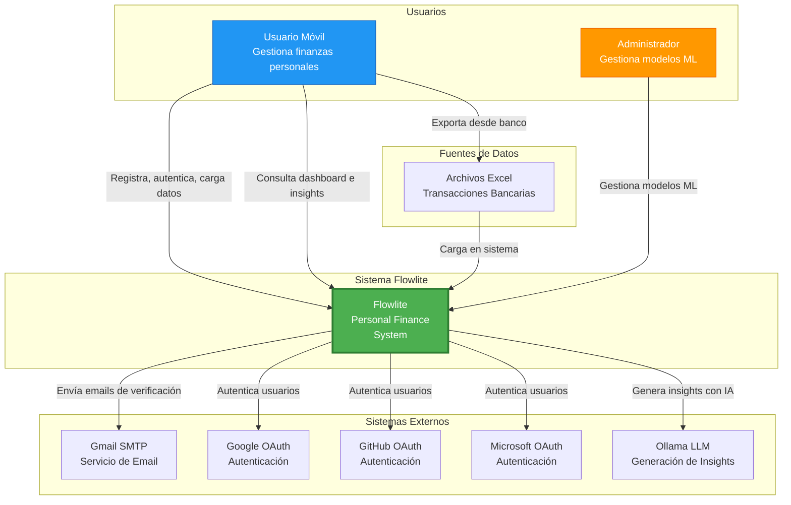

**Descripción:**
- **Usuarios Móviles:** Personas que gestionan sus finanzas personales
- **Administradores:** Personal técnico que gestiona modelos ML y configuraciones
- **Sistema Flowlite:** Sistema completo de finanzas personales
- **Sistemas Externos:** Servicios de terceros para autenticación, email y LLM

---

## 2. Vista de Contenedores (C4)

**Propósito:** Descompone el sistema en contenedores (aplicaciones, servicios, bases de datos).

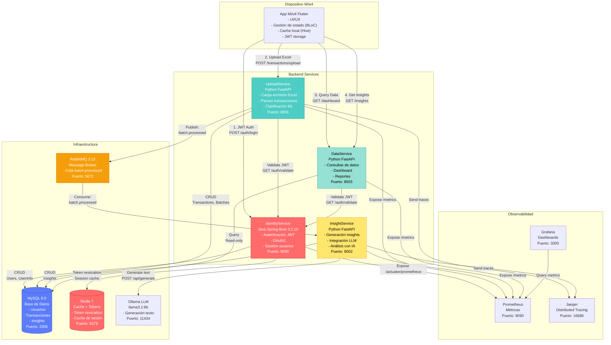

**Descripción de Tecnologías:**

| Contenedor | Tecnología | Justificación |
|------------|------------|---------------|
| **IdentityService** | Java 17 + Spring Boot 3.2.10 | Ecosistema maduro para autenticación, Spring Security robusto |
| **UploadService** | Python 3.11 + FastAPI | Excelente para ML (scikit-learn), async performance |
| **InsightService** | Python 3.11 + FastAPI | Integración nativa con Ollama y librerías ML |
| **DataService** | Python 3.11 + FastAPI | Query optimization, async DB access |
| **MySQL** | 8.0 | ACID, transacciones, relaciones complejas |
| **Redis** | 7 | High performance cache, token revocation |
| **RabbitMQ** | 3.12 | Message durability, routing flexible |
| **Ollama** | llama3.1:8b | LLM local, privacidad, sin costos API |

---

## 3. Vista de Componentes

**Propósito:** Muestra los componentes internos de cada contenedor y sus interacciones.

### 3.1 IdentityService - Componentes Internos

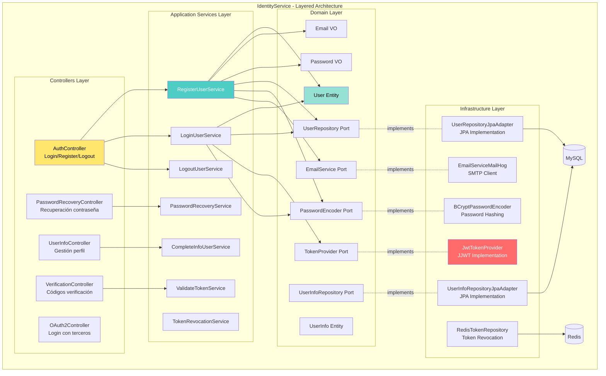

---

### 3.2 UploadService - Componentes Internos (Hexagonal)

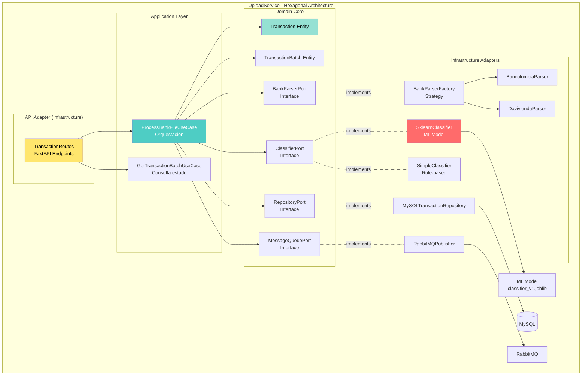

**Key Ports (Abstracciones):**
- `BankParserPort`: Abstracción para parsear diferentes bancos
- `ClassifierPort`: Abstracción para modelos ML
- `RepositoryPort`: Abstracción para persistencia
- `MessageQueuePort`: Abstracción para mensajería

---

### 3.3 InsightService - Componentes Internos (Clean Architecture)

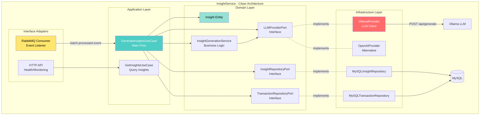

---

### 3.4 DataService - Componentes Internos (CQRS Read)

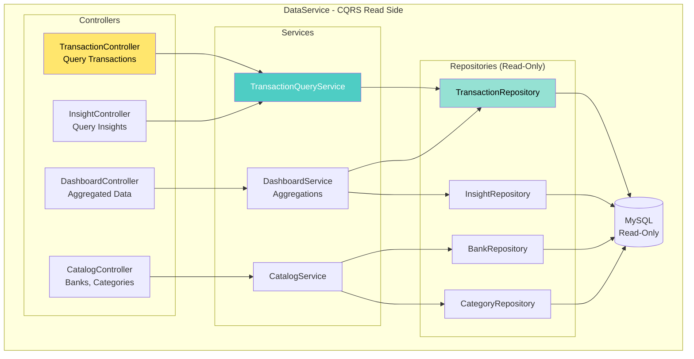

---

## 4. Vista de Módulos

**Propósito:** Muestra la organización estática del código en módulos, paquetes y dependencias.

### 4.1 IdentityService - Estructura de Módulos

```
com.flowlite.identifyservice/
│
├── application/ (Application Layer)
│ ├── dto/ (Data Transfer Objects)
│ │ ├── ResetPasswordRequest
│ │ ├── PasswordRecoveryRequest
│ │ └── UpdateUserInfoRequest
│ │
│ ├── services/ (Application Services - Use Cases)
│ │ ├── RegisterUserService
│ │ ├── LoginUserService
│ │ ├── LogoutUserService
│ │ ├── PasswordRecoveryService
│ │ ├── CompleteInfoUserService
│ │ ├── ValidateTokenService
│ │ └── TokenRevocationService
│ │
│ └── ports/ (Interfaces para Infrastructure)
│ ├── TokenProvider
│ ├── PasswordEncoder
│ └── EmailService
│
├── domain/ (Domain Layer - Core Business)
│ ├── entities/ (Aggregate Roots)
│ │ ├── User
│ │ ├── UserInfo
│ │ ├── Role
│ │ └── VerificationCode
│ │
│ ├── valueobjects/ (Value Objects)
│ │ ├── Email
│ │ ├── Password
│ │ ├── Username
│ │ └── IdentificationType
│ │
│ └── repositories/ (Repository Interfaces)
│ ├── UserRepository
│ ├── UserInfoRepository
│ └── VerificationCodeRepository
│
├── infrastructure/ (Infrastructure Layer)
│ ├── controllers/ (REST API Controllers)
│ │ ├── AuthController
│ │ ├── PasswordRecoveryController
│ │ ├── UserInfoController
│ │ ├── VerificationController
│ │ └── OAuth2Controller
│ │
│ ├── dtos/ (Infrastructure DTOs)
│ │ ├── LoginRequest
│ │ ├── RegisterRequest
│ │ └── VerifyCodeRequest
│ │
│ ├── persistence/ (JPA Implementation)
│ │ ├── entities/
│ │ │ ├── UserEntity
│ │ │ └── UserInfoEntity
│ │ ├── repositories/
│ │ │ ├── JpaUserRepository
│ │ │ ├── UserRepositoryJpaAdapter
│ │ │ └── UserInfoRepositoryJpaAdapter
│ │ └── mappers/
│ │ ├── UserMapper
│ │ └── UserInfoMapper
│ │
│ ├── security/ (Security Adapters)
│ │ ├── jwt/
│ │ │ ├── JwtTokenProvider
│ │ │ ├── JwtAuthenticationFilter
│ │ │ └── JwtProperties
│ │ ├── encoder/
│ │ │ └── BCryptPasswordEncoderAdapter
│ │ └── oauth2/
│ │ ├── OAuth2UserServiceAdapter
│ │ ├── OAuth2LoginSuccessHandler
│ │ └── OAuth2ClientConfig
│ │
│ ├── services/ (Email Implementation)
│ │ └── EmailServiceMailHog
│ │
│ ├── config/ (Configuration)
│ │ ├── SwaggerConfig
│ │ ├── RedisConfig
│ │ ├── ValidationConfig
│ │ └── EmailConfig
│ │
│ └── exception/ (Exception Handling)
│ └── GlobalExceptionHandler
│
└── IdentifyserviceApplication (Main Entry Point)
```

**Dependencias entre capas:**

```
Infrastructure → Application → Domain
       ↓ ↓
   Frameworks Use Cases Core Business
   (Spring, (Services) (Entities, VOs)
    JPA, JWT)
```

**Reglas de dependencia:**
- Domain NO puede depender de nada
- Application puede depender de Domain
- Infrastructure puede depender de Application y Domain
- Las dependencias apuntan HACIA ADENTRO (hacia Domain)

---

### 4.2 UploadService - Estructura de Módulos (Hexagonal)

```
uploadservice/
│
├── api/ (API Adapter)
│ └── routes/
│ └── transaction_routes.py
│
├── application/ (Application Layer)
│ └── use_cases/
│ ├── process_bank_file.py
│ └── get_transaction_batch.py
│
├── domain/ (Domain Core - Hexagon Center)
│ ├── entities/
│ │ ├── transaction.py
│ │ ├── transaction_batch.py
│ │ ├── bank.py
│ │ └── category.py
│ │
│ └── ports/ (Abstractions)
│ ├── bank_parser.py
│ ├── classifier.py
│ ├── repository.py
│ └── message_queue.py
│
├── infrastructure/ (Infrastructure Adapters)
│ ├── parsers/ (Bank Parser Implementations)
│ │ ├── bancolombia_parser.py
│ │ ├── davivienda_parser.py
│ │ ├── nequi_parser.py
│ │ └── factory.py
│ │
│ ├── ml/ (ML Classifier Implementations)
│ │ ├── sklearn_classifier.py
│ │ └── simple_classifier.py
│ │
│ ├── persistence/ (Repository Implementations)
│ │ └── mysql_transaction_repository.py
│ │
│ └── messaging/ (Message Queue Implementations)
│ └── rabbitmq_publisher.py
│
├── models/ (ML Models)
│ ├── classifier_v1.joblib
│ └── tfidf_vectorizer_v1.joblib
│
├── config.py (Configuration)
├── dependencies.py (Dependency Injection)
└── main.py (Entry Point)
```

**Flujo de dependencias (Hexagonal):**

```
        API Adapter
             ↓
      Application Layer
             ↓
    ← Domain (Ports) →
    ↓ ↓
 Infrastructure Infrastructure
 (Parsers) (ML)
```

---

### 4.3 InsightService - Estructura de Módulos (Clean Architecture)

```
InsightService/
│
├── interface_adapters/ (Interface Adapters Layer)
│ ├── messaging/
│ │ └── rabbitmq_consumer.py
│ └── api/
│ └── health_routes.py
│
├── application/ (Application Layer)
│ └── use_cases/
│ ├── generate_insights.py
│ └── get_insights.py
│
├── domain/ (Domain Layer - Enterprise Business)
│ ├── entities/
│ │ ├── insight.py
│ │ └── insight_category.py
│ │
│ ├── services/ (Domain Services)
│ │ └── insight_generation_service.py
│ │
│ └── ports/ (Abstractions)
│ ├── llm_provider.py
│ ├── repository.py
│ └── transaction_repository.py
│
├── infrastructure/ (Infrastructure Layer)
│ ├── llm/
│ │ ├── ollama_provider.py
│ │ └── openai_provider.py
│ │
│ └── persistence/
│ ├── mysql_insight_repository.py
│ └── mysql_transaction_repository.py
│
├── config.py
└── main.py
```

---

## 5. Vista de Componentes y Conectores

**Propósito:** Muestra el comportamiento en tiempo de ejecución, procesos, comunicación.

### Flujo Completo: Upload → Classification → Insights

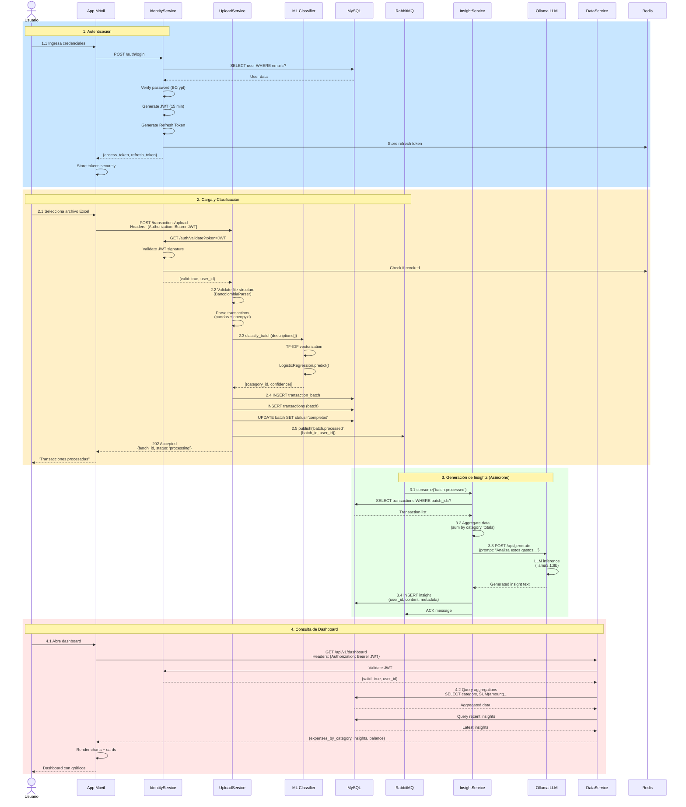

**Leyenda de Colores:**
- Azul: Autenticación
- Amarillo: Procesamiento de datos
- Verde: Generación de insights
- Rojo: Consulta y visualización

---

## 6. Vista de Deployment

**Propósito:** Muestra la infraestructura física/cloud y el mapeo de software a hardware.

### 6.1 Deployment Local/Desarrollo (Docker Compose)

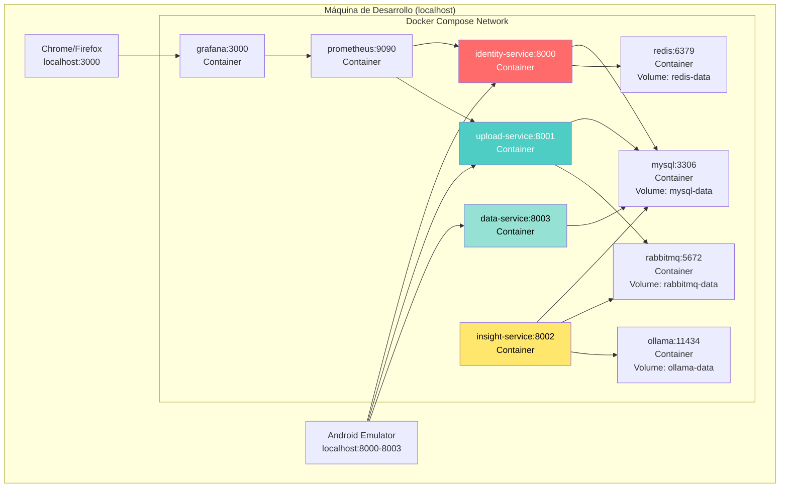

---

### 6.2 Deployment Producción (Kubernetes en Cloud)

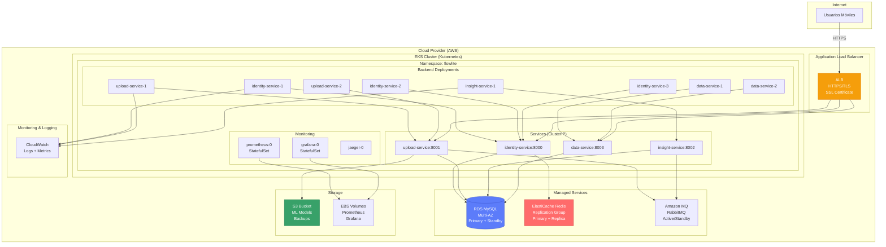

**Características del Deployment de Producción:**

| Componente | Estrategia | Configuración |
|------------|-----------|---------------|
| **Load Balancer** | Application Load Balancer | HTTPS/TLS, sticky sessions |
| **Identity Pods** | 3 réplicas mínimo | HPA: min 2, max 10 |
| **Upload Pods** | 2 réplicas mínimo | HPA: min 2, max 8 |
| **Insight Pods** | 1 réplica | HPA: min 1, max 3 |
| **Data Pods** | 2 réplicas mínimo | HPA: min 2, max 10 |
| **MySQL** | RDS Multi-AZ | Primary + Standby, auto-failover |
| **Redis** | ElastiCache Replication | Primary + Replica, auto-failover |
| **RabbitMQ** | Amazon MQ | Active/Standby cluster |
| **Storage** | S3 + EBS | S3 para modelos, EBS para Prometheus |

---

## 7. Vista de Datos

**Propósito:** Muestra el modelo de datos, esquemas de base de datos y flujo de datos.

### 7.1 Modelo de Entidad-Relación

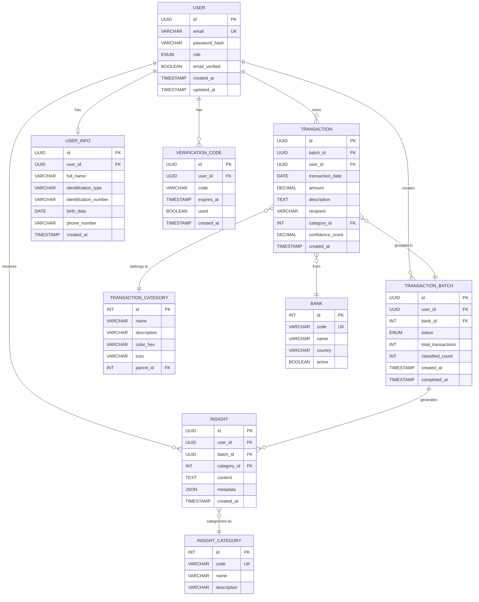

### 7.2 Esquema SQL Completo

```sql
-- ============================================
-- SCHEMA: flowlite_db
-- ============================================

-- ============================================
-- 1. USERS & AUTHENTICATION
-- ============================================

CREATE TABLE users (
    id BINARY(16) PRIMARY KEY,
    email VARCHAR(255) UNIQUE NOT NULL,
    password_hash VARCHAR(255) NOT NULL,
    role ENUM('USER', 'ADMIN') DEFAULT 'USER',
    email_verified BOOLEAN DEFAULT FALSE,
    oauth_provider VARCHAR(50),
    oauth_id VARCHAR(255),
    created_at TIMESTAMP DEFAULT CURRENT_TIMESTAMP,
    updated_at TIMESTAMP DEFAULT CURRENT_TIMESTAMP ON UPDATE CURRENT_TIMESTAMP,
    INDEX idx_email (email),
    INDEX idx_oauth (oauth_provider, oauth_id)
) ENGINE=InnoDB DEFAULT CHARSET=utf8mb4 COLLATE=utf8mb4_unicode_ci;

CREATE TABLE user_info (
    id BINARY(16) PRIMARY KEY,
    user_id BINARY(16) UNIQUE NOT NULL,
    full_name VARCHAR(255),
    identification_type VARCHAR(50),
    identification_number VARCHAR(50),
    birth_date DATE,
    phone_number VARCHAR(20),
    created_at TIMESTAMP DEFAULT CURRENT_TIMESTAMP,
    updated_at TIMESTAMP DEFAULT CURRENT_TIMESTAMP ON UPDATE CURRENT_TIMESTAMP,
    FOREIGN KEY (user_id) REFERENCES users(id) ON DELETE CASCADE,
    INDEX idx_user_id (user_id)
) ENGINE=InnoDB DEFAULT CHARSET=utf8mb4 COLLATE=utf8mb4_unicode_ci;

CREATE TABLE verification_code (
    id BINARY(16) PRIMARY KEY,
    user_id BINARY(16) NOT NULL,
    code VARCHAR(6) NOT NULL,
    expires_at TIMESTAMP NOT NULL,
    used BOOLEAN DEFAULT FALSE,
    created_at TIMESTAMP DEFAULT CURRENT_TIMESTAMP,
    FOREIGN KEY (user_id) REFERENCES users(id) ON DELETE CASCADE,
    INDEX idx_user_code (user_id, code),
    INDEX idx_expires (expires_at)
) ENGINE=InnoDB DEFAULT CHARSET=utf8mb4 COLLATE=utf8mb4_unicode_ci;

-- ============================================
-- 2. CATALOGS
-- ============================================

CREATE TABLE bank (
    id INT PRIMARY KEY AUTO_INCREMENT,
    code VARCHAR(50) UNIQUE NOT NULL,
    name VARCHAR(255) NOT NULL,
    country VARCHAR(2) DEFAULT 'CO',
    active BOOLEAN DEFAULT TRUE,
    created_at TIMESTAMP DEFAULT CURRENT_TIMESTAMP
) ENGINE=InnoDB DEFAULT CHARSET=utf8mb4 COLLATE=utf8mb4_unicode_ci;

INSERT INTO bank (code, name) VALUES
    ('bancolombia', 'Bancolombia'),
    ('davivienda', 'Davivienda'),
    ('nequi', 'Nequi'),
    ('bbva', 'BBVA Colombia');

CREATE TABLE transaction_category (
    id INT PRIMARY KEY AUTO_INCREMENT,
    name VARCHAR(100) NOT NULL,
    description TEXT,
    color_hex VARCHAR(7) DEFAULT '#6B7280',
    icon VARCHAR(50),
    parent_id INT,
    created_at TIMESTAMP DEFAULT CURRENT_TIMESTAMP,
    FOREIGN KEY (parent_id) REFERENCES transaction_category(id)
) ENGINE=InnoDB DEFAULT CHARSET=utf8mb4 COLLATE=utf8mb4_unicode_ci;

INSERT INTO transaction_category (name, description, color_hex, icon) VALUES
    ('Alimentación', 'Supermercado, restaurantes, comida', '#10B981', 'restaurant'),
    ('Transporte', 'Uber, taxi, gasolina, transporte público', '#3B82F6', 'directions_car'),
    ('Entretenimiento', 'Netflix, cine, suscripciones', '#8B5CF6', 'movie'),
    ('Servicios', 'Luz, agua, gas, internet, celular', '#F59E0B', 'miscellaneous_services'),
    ('Salud', 'Medicina, consultas, seguros', '#EF4444', 'local_hospital'),
    ('Educación', 'Cursos, libros, universidad', '#6366F1', 'school'),
    ('Vivienda', 'Arriendo, administración, reparaciones', '#EC4899', 'home'),
    ('Ropa', 'Vestuario, accesorios', '#14B8A6', 'checkroom'),
    ('Tecnología', 'Dispositivos, software, gadgets', '#06B6D4', 'devices'),
    ('Deportes', 'Gimnasio, equipamiento deportivo', '#F97316', 'fitness_center'),
    ('Ahorro', 'Inversiones, cuentas de ahorro', '#22C55E', 'savings'),
    ('Otros', 'Gastos no categorizados', '#6B7280', 'category');

CREATE TABLE insight_category (
    id INT PRIMARY KEY AUTO_INCREMENT,
    code VARCHAR(50) UNIQUE NOT NULL,
    name VARCHAR(100) NOT NULL,
    description TEXT
) ENGINE=InnoDB DEFAULT CHARSET=utf8mb4 COLLATE=utf8mb4_unicode_ci;

INSERT INTO insight_category (code, name, description) VALUES
    ('monthly_analysis', 'Análisis Mensual', 'Análisis general de gastos del mes'),
    ('spending_alert', 'Alerta de Gasto', 'Alerta cuando hay gasto excesivo en una categoría'),
    ('saving_tip', 'Consejo de Ahorro', 'Recomendación personalizada para ahorrar');

-- ============================================
-- 3. TRANSACTIONS
-- ============================================

CREATE TABLE transaction_batch (
    id BINARY(16) PRIMARY KEY,
    user_id BINARY(16) NOT NULL,
    bank_id INT NOT NULL,
    status ENUM('pending', 'processing', 'completed', 'failed') DEFAULT 'processing',
    total_transactions INT DEFAULT 0,
    classified_count INT DEFAULT 0,
    created_at TIMESTAMP DEFAULT CURRENT_TIMESTAMP,
    completed_at TIMESTAMP NULL,
    FOREIGN KEY (user_id) REFERENCES users(id) ON DELETE CASCADE,
    FOREIGN KEY (bank_id) REFERENCES bank(id),
    INDEX idx_user_id (user_id),
    INDEX idx_status (status),
    INDEX idx_created (created_at DESC)
) ENGINE=InnoDB DEFAULT CHARSET=utf8mb4 COLLATE=utf8mb4_unicode_ci;

CREATE TABLE transaction (
    id BINARY(16) PRIMARY KEY,
    batch_id BINARY(16) NOT NULL,
    user_id BINARY(16) NOT NULL,
    transaction_date DATE NOT NULL,
    amount DECIMAL(15, 2) NOT NULL,
    description TEXT NOT NULL,
    recipient VARCHAR(255),
    category_id INT,
    confidence_score DECIMAL(3, 2),
    created_at TIMESTAMP DEFAULT CURRENT_TIMESTAMP,
    FOREIGN KEY (batch_id) REFERENCES transaction_batch(id) ON DELETE CASCADE,
    FOREIGN KEY (user_id) REFERENCES users(id) ON DELETE CASCADE,
    FOREIGN KEY (category_id) REFERENCES transaction_category(id),
    INDEX idx_user_date (user_id, transaction_date DESC),
    INDEX idx_batch (batch_id),
    INDEX idx_category (category_id),
    INDEX idx_amount (amount),
    FULLTEXT idx_description (description)
) ENGINE=InnoDB DEFAULT CHARSET=utf8mb4 COLLATE=utf8mb4_unicode_ci;

-- ============================================
-- 4. INSIGHTS
-- ============================================

CREATE TABLE insights (
    id BINARY(16) PRIMARY KEY,
    user_id BINARY(16) NOT NULL,
    batch_id BINARY(16),
    category_id INT NOT NULL,
    content TEXT NOT NULL,
    metadata JSON,
    created_at TIMESTAMP DEFAULT CURRENT_TIMESTAMP,
    FOREIGN KEY (user_id) REFERENCES users(id) ON DELETE CASCADE,
    FOREIGN KEY (batch_id) REFERENCES transaction_batch(id) ON DELETE SET NULL,
    FOREIGN KEY (category_id) REFERENCES insight_category(id),
    INDEX idx_user_created (user_id, created_at DESC),
    INDEX idx_batch (batch_id),
    INDEX idx_category (category_id)
) ENGINE=InnoDB DEFAULT CHARSET=utf8mb4 COLLATE=utf8mb4_unicode_ci;

-- ============================================
-- 5. VIEWS (Para optimización de queries)
-- ============================================

-- Vista de gastos por categoría (pre-agregada)
CREATE VIEW v_expenses_by_category AS
SELECT
    user_id,
    category_id,
    tc.name AS category_name,
    tc.color_hex AS category_color,
    SUM(ABS(amount)) AS total_expenses,
    COUNT(*) AS transaction_count,
    AVG(ABS(amount)) AS avg_transaction
FROM transaction t
JOIN transaction_category tc ON t.category_id = tc.id
WHERE amount < 0 -- Solo gastos
GROUP BY user_id, category_id, tc.name, tc.color_hex;

-- Vista de insights recientes
CREATE VIEW v_recent_insights AS
SELECT
    i.id,
    i.user_id,
    i.content,
    ic.name AS category_name,
    i.created_at
FROM insights i
JOIN insight_category ic ON i.category_id = ic.id
ORDER BY i.created_at DESC;
```

### 7.3 Índices y Optimización

**Índices Principales:**

| Tabla | Índice | Tipo | Justificación |
|-------|--------|------|---------------|
| `users` | `idx_email` | UNIQUE | Login por email (búsqueda frecuente) |
| `transaction` | `idx_user_date` | COMPOSITE | Dashboard filtrado por usuario y fecha |
| `transaction` | `idx_category` | SIMPLE | Agregación por categoría |
| `transaction` | `idx_description` | FULLTEXT | Búsqueda de transacciones por texto |
| `insights` | `idx_user_created` | COMPOSITE | Consulta de insights ordenados por fecha |

**Particionado (Futuro):**

```sql
-- Particionar transacciones por año para mejorar performance
ALTER TABLE transaction
PARTITION BY RANGE (YEAR(transaction_date)) (
    PARTITION p2023 VALUES LESS THAN (2024),
    PARTITION p2024 VALUES LESS THAN (2025),
    PARTITION p2025 VALUES LESS THAN (2026),
    PARTITION p_future VALUES LESS THAN MAXVALUE
);
```

---

## 8. Vista de Seguridad

**Propósito:** Muestra mecanismos de seguridad, flujos de autenticación y protección de datos.

### 8.1 Flujo de Autenticación JWT

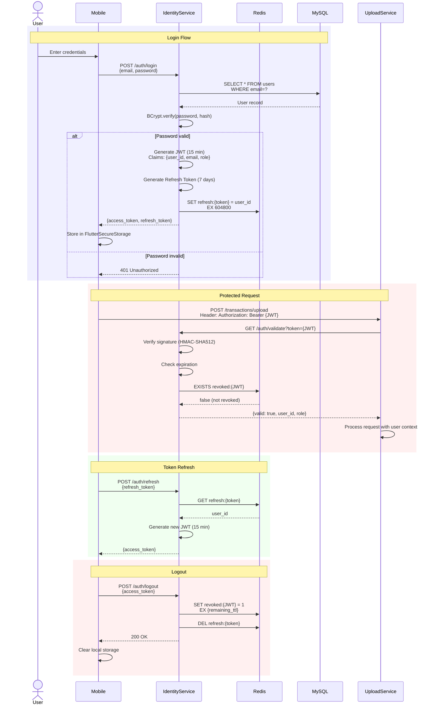

### 8.2 Mecanismos de Seguridad

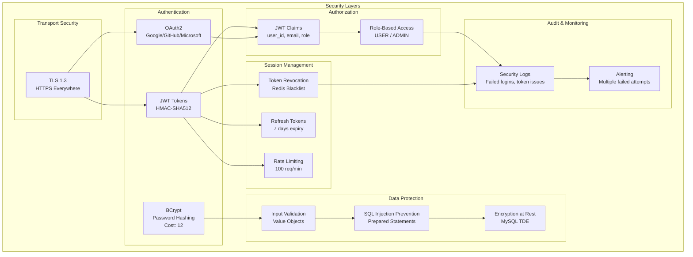

**Implementación de Seguridad por Capa:**

| Capa | Mecanismo | Implementación |
|------|-----------|----------------|
| **Transport** | TLS 1.3 | ALB/Ingress con certificados SSL |
| **Authentication** | JWT | JJWT library, HMAC-SHA512, 15 min expiry |
| **Password** | BCrypt | Cost factor: 12 (2^12 = 4096 iterations) |
| **Authorization** | RBAC | Claims en JWT: `role: ['USER', 'ADMIN']` |
| **Data** | Encryption | MySQL Transparent Data Encryption |
| **Input** | Validation | Value Objects (Email, Password) + Jakarta Validation |
| **SQL Injection** | Prepared Statements | JPA + SQLAlchemy ORM |
| **XSS** | Output Encoding | JSON serialization automática |
| **CSRF** | Token-based | JWT elimina necesidad de cookies |
| **Rate Limiting** | Redis | 100 requests/min per user |

---

### 8.3 Gestión de Secretos

**Desarrollo (Docker Compose):**

```bash
# .env file
JWT_SECRET=dev_secret_key_change_in_production
MYSQL_ROOT_PASSWORD=rootpass
MYSQL_PASSWORD=flowlite_dev
```

**Producción (Kubernetes Secrets):**

```yaml
# k8s/secrets.yaml (Base64 encoded)
apiVersion: v1
kind: Secret
metadata:
  name: app-secrets
  namespace: flowlite
type: Opaque
data:
  jwt-secret: <base64-encoded-value>
  mysql-password: <base64-encoded-value>
  rabbitmq-password: <base64-encoded-value>
```

**Mejores Prácticas:**
- Usar AWS Secrets Manager / Azure Key Vault en producción
- Rotar secretos periódicamente (cada 90 días)
- Nunca commitear secretos en Git
- Diferentes secretos por ambiente (dev, staging, prod)

---

## Conclusión

Este documento presenta las **8 vistas arquitectónicas** principales del sistema Flowlite Personal Finance:

1. **Vista de Contexto:** Sistema y actores externos
2. **Vista de Contenedores:** Servicios y tecnologías
3. **Vista de Componentes:** Estructura interna de cada servicio
4. **Vista de Módulos:** Organización del código
5. **Vista de Componentes y Conectores:** Flujos en runtime
6. **Vista de Deployment:** Infraestructura física/cloud
7. **Vista de Datos:** Modelo de datos y esquemas
8. **Vista de Seguridad:** Mecanismos de protección

Estas vistas proporcionan una comprensión completa del sistema desde múltiples perspectivas, facilitando:
- Comunicación con stakeholders
- Onboarding de nuevos desarrolladores
- Análisis de impacto de cambios
- Toma de decisiones arquitectónicas
