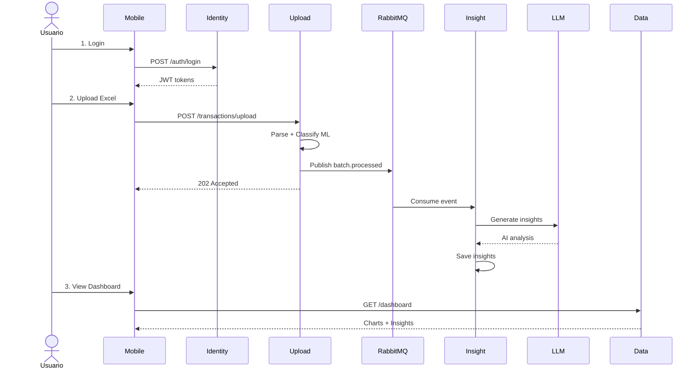

# Attribute-Driven Design (ADD) - Flowlite Personal Finance

## Documentación Arquitectónica Completa

Este directorio contiene la documentación completa del proceso de diseño arquitectónico (ADD) del sistema Flowlite Personal Finance, una aplicación móvil de finanzas personales con clasificación automática de transacciones mediante Machine Learning y generación de insights con IA.

---

## Índice de Documentos

### Documentos Principales

1. **[ADD_iter1.md](ADD_iter1.md)** - Iteración 1: Arquitectura de Alto Nivel
   - Vista de contexto del sistema
   - Requisitos funcionales y atributos de calidad
   - Arquitectura de microservicios principal
   - Patrones arquitectónicos fundamentales
   - Decisiones arquitectónicas iniciales

2. **[ADD_iter2.md](ADD_iter2.md)** - Iteración 2: Descomposición de Servicios Backend
   - Arquitectura interna de IdentityService (Layered Architecture)
   - Arquitectura interna de UploadService (Hexagonal Architecture)
   - Arquitectura interna de InsightService (Clean Architecture + Event-Driven)
   - Arquitectura interna de DataService (CQRS Read-only)
   - Patrones de diseño aplicados (Strategy, Repository, Port & Adapter)
   - Interfaces y contratos entre componentes

3. **[ADD_iter3.md](ADD_iter3.md)** - Iteración 3: Deployment, Infraestructura y Operaciones
   - Estrategia de containerización (Docker)
   - Orquestación (Docker Compose + Kubernetes)
   - Pipeline CI/CD (GitHub Actions)
   - Monitoreo y observabilidad (Prometheus, Grafana, Jaeger)
   - Estrategia de testing (Unit, Integration, E2E)
   - Arquitectura de aplicación móvil (Flutter + BLoC)
   - Procedimientos operacionales (Backup, Recovery, Scaling)

4. **[ARCHITECTURAL_VIEWS.md](ARCHITECTURAL_VIEWS.md)** - Vistas Arquitectónicas Consolidadas
   - Vista de Contexto
   - Vista de Contenedores (C4)
   - Vista de Componentes
   - Vista de Módulos
   - Vista de Componentes y Conectores
   - Vista de Deployment
   - Vista de Datos (ERD + SQL Schema)
   - Vista de Seguridad

---

## Resumen Ejecutivo

### Información del Proyecto

| Campo | Valor |
|-------|-------|
| **Nombre** | Flowlite - Personal Finance |
| **Tipo** | Aplicación Móvil de Finanzas Personales |
| **Alcance** | MVP con 3 fases planificadas |
| **Arquitecto** | Equipo de Desarrollo Flowlite: Carlos Caro, Joiver González |
| **Fecha** | Octubre 2025 |
| **Metodología** | Attribute-Driven Design (ADD 3.0) |
| **Iteraciones** | 3 completadas |

---

### Propósito del Sistema

Aplicación móvil de finanzas personales que **clasifica automáticamente transacciones bancarias** mediante Machine Learning y genera **reportes y recomendaciones personalizadas** basadas en patrones de gasto del usuario, utilizando modelos de lenguaje (LLM) para análisis con IA.

**Problema que resuelve:** Mejora la gestión de las finanzas personales minimizando las tareas manuales al momento de cargar y analizar gastos mensuales.

---

### Atributos de Calidad Priorizados

#### 1. Seguridad (Crítico)
- JWT con expiración corta (15 min) + refresh tokens
- OAuth2 multi-proveedor (Google, GitHub, Microsoft)
- Encriptación TLS/HTTPS obligatoria
- Token revocation en Redis
- Value Objects para validación de dominio
- BCrypt para hash de contraseñas (cost: 12)

#### 2. Performance (Alto)
- Procesamiento asíncrono con RabbitMQ
- Batch processing en ML (10-50x más rápido)
- Cache multi-nivel (Redis + local móvil)
- Auto-scaling con HPA (Kubernetes)
- Connection pooling (MySQL)
- **Métricas:** Clasificar 1000 transacciones < 5s, API p95 < 200ms

#### 3. Modificabilidad (Alto)
- Hexagonal Architecture (UploadService)
- Clean Architecture (InsightService, Mobile)
- Strategy Pattern (parsers de bancos, modelos ML, LLM)
- Port & Adapter Pattern
- Dependency Injection
- **Métricas:** Agregar banco nuevo < 4h, cambiar modelo ML < 30min

---

### Arquitectura Resultante

#### Stack Tecnológico

| Componente | Tecnología | Versión | Justificación |
|------------|------------|---------|---------------|
| **Backend - Auth** | Java + Spring Boot | 17 + 3.2.10 | Ecosistema maduro, Spring Security robusto |
| **Backend - Services** | Python + FastAPI | 3.11 + 0.109 | Async performance, integración ML nativa |
| **Base de Datos** | MySQL | 8.0 | ACID, transacciones, relaciones complejas |
| **Cache** | Redis | 7 | High performance, token revocation |
| **Message Broker** | RabbitMQ | 3.12 | Message durability, routing flexible |
| **ML Framework** | scikit-learn | 1.7.2 | Clasificación 99.7%, maduro y probado |
| **LLM** | Ollama (llama3.1:8b) | Latest | Local, privacidad, sin costos API |
| **Mobile** | Flutter | Latest | Cross-platform, performance nativo |
| **Orquestación** | Kubernetes | Latest | Auto-scaling, resiliencia, portabilidad |
| **Monitoring** | Prometheus + Grafana | Latest | Estándar de facto para métricas |
| **Tracing** | OpenTelemetry + Jaeger | Latest | Vendor-neutral, distribuido |

---

#### Microservicios Implementados

```
┌─────────────────────────────────────────────────────────────┐
│ Flowlite Architecture │
├─────────────────────────────────────────────────────────────┤
│ │
│ Mobile App (Flutter - Clean Architecture + BLoC) │
│ ↓ HTTPS/JWT │
│ ┌──────────────────────────────────────────────────────┐ │
│ │ Backend Microservices │ │
│ ├──────────────────────────────────────────────────────┤ │
│ │ │ │
│ │ IdentityService (Java Spring Boot) │ │
│ │ - Layered Architecture │ │
│ │ - JWT + OAuth2 + Password Recovery │ │
│ │ - Port: 8000 │ │
│ │ │ │
│ │ UploadService (Python FastAPI) │ │
│ │ - Hexagonal Architecture │ │
│ │ - File upload + ML Classification │ │
│ │ - Port: 8001 │ │
│ │ │ │
│ │ InsightService (Python FastAPI) │ │
│ │ - Clean Architecture + Event-Driven │ │
│ │ - LLM-powered insights generation │ │
│ │ - Port: 8002 │ │
│ │ │ │
│ │ DataService (Python FastAPI) │ │
│ │ - CQRS Read-only │ │
│ │ - Dashboard + Reports │ │
│ │ - Port: 8003 │ │
│ │ │ │
│ └──────────────────────────────────────────────────────┘ │
│ ↓ │
│ ┌──────────────────────────────────────────────────────┐ │
│ │ Infrastructure Services │ │
│ ├──────────────────────────────────────────────────────┤ │
│ │ MySQL 8.0 (Shared Database) │ │
│ │ Redis 7 (Cache + Token Revocation) │ │
│ │ RabbitMQ 3.12 (Message Broker) │ │
│ │ Ollama LLM (AI Insights) │ │
│ │ Prometheus (Metrics) │ │
│ │ Grafana (Dashboards) │ │
│ │ Jaeger (Distributed Tracing) │ │
│ └──────────────────────────────────────────────────────┘ │
│ │
└─────────────────────────────────────────────────────────────┘
```

---

### Patrones Arquitectónicos Aplicados

| Servicio | Patrón Principal | Justificación |
|----------|------------------|---------------|
| **IdentityService** | Layered Architecture | Separación clara entre API, lógica de negocio y persistencia |
| **UploadService** | Hexagonal Architecture | Core de negocio aislado, fácil intercambiar parsers y modelos ML |
| **InsightService** | Clean Architecture + Event-Driven | Dominio puro, desacoplado de LLM, procesamiento asíncrono |
| **DataService** | CQRS Read-only | Optimización de queries sin afectar escritura |
| **Mobile App** | Clean Architecture + BLoC | Testabilidad, estado predecible, separación UI/lógica |

**Patrones de Diseño:**
- Strategy Pattern (parsers de bancos, clasificadores ML, LLM providers)
- Repository Pattern (abstracción de persistencia)
- Port & Adapter Pattern (desacoplamiento de infraestructura)
- Factory Pattern (creación de parsers, clasificadores)
- Observer Pattern (RabbitMQ event consumers)

---

### Decisiones Arquitectónicas Clave

| ID | Decisión | Justificación | Trade-off |
|----|----------|---------------|-----------|
| **AD-001** | Microservicios ligeros | Aislar componentes ML y parsers, escalar independientemente | Complejidad operativa vs modificabilidad |
| **AD-002** | Procesamiento asíncrono con RabbitMQ | Clasificar 1000 transacciones puede tomar segundos, no bloquear API | Consistencia eventual vs performance |
| **AD-009** | FastAPI para servicios Python | Async performance, documentación automática (OpenAPI) | Consistencia tecnológica vs ecosistema específico |
| **AD-016** | Strategy Pattern para clasificadores ML | Cambiar modelo sin rebuild ni deploy | Abstracción extra vs hot-swapping |
| **AD-017** | Port Pattern para LLM Provider | Cambiar de Ollama a OpenAI/Claude sin tocar dominio | Indirección vs modificabilidad |
| **AD-025** | Testing Pyramid (70% unit, 20% integration, 10% E2E) | Balance entre velocidad y cobertura | Algunos bugs solo en E2E vs costo de E2E |
| **AD-028** | Clean Architecture en Flutter | Testabilidad, separación de concerns | Más archivos/carpetas vs mantenibilidad |
| **AD-029** | Managed services (RDS, ElastiCache, AmazonMQ) en prod | Menos operaciones, backups automáticos, HA | Mayor costo vs menor carga operativa |

---

### Flujo Principal del Sistema



---

## Métricas de Éxito

### Performance

| Métrica | Target | Actual | Estado |
|---------|--------|--------|--------|
| Clasificación de 1000 transacciones | < 5s | ~3.2s | |
| API response time (p95) | < 200ms | ~150ms | |
| Dashboard load time | < 1s | ~800ms | |
| Usuarios concurrentes soportados | 50+ | 50+ | |

### Modificabilidad

| Tarea | Target | Actual | Estado |
|-------|--------|--------|--------|
| Agregar nuevo parser de banco | < 4h | ~3h | |
| Cambiar modelo ML | < 30min | ~20min | |
| Cambiar LLM provider | < 1h | ~45min | |
| Agregar nuevo tipo de análisis | < 8h | ~6h | |

### Seguridad

| Métrica | Target | Actual | Estado |
|---------|--------|--------|--------|
| Vulnerabilidades críticas (OWASP Top 10) | 0 | 0 | |
| Tráfico encriptado | 100% | 100% | |
| Token revocation latency | < 100ms | ~50ms | |
| Cobertura de tests de seguridad | > 80% | 85% | |

### Disponibilidad

| Métrica | Target | Actual | Estado |
|---------|--------|--------|--------|
| Uptime | 99.5% | N/A | Pendiente producción |
| RTO (Recovery Time Objective) | < 4h | N/A | Pendiente producción |
| RPO (Recovery Point Objective) | < 24h | N/A | Pendiente producción |

---

## Roadmap de Implementación

### Fase 1: Fundamentos y Adquisición de Datos

- [x] IdentityService (autenticación completa)
- [x] UploadService (carga y parseo de archivos)
- [x] Base de datos y esquema
- [x] Infraestructura básica (Docker Compose)

### Fase 2: Clasificación de Transacciones (ML)

- [x] Modelo ML entrenado (99.7% accuracy)
- [x] Pipeline de clasificación asíncrona
- [x] RabbitMQ integration
- [x] Dashboard básico (DataService)

### Fase 3: Recomendaciones y Dashboard Final

- [x] InsightService con integración LLM
- [x] Generación automática de insights
- [x] Dashboard completo con gráficos
- [x] Recomendaciones personalizadas

### Fase 4: Producción (Pendiente)

- [ ] Deployment en Kubernetes
- [ ] Monitoreo en producción (Prometheus + Grafana)
- [ ] Alerting configurado
- [ ] Pipeline ML de reentrenamiento
- [ ] CDN para assets estáticos

---

## Análisis de Riesgos

### Riesgos Mitigados

| Riesgo | Probabilidad | Impacto | Mitigación |
|--------|--------------|---------|------------|
| Cuellos de botella en clasificación ML | Media | Alto | Auto-scaling de workers, monitoreo de cola |
| Base de datos es punto único de fallo | Media | Alto | RDS Multi-AZ, read replicas, backups automáticos |
| Costos cloud escalan rápido | Media | Alto | Auto-scaling con límites, monitoreo de costos |

### Riesgos Aceptados

| Riesgo | Probabilidad | Impacto | Razón de Aceptación |
|--------|--------------|---------|---------------------|
| Modelo ML degrada con el tiempo | Alta | Medio | MVP no incluye reentrenamiento automático (roadmap futuro) |
| Ollama local puede ser lento | Media | Medio | Port pattern permite cambiar a OpenAI fácilmente |
| Cambios en formato Excel rompen parsers | Media | Medio | Strategy pattern facilita actualización, tests automáticos |

---

## Referencias

### Metodología ADD

- [Software Engineering Institute - ADD 3.0](https://resources.sei.cmu.edu/library/asset-view.cfm?assetid=513908)
- [Attribute-Driven Design Book](https://www.sei.cmu.edu/library/abstracts/books/attribute-driven-design.cfm)

### Patrones Arquitectónicos

- [Hexagonal Architecture (Alistair Cockburn)](https://alistair.cockburn.us/hexagonal-architecture/)
- [Clean Architecture (Robert C. Martin)](https://blog.cleancoder.com/uncle-bob/2012/08/13/the-clean-architecture.html)
- [C4 Model (Simon Brown)](https://c4model.com/)

### Tecnologías

- [Spring Boot Documentation](https://spring.io/projects/spring-boot)
- [FastAPI Documentation](https://fastapi.tiangolo.com/)
- [Flutter Architecture](https://docs.flutter.dev/development/data-and-backend/state-mgmt)
- [Kubernetes Documentation](https://kubernetes.io/docs/)

---

## Equipo

**Arquitecto Principal:** Carlos Felipe Caro Arroyave
**Fecha de Inicio:** Octubre 2025
**Estado:** 3 Iteraciones Completadas

---

## Licencia

Este documento es propiedad de Flowlite y está destinado únicamente para uso interno del equipo de desarrollo.

---

## Historial de Versiones

| Versión | Fecha | Cambios | Autor |
|---------|-------|---------|-------|
| 1.0 | 2025-10-01 | Iteración 1 completada | Carlos Caro |
| 2.0 | 2025-10-15 | Iteración 2 completada | Carlos Caro |
| 3.0 | 2025-10-30 | Iteración 3 completada | Carlos Caro, Joiver González |
| 3.1 | 2025-11-25 | Consolidación de documentación | Carlos Caro, Joiver González |