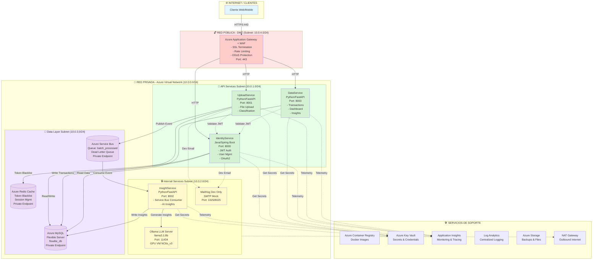
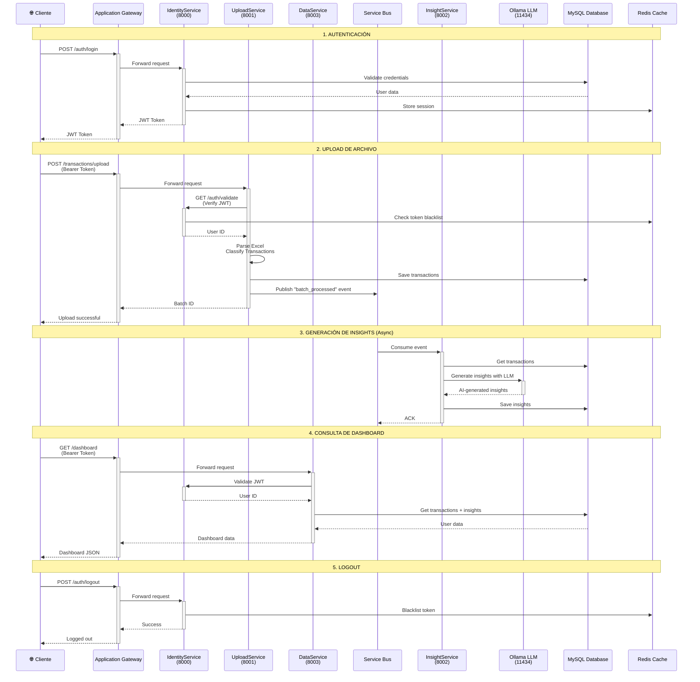
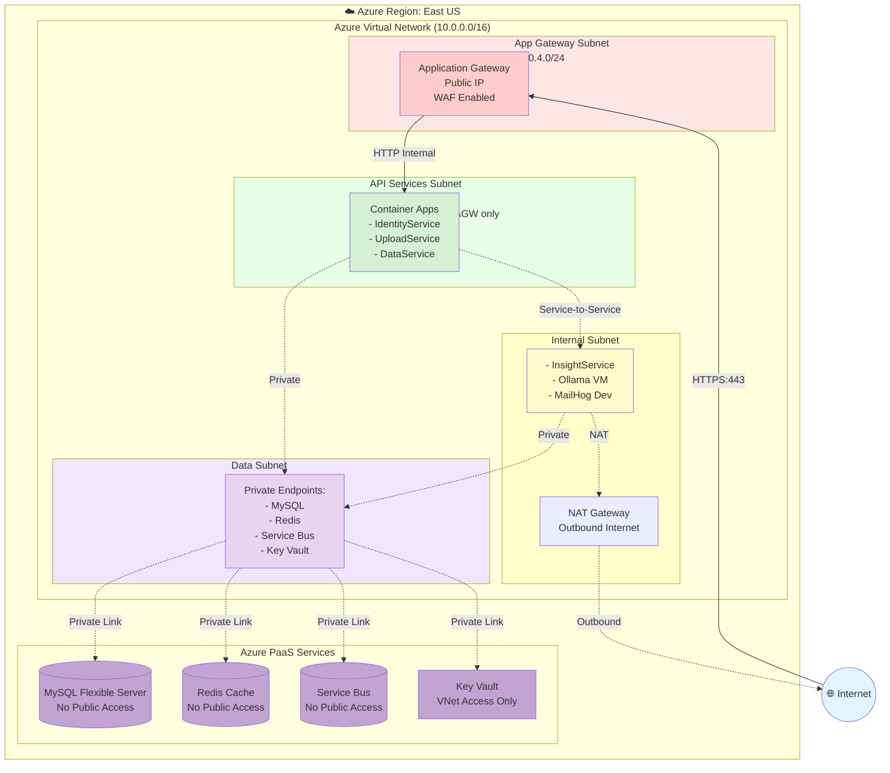
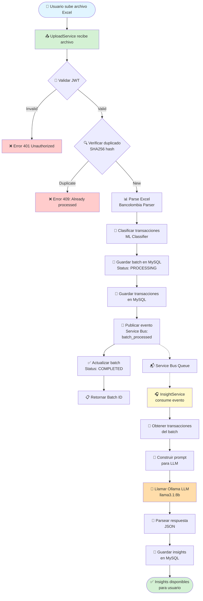
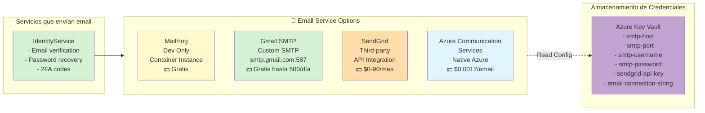

# Arquitectura Azure - Flowlite Personal Finance

## Diagrama de Arquitectura General

## Diagrama de Comunicación entre Servicios (Sequence Diagram)

## Diagrama de Red y Seguridad (Network Architecture)

## Flujo de Procesamiento de Archivos

## Flujo de Email Service

## Tabla de Comunicación entre Servicios

| Servicio Origen | Servicio Destino | Protocolo | Puerto | Tipo de Red | Propósito |
|----------------|------------------|-----------|--------|-------------|-----------|
| Internet | Application Gateway | HTTPS | 443 | Pública → DMZ | Entrada clientes |
| App Gateway | IdentityService | HTTP | 8000 | DMZ → Privada | Auth requests |
| App Gateway | UploadService | HTTP | 8001 | DMZ → Privada | File uploads |
| App Gateway | DataService | HTTP | 8003 | DMZ → Privada | Data queries |
| UploadService | IdentityService | HTTP | 8000 | Privada → Privada | JWT validation |
| DataService | IdentityService | HTTP | 8000 | Privada → Privada | JWT validation |
| UploadService | MySQL | MySQL | 3306 | Privada → Privada | Write transactions |
| DataService | MySQL | MySQL | 3306 | Privada → Privada | Read data |
| IdentityService | MySQL | MySQL | 3306 | Privada → Privada | User management |
| InsightService | MySQL | MySQL | 3306 | Privada → Privada | Read/Write insights |
| IdentityService | Redis | Redis | 6379 | Privada → Privada | Token blacklist |
| UploadService | Service Bus | AMQP | 5671 | Privada → Privada | Publish events |
| InsightService | Service Bus | AMQP | 5671 | Privada → Privada | Consume events |
| InsightService | Ollama LLM | HTTP | 11434 | Privada → Privada | Generate insights |

## Estrategia de Seguridad por Capas

### Capa 1: Perímetro (Red Pública)
- **Application Gateway con WAF**: Protección contra OWASP Top 10
- **DDoS Protection Standard**: Protección contra ataques volumétricos
- **SSL/TLS Termination**: Certificados gestionados por Azure
- **Rate Limiting**: Límites por IP y por endpoint

### Capa 2: Red Privada (API Services)
- **Network Security Groups (NSG)**: Reglas de firewall por subnet
- **Acceso solo desde Application Gateway**: No exposición directa
- **Service Endpoints**: Conexión privada a servicios Azure
- **Managed Identities**: No credenciales hardcodeadas

### Capa 3: Servicios Internos
- **No acceso público**: InsightService solo accesible internamente
- **Comunicación interna exclusiva**: No rutas a Internet
- **Ollama LLM aislado**: Solo accesible por InsightService

### Capa 4: Capa de Datos
- **Private Endpoints**: MySQL, Redis, Service Bus sin IP pública
- **Encryption at Rest**: Datos cifrados en reposo (Azure Disk Encryption)
- **Encryption in Transit**: TLS 1.2+ obligatorio
- **Firewall Rules**: Solo acceso desde VNet privada
- **Backups automatizados**: Retención 30 días

### Capa 5: Gestión de Secretos
- **Azure Key Vault**: Todas las credenciales y secretos
- **Managed Identities**: Acceso sin credenciales explícitas
- **Secret Rotation**: Rotación automática de secretos

## Escalabilidad y Alta Disponibilidad

### Estrategia de Escalado

**Servicios API (Identity, Upload, Data)**:
- Azure Kubernetes Service (AKS) o Azure Container Apps
- Horizontal Pod Autoscaling (HPA): 2-10 replicas
- Métricas: CPU > 70%, Memory > 80%, Request Rate

**InsightService**:
- Escalado basado en cola: Service Bus Queue Length
- 1-5 replicas según volumen de mensajes

**Base de Datos**:
- Azure Database for MySQL Flexible Server
- Escalado vertical automático (CPU/Memory)
- Read Replicas para consultas de DataService

**Redis**:
- Azure Cache for Redis Premium Tier
- Clustering habilitado (99.95% SLA)

**Ollama LLM**:
- GPU VM (Standard_NC6s_v3 o superior)
- Escalado manual según demanda
- Considerar Azure OpenAI como alternativa gestionada

### Alta Disponibilidad

- **Multi-AZ Deployment**: Servicios distribuidos en múltiples zonas
- **Health Probes**: Liveness y Readiness checks en todos los servicios
- **Circuit Breaker**: Implementado en llamadas entre servicios
- **Retry Logic**: Reintentos exponenciales con backoff
- **Database HA**: Zone-redundant deployment
- **SLA Target**: 99.9% uptime

## Monitoreo y Observabilidad

### Application Insights
- Telemetría de aplicación en tiempo real
- Distributed Tracing entre servicios
- Performance metrics (latencia, throughput)
- Exception tracking

### Azure Monitor
- Logs centralizados (Log Analytics Workspace)
- Alertas automatizadas (CPU, Memory, Errors)
- Dashboards personalizados

### Métricas Clave
- Request Rate (req/s)
- Response Time (p50, p95, p99)
- Error Rate (%)
- Database Connection Pool
- Queue Length (Service Bus)
- LLM Response Time

## Estimación de Costos (Región: East US)

| Recurso | SKU/Tier | Costo Mensual Estimado |
|---------|----------|------------------------|
| Application Gateway | WAF V2 (1 instancia) | ~$250 |
| AKS Cluster | 2x Standard_D4s_v3 | ~$280 |
| Azure MySQL | Flexible B2s (2 vCPU, 4GB) | ~$85 |
| Azure Redis | Premium P1 (6GB) | ~$170 |
| Azure Service Bus | Premium (1 MU) | ~$670 |
| Ollama VM | NC6s_v3 (GPU) | ~$900 |
| Azure Container Registry | Basic | ~$5 |
| Key Vault | Standard | ~$5 |
| Application Insights | Standard | ~$50 |
| Storage Account | Standard LRS | ~$20 |
| **TOTAL ESTIMADO** | | **~$2,435/mes** |

**Notas**:
- Costos pueden variar según región y uso real
- Considerar Azure Reserved Instances para reducir costos (30-50%)
- Service Bus Premium puede reemplazarse con RabbitMQ en ACI (~$30/mes)
- Azure OpenAI puede ser más económico que Ollama VM para producción

## Alternativas de Optimización de Costos

### Opción Económica (Dev/Staging)
- AKS → Azure Container Apps (~$100/mes)
- MySQL Flexible → Burstable B1ms (~$15/mes)
- Redis Premium → Standard C1 (~$15/mes)
- Service Bus Premium → Standard Tier (~$10/mes)
- Ollama VM → Azure OpenAI Pay-as-you-go (~$50/mes estimado)
- **TOTAL: ~$500-700/mes**

### Opción Serverless (Mínimo costo en idle)
- Azure Container Apps con scale-to-zero
- Azure Database for MySQL Serverless (próximamente)
- Redis on-demand scaling
- Azure OpenAI (pago por uso)
- **TOTAL: ~$200-400/mes con tráfico bajo**

## Roadmap de Implementación

### Fase 1: Infraestructura Base (Semana 1)
- ✅ Crear Resource Group
- ✅ Configurar Virtual Network y Subnets
- ✅ Desplegar Azure MySQL
- ✅ Desplegar Azure Redis
- ✅ Configurar Azure Container Registry
- ✅ Setup Key Vault

### Fase 2: Servicios Core (Semana 2)
- ✅ Desplegar IdentityService
- ✅ Desplegar UploadService
- ✅ Desplegar DataService
- ✅ Configurar Service Bus / RabbitMQ

### Fase 3: Servicios AI (Semana 3)
- ✅ Desplegar Ollama VM o configurar Azure OpenAI
- ✅ Desplegar InsightService
- ✅ Integrar cola de mensajes

### Fase 4: Seguridad y Networking (Semana 4)
- ✅ Configurar Application Gateway + WAF
- ✅ Implementar NSGs y Private Endpoints
- ✅ Configurar Managed Identities

### Fase 5: Monitoreo y Optimización (Semana 5)
- ✅ Configurar Application Insights
- ✅ Setup alertas y dashboards
- ✅ Performance testing y tuning

## Próximos Pasos

1. **Revisar y aprobar arquitectura**: Validar diseño con equipo
2. **Ejecutar Terraform**: `terraform init && terraform plan && terraform apply`
3. **Configurar CI/CD**: Azure DevOps o GitHub Actions
4. **Migrar datos**: Importar datos existentes a Azure MySQL
5. **Testing**: Pruebas de integración y carga
6. **Go Live**: Despliegue gradual con canary deployments
