# Arquitectura Azure - Flowlite Personal Finance

## Diagrama de Arquitectura General

## Diagrama de Comunicación entre Servicios (Sequence Diagram)

```mermaid
sequenceDiagram
    participant Client as 🌐 Cliente
    participant AGW as Application Gateway
    participant Identity as IdentityService<br/>(8000)
    participant Upload as UploadService<br/>(8001)
    participant Data as DataService<br/>(8003)
    participant SB as Service Bus
    participant Insight as InsightService<br/>(8002)
    participant Ollama as Ollama LLM<br/>(11434)
    participant MySQL as MySQL Database
    participant Redis as Redis Cache

    Note over Client,Redis: 1. AUTENTICACIÓN
    Client->>+AGW: POST /auth/login
    AGW->>+Identity: Forward request
    Identity->>MySQL: Validate credentials
    MySQL-->>Identity: User data
    Identity->>Redis: Store session
    Identity-->>-AGW: JWT Token
    AGW-->>-Client: JWT Token

    Note over Client,Redis: 2. UPLOAD DE ARCHIVO
    Client->>+AGW: POST /transactions/upload<br/>(Bearer Token)
    AGW->>+Upload: Forward request
    Upload->>+Identity: GET /auth/validate<br/>(Verify JWT)
    Identity->>Redis: Check token blacklist
    Identity-->>-Upload: User ID
    Upload->>Upload: Parse Excel<br/>Classify Transactions
    Upload->>MySQL: Save transactions
    Upload->>SB: Publish "batch_processed" event
    Upload-->>-AGW: Batch ID
    AGW-->>-Client: Upload successful

    Note over Client,Redis: 3. GENERACIÓN DE INSIGHTS (Async)
    SB->>+Insight: Consume event
    Insight->>MySQL: Get transactions
    Insight->>+Ollama: Generate insights with LLM
    Ollama-->>-Insight: AI-generated insights
    Insight->>MySQL: Save insights
    Insight-->>-SB: ACK

    Note over Client,Redis: 4. CONSULTA DE DASHBOARD
    Client->>+AGW: GET /dashboard<br/>(Bearer Token)
    AGW->>+Data: Forward request
    Data->>+Identity: Validate JWT
    Identity-->>-Data: User ID
    Data->>MySQL: Get transactions + insights
    MySQL-->>Data: User data
    Data-->>-AGW: Dashboard data
    AGW-->>-Client: Dashboard JSON

    Note over Client,Redis: 5. LOGOUT
    Client->>+AGW: POST /auth/logout
    AGW->>+Identity: Forward request
    Identity->>Redis: Blacklist token
    Identity-->>-AGW: Success
    AGW-->>-Client: Logged out
```

## Diagrama de Red y Seguridad (Network Architecture)

```mermaid
graph TB
    subgraph AzureRegion["☁️ Azure Region: East US"]
        subgraph VNet["Azure Virtual Network (10.0.0.0/16)"]

            subgraph AGWSubnet["App Gateway Subnet<br/>10.0.4.0/24"]
                AppGW[Application Gateway<br/>Public IP<br/>WAF Enabled]
            end

            subgraph APISubnet["API Services Subnet<br/>10.0.1.0/24<br/>🔒 NSG: Allow from AGW only"]
                ContainerApps[Container Apps<br/>- IdentityService<br/>- UploadService<br/>- DataService]
            end

            subgraph InternalSubnet["Internal Subnet<br/>10.0.2.0/24<br/>🔒 NSG: VNet only"]
                InternalServices[- InsightService<br/>- Ollama VM<br/>- MailHog Dev]
                NATGateway[NAT Gateway<br/>Outbound Internet]
            end

            subgraph DataSubnet["Data Subnet<br/>10.0.3.0/24<br/>🔒 NSG: VNet only<br/>Private Endpoints"]
                PrivateEndpoints[Private Endpoints:<br/>- MySQL<br/>- Redis<br/>- Service Bus<br/>- Key Vault]
            end
        end

        subgraph PaaS["Azure PaaS Services"]
            MySQLServer[(MySQL Flexible Server<br/>No Public Access)]
            RedisCache[(Redis Cache<br/>No Public Access)]
            ServiceBusSvc[(Service Bus<br/>No Public Access)]
            KeyVaultSvc[Key Vault<br/>VNet Access Only]
        end
    end

    Internet((🌐 Internet)) -->|HTTPS:443| AppGW
    AppGW -->|HTTP Internal| ContainerApps
    ContainerApps -.->|Service-to-Service| InternalServices
    InternalServices -.->|NAT| NATGateway
    NATGateway -.->|Outbound| Internet

    PrivateEndpoints -.->|Private Link| MySQLServer
    PrivateEndpoints -.->|Private Link| RedisCache
    PrivateEndpoints -.->|Private Link| ServiceBusSvc
    PrivateEndpoints -.->|Private Link| KeyVaultSvc

    ContainerApps -.->|Private| PrivateEndpoints
    InternalServices -.->|Private| PrivateEndpoints

    style Internet fill:#e1f5ff
    style AppGW fill:#ffcccc
    style ContainerApps fill:#d4f1d4
    style InternalServices fill:#fff9cc
    style PrivateEndpoints fill:#e8d4f1
    style MySQLServer fill:#c2a3d1
    style RedisCache fill:#c2a3d1
    style ServiceBusSvc fill:#c2a3d1
    style KeyVaultSvc fill:#c2a3d1
    style AGWSubnet fill:#ffe6e6
    style APISubnet fill:#e6ffe6
    style InternalSubnet fill:#ffffcc
    style DataSubnet fill:#f0e6ff
```

## Flujo de Procesamiento de Archivos

```mermaid
flowchart TD
    Start([👤 Usuario sube archivo Excel]) --> Upload[📤 UploadService recibe archivo]
    Upload --> Validate{🔐 Validar JWT}
    Validate -->|Invalid| Error1[❌ Error 401 Unauthorized]
    Validate -->|Valid| CheckDup{🔍 Verificar duplicado<br/>SHA256 hash}
    CheckDup -->|Duplicate| Error2[❌ Error 409: Already processed]
    CheckDup -->|New| Parse[📊 Parse Excel<br/>Bancolombia Parser]
    Parse --> Classify[🤖 Clasificar transacciones<br/>ML Classifier]
    Classify --> SaveBatch[💾 Guardar batch en MySQL<br/>Status: PROCESSING]
    SaveBatch --> SaveTx[💾 Guardar transacciones<br/>en MySQL]
    SaveTx --> Publish[📨 Publicar evento<br/>Service Bus:<br/>batch_processed]
    Publish --> UpdateBatch[✅ Actualizar batch<br/>Status: COMPLETED]
    UpdateBatch --> Return[📋 Retornar Batch ID]

    Publish -.-> Queue[📬 Service Bus Queue]
    Queue -.-> Consume[🎧 InsightService<br/>consume evento]
    Consume --> GetTx[📖 Obtener transacciones<br/>del batch]
    GetTx --> BuildPrompt[🔨 Construir prompt<br/>para LLM]
    BuildPrompt --> CallLLM[🤖 Llamar Ollama LLM<br/>llama3.1:8b]
    CallLLM --> ParseResponse[📝 Parsear respuesta<br/>JSON]
    ParseResponse --> SaveInsights[💾 Guardar insights<br/>en MySQL]
    SaveInsights --> Done([✅ Insights disponibles<br/>para usuario])

    style Start fill:#e1f5ff
    style Upload fill:#d4f1d4
    style Consume fill:#fff9cc
    style CallLLM fill:#ffddaa
    style Done fill:#d4f1d4
    style Error1 fill:#ffcccc
    style Error2 fill:#ffcccc
```

## Flujo de Email Service

```mermaid
flowchart LR
    subgraph EmailOptions["📧 Email Service Options"]
        MailHog[MailHog<br/>Dev Only<br/>Container Instance<br/>💵 Gratis]
        Gmail[Gmail SMTP<br/>Custom SMTP<br/>smtp.gmail.com:587<br/>💵 Gratis hasta 500/día]
        SendGrid[SendGrid<br/>Third-party<br/>API Integration<br/>💵 $0-90/mes]
        AzureComm[Azure Communication<br/>Services<br/>Native Azure<br/>💵 $0.0012/email]
    end

    subgraph Services["Servicios que envían email"]
        Identity[IdentityService<br/>- Email verification<br/>- Password recovery<br/>- 2FA codes]
    end

    subgraph Storage["Almacenamiento de Credenciales"]
        KeyVault[Azure Key Vault<br/>- smtp-host<br/>- smtp-port<br/>- smtp-username<br/>- smtp-password<br/>- sendgrid-api-key<br/>- email-connection-string]
    end

    Identity --> EmailOptions
    EmailOptions -.->|Read Config| KeyVault

    style MailHog fill:#fff9cc
    style Gmail fill:#d4f1d4
    style SendGrid fill:#ffddaa
    style AzureComm fill:#e1f5ff
    style Identity fill:#d4f1d4
    style KeyVault fill:#c2a3d1
```

## Tabla de Comunicación entre Servicios

| Servicio Origen | Servicio Destino | Protocolo | Puerto | Tipo de Red | Propósito |
|----------------|------------------|-----------|--------|-------------|-----------|
| Internet | Application Gateway | HTTPS | 443 | Pública → DMZ | Entrada clientes |
| App Gateway | IdentityService | HTTP | 8000 | DMZ → Privada | Auth requests |
| App Gateway | UploadService | HTTP | 8001 | DMZ → Privada | File uploads |
| App Gateway | DataService | HTTP | 8003 | DMZ → Privada | Data queries |
| UploadService | IdentityService | HTTP | 8000 | Privada → Privada | JWT validation |
| DataService | IdentityService | HTTP | 8000 | Privada → Privada | JWT validation |
| UploadService | MySQL | MySQL | 3306 | Privada → Privada | Write transactions |
| DataService | MySQL | MySQL | 3306 | Privada → Privada | Read data |
| IdentityService | MySQL | MySQL | 3306 | Privada → Privada | User management |
| InsightService | MySQL | MySQL | 3306 | Privada → Privada | Read/Write insights |
| IdentityService | Redis | Redis | 6379 | Privada → Privada | Token blacklist |
| UploadService | Service Bus | AMQP | 5671 | Privada → Privada | Publish events |
| InsightService | Service Bus | AMQP | 5671 | Privada → Privada | Consume events |
| InsightService | Ollama LLM | HTTP | 11434 | Privada → Privada | Generate insights |

## Estrategia de Seguridad por Capas

### Capa 1: Perímetro (Red Pública)
- **Application Gateway con WAF**: Protección contra OWASP Top 10
- **DDoS Protection Standard**: Protección contra ataques volumétricos
- **SSL/TLS Termination**: Certificados gestionados por Azure
- **Rate Limiting**: Límites por IP y por endpoint

### Capa 2: Red Privada (API Services)
- **Network Security Groups (NSG)**: Reglas de firewall por subnet
- **Acceso solo desde Application Gateway**: No exposición directa
- **Service Endpoints**: Conexión privada a servicios Azure
- **Managed Identities**: No credenciales hardcodeadas

### Capa 3: Servicios Internos
- **No acceso público**: InsightService solo accesible internamente
- **Comunicación interna exclusiva**: No rutas a Internet
- **Ollama LLM aislado**: Solo accesible por InsightService

### Capa 4: Capa de Datos
- **Private Endpoints**: MySQL, Redis, Service Bus sin IP pública
- **Encryption at Rest**: Datos cifrados en reposo (Azure Disk Encryption)
- **Encryption in Transit**: TLS 1.2+ obligatorio
- **Firewall Rules**: Solo acceso desde VNet privada
- **Backups automatizados**: Retención 30 días

### Capa 5: Gestión de Secretos
- **Azure Key Vault**: Todas las credenciales y secretos
- **Managed Identities**: Acceso sin credenciales explícitas
- **Secret Rotation**: Rotación automática de secretos

## Escalabilidad y Alta Disponibilidad

### Estrategia de Escalado

**Servicios API (Identity, Upload, Data)**:
- Azure Kubernetes Service (AKS) o Azure Container Apps
- Horizontal Pod Autoscaling (HPA): 2-10 replicas
- Métricas: CPU > 70%, Memory > 80%, Request Rate

**InsightService**:
- Escalado basado en cola: Service Bus Queue Length
- 1-5 replicas según volumen de mensajes

**Base de Datos**:
- Azure Database for MySQL Flexible Server
- Escalado vertical automático (CPU/Memory)
- Read Replicas para consultas de DataService

**Redis**:
- Azure Cache for Redis Premium Tier
- Clustering habilitado (99.95% SLA)

**Ollama LLM**:
- GPU VM (Standard_NC6s_v3 o superior)
- Escalado manual según demanda
- Considerar Azure OpenAI como alternativa gestionada

### Alta Disponibilidad

- **Multi-AZ Deployment**: Servicios distribuidos en múltiples zonas
- **Health Probes**: Liveness y Readiness checks en todos los servicios
- **Circuit Breaker**: Implementado en llamadas entre servicios
- **Retry Logic**: Reintentos exponenciales con backoff
- **Database HA**: Zone-redundant deployment
- **SLA Target**: 99.9% uptime

## Monitoreo y Observabilidad

### Application Insights
- Telemetría de aplicación en tiempo real
- Distributed Tracing entre servicios
- Performance metrics (latencia, throughput)
- Exception tracking

### Azure Monitor
- Logs centralizados (Log Analytics Workspace)
- Alertas automatizadas (CPU, Memory, Errors)
- Dashboards personalizados

### Métricas Clave
- Request Rate (req/s)
- Response Time (p50, p95, p99)
- Error Rate (%)
- Database Connection Pool
- Queue Length (Service Bus)
- LLM Response Time

## Estimación de Costos (Región: East US)

| Recurso | SKU/Tier | Costo Mensual Estimado |
|---------|----------|------------------------|
| Application Gateway | WAF V2 (1 instancia) | ~$250 |
| AKS Cluster | 2x Standard_D4s_v3 | ~$280 |
| Azure MySQL | Flexible B2s (2 vCPU, 4GB) | ~$85 |
| Azure Redis | Premium P1 (6GB) | ~$170 |
| Azure Service Bus | Premium (1 MU) | ~$670 |
| Ollama VM | NC6s_v3 (GPU) | ~$900 |
| Azure Container Registry | Basic | ~$5 |
| Key Vault | Standard | ~$5 |
| Application Insights | Standard | ~$50 |
| Storage Account | Standard LRS | ~$20 |
| **TOTAL ESTIMADO** | | **~$2,435/mes** |

**Notas**:
- Costos pueden variar según región y uso real
- Considerar Azure Reserved Instances para reducir costos (30-50%)
- Service Bus Premium puede reemplazarse con RabbitMQ en ACI (~$30/mes)
- Azure OpenAI puede ser más económico que Ollama VM para producción

## Alternativas de Optimización de Costos

### Opción Económica (Dev/Staging)
- AKS → Azure Container Apps (~$100/mes)
- MySQL Flexible → Burstable B1ms (~$15/mes)
- Redis Premium → Standard C1 (~$15/mes)
- Service Bus Premium → Standard Tier (~$10/mes)
- Ollama VM → Azure OpenAI Pay-as-you-go (~$50/mes estimado)
- **TOTAL: ~$500-700/mes**

### Opción Serverless (Mínimo costo en idle)
- Azure Container Apps con scale-to-zero
- Azure Database for MySQL Serverless (próximamente)
- Redis on-demand scaling
- Azure OpenAI (pago por uso)
- **TOTAL: ~$200-400/mes con tráfico bajo**

## Roadmap de Implementación

### Fase 1: Infraestructura Base (Semana 1)
- ✅ Crear Resource Group
- ✅ Configurar Virtual Network y Subnets
- ✅ Desplegar Azure MySQL
- ✅ Desplegar Azure Redis
- ✅ Configurar Azure Container Registry
- ✅ Setup Key Vault

### Fase 2: Servicios Core (Semana 2)
- ✅ Desplegar IdentityService
- ✅ Desplegar UploadService
- ✅ Desplegar DataService
- ✅ Configurar Service Bus / RabbitMQ

### Fase 3: Servicios AI (Semana 3)
- ✅ Desplegar Ollama VM o configurar Azure OpenAI
- ✅ Desplegar InsightService
- ✅ Integrar cola de mensajes

### Fase 4: Seguridad y Networking (Semana 4)
- ✅ Configurar Application Gateway + WAF
- ✅ Implementar NSGs y Private Endpoints
- ✅ Configurar Managed Identities

### Fase 5: Monitoreo y Optimización (Semana 5)
- ✅ Configurar Application Insights
- ✅ Setup alertas y dashboards
- ✅ Performance testing y tuning

## Próximos Pasos

1. **Revisar y aprobar arquitectura**: Validar diseño con equipo
2. **Ejecutar Terraform**: `terraform init && terraform plan && terraform apply`
3. **Configurar CI/CD**: Azure DevOps o GitHub Actions
4. **Migrar datos**: Importar datos existentes a Azure MySQL
5. **Testing**: Pruebas de integración y carga
6. **Go Live**: Despliegue gradual con canary deployments
