# Optimización de Costos - Flowlite Azure Infrastructure

Este documento presenta estrategias de optimización de costos para desplegar Flowlite en Azure, con comparativas detalladas por ambiente.

## 📊 Resumen Ejecutivo de Costos

| Configuración | Costo Mensual | Ahorro vs Completa | Uso Recomendado |
|---------------|---------------|-------------------|-----------------|
| **🏗️ Desarrollo** | **$150-250/mes** | 90% ahorro | Testing, demos |
| **🚀 Lanzamiento MVP** | **$300-500/mes** | 80% ahorro | Primeros usuarios |
| **📈 Producción Básica** | **$800-1,200/mes** | 50% ahorro | < 1,000 usuarios |
| **⚡ Producción Completa** | **$2,400-3,000/mes** | Baseline | > 5,000 usuarios |
| **🌟 Enterprise** | **$5,000+/mes** | +100% | Alta disponibilidad |

## Diagrama de Decisión de Costos

```mermaid
flowchart TD
    Start([🤔 ¿Qué configuración elegir?]) --> Question1{¿Cuántos usuarios<br/>esperas?}

    Question1 -->|< 10 usuarios<br/>Testing| Dev[🏗️ Desarrollo<br/>$150-250/mes]
    Question1 -->|< 100 usuarios<br/>MVP| Launch[🚀 Lanzamiento MVP<br/>$300-500/mes]
    Question1 -->|< 1000 usuarios<br/>Beta pública| ProdBasic[📈 Producción Básica<br/>$800-1200/mes]
    Question1 -->|> 1000 usuarios<br/>Escala| ProdFull[⚡ Producción Completa<br/>$2400-3000/mes]

    Dev --> DevDetails[✅ MailHog email<br/>✅ B1s VMs<br/>✅ Basic tiers<br/>✅ Manual scaling]
    Launch --> LaunchDetails[✅ SendGrid free<br/>✅ B2s databases<br/>✅ Standard tiers<br/>✅ Limited auto-scale]
    ProdBasic --> BasicDetails[✅ Custom SMTP<br/>✅ GP databases<br/>✅ Standard/Premium<br/>✅ Auto-scaling 2-5x]
    ProdFull --> FullDetails[✅ Azure Comm Services<br/>✅ HA databases<br/>✅ Premium tiers<br/>✅ Full auto-scale]

    style Start fill:#e1f5ff
    style Dev fill:#90EE90
    style Launch fill:#FFD700
    style ProdBasic fill:#FFA500
    style ProdFull fill:#FF6B6B
```



## 🏗️ Configuración 1: Desarrollo (~$150-250/mes)

### Arquitectura Simplificada


### Detalles de Configuración Desarrollo

| Componente | SKU Desarrollo | Costo Mensual | vs Producción |
|------------|----------------|---------------|---------------|
| **Container Apps** | 0.25-0.5 vCPU, scale-to-zero | $50-80 | -70% |
| **MySQL** | B1s (1 vCPU, 2GB) | $15 | -85% |
| **Redis** | Basic C0 (250MB) | $17 | -90% |
| **Service Bus** | Basic | $0.05 | -99% |
| **Email** | MailHog (Container) | $10 | Gratis en local |
| **ACR** | Basic | $5 | Igual |
| **Key Vault** | Standard | $3 | Igual |
| **NO Application Gateway** | - | $0 | -$250 |
| **NO Ollama VM** | - | $0 | -$900 |
| **App Insights** | Free tier (5GB/mes) | $0 | -$50 |
| **TOTAL** | | **~$150-200/mes** | **-93%** |

### Características Desarrollo

✅ **Incluye:**
- Todos los servicios funcionales
- Base de datos MySQL con backups
- Redis para tokens
- Service Bus para eventos
- MailHog para testing de emails
- Container Apps con scale-to-zero (ahorra cuando no se usa)

❌ **No incluye:**
- Application Gateway (exponer directamente o usar Azure FrontDoor gratis)
- WAF (Web Application Firewall)
- Ollama VM (usar Azure OpenAI pay-as-you-go o mock)
- Alta disponibilidad
- Auto-scaling agresivo
- DDoS Protection

### Terraform para Desarrollo

```hcl
# terraform.tfvars para desarrollo
environment = "dev"

# Compute - Container Apps con mínimo
use_aks = false
service_replicas = {
  identity_service = 1
  upload_service   = 1
  data_service     = 1
  insight_service  = 1
}

# Database - Tier más bajo
mysql_sku_name    = "B_Standard_B1s"  # 1 vCPU, 2GB - $15/mes
mysql_storage_size_gb = 20
mysql_high_availability_enabled = false
mysql_backup_retention_days = 7

# Redis - Tier básico
redis_sku_name = "Basic"
redis_capacity = 0  # C0: 250MB - $17/mes
redis_family   = "C"

# Service Bus - Basic (sin topics)
servicebus_sku = "Basic"

# Email - MailHog para dev
deploy_mailhog_dev = true
use_azure_communication_services = false
use_sendgrid = false
use_custom_smtp = false

# NO Application Gateway
# Comentar o deshabilitar el recurso en main.tf

# ACR - Basic es suficiente
acr_sku = "Basic"

# Monitoring - Free tier
log_retention_days = 7
enable_application_insights = true  # Free tier 5GB/mes
```

## 🚀 Configuración 2: Lanzamiento MVP (~$300-500/mes)

### Arquitectura MVP


### Detalles de Configuración MVP

| Componente | SKU MVP | Costo Mensual | vs Producción Completa |
|------------|---------|---------------|------------------------|
| **Azure FrontDoor** | Standard | $22 | vs App Gateway $250 |
| **Container Apps** | 0.5-1 vCPU, 2 replicas | $100-150 | -50% |
| **MySQL** | B2s (2 vCPU, 4GB) | $85 | Igual producción básica |
| **Redis** | Standard C1 (1GB) | $15 | -90% vs Premium |
| **Service Bus** | Standard | $10 | -98% vs Premium |
| **Email** | SendGrid Free (100/day) | $0 | vs Azure Comm $50 |
| **AI** | Azure OpenAI pay-per-use | $20-50 | vs Ollama VM $900 |
| **ACR** | Basic | $5 | Igual |
| **Key Vault** | Standard | $3 | Igual |
| **App Insights** | 5GB free + $0.30/GB | $10-20 | -60% |
| **Storage** | LRS 100GB | $2 | -90% |
| **TOTAL** | | **~$300-500/mes** | **-80%** |

### Características MVP

✅ **Incluye:**
- SSL/CDN con Azure FrontDoor (más económico que App Gateway)
- Base de datos con backups automáticos
- Redis para performance
- Service Bus Standard (más confiable que Basic)
- SendGrid gratis (100 emails/día)
- Azure OpenAI pay-as-you-go (más económico que VM dedicado)
- Auto-scaling limitado (1-3 replicas)
- Monitoring básico

❌ **No incluye:**
- WAF (Web Application Firewall)
- Alta disponibilidad de BD
- DDoS Protection dedicado
- Ollama VM dedicado
- Premium tiers
- Escalado agresivo

### Terraform para MVP

```hcl
# terraform.tfvars para MVP
environment = "staging"

# Compute - Container Apps con auto-scale limitado
use_aks = false
service_replicas = {
  identity_service = 1
  upload_service   = 1
  data_service     = 2  # Más réplicas para lectura
  insight_service  = 1
}

# Database - B2s es suficiente para MVP
mysql_sku_name    = "B_Standard_B2s"  # 2 vCPU, 4GB - $85/mes
mysql_storage_size_gb = 32
mysql_high_availability_enabled = false
mysql_backup_retention_days = 14

# Redis - Standard C1
redis_sku_name = "Standard"
redis_capacity = 1  # C1: 1GB - $15/mes
redis_family   = "C"

# Service Bus - Standard
servicebus_sku = "Standard"

# Email - SendGrid Free
use_sendgrid = true
sendgrid_api_key = "SG.xxxxx"  # Obtener de SendGrid
sendgrid_from_email = "noreply@flowlite.com"

# AI - Azure OpenAI (comentar Ollama VM en compute module)
# En lugar de Ollama VM, usar:
# AZURE_OPENAI_ENDPOINT en variables de entorno
# Costo: ~$0.002 per 1K tokens

# ACR
acr_sku = "Basic"

# Monitoring
log_retention_days = 30
enable_application_insights = true

# Usar Azure FrontDoor en lugar de Application Gateway
# (Configurar manualmente o con módulo separado)
```

## 📈 Configuración 3: Producción Básica (~$800-1,200/mes)

### Arquitectura Producción Básica


### Detalles de Configuración Producción Básica

| Componente | SKU Prod Básica | Costo Mensual | vs Prod Completa |
|------------|-----------------|---------------|------------------|
| **Application Gateway** | Standard_v2 (no WAF) | $150 | vs WAF_v2 $250 |
| **Container Apps** | 1-2 vCPU, auto-scale 2-6x | $200-300 | -30% |
| **MySQL** | GP_Standard_D2ds_v4 | $200 | Sin HA (-50%) |
| **Redis** | Standard C2 (2.5GB) | $55 | vs Premium $170 |
| **Service Bus** | Standard | $10 | vs Premium $670 |
| **Email** | SendGrid Essentials o Gmail | $15-20 | vs Azure Comm $50 |
| **AI** | Azure OpenAI | $50-100 | vs Ollama $900 |
| **AI Alt** | Ollama Standard_NC6 | $450 | vs NC6s_v3 $900 |
| **ACR** | Standard | $20 | vs Basic $5 |
| **Key Vault** | Standard | $5 | Igual |
| **App Insights** | ~10GB/mes | $30 | vs Full $50 |
| **Storage** | LRS 500GB | $10 | Igual |
| **TOTAL (OpenAI)** | | **~$800-1,000/mes** | **-65%** |
| **TOTAL (Ollama)** | | **~$1,100-1,300/mes** | **-55%** |

### Características Producción Básica

✅ **Incluye:**
- Application Gateway Standard v2
- SSL termination
- Auto-scaling 2-6 replicas
- Base de datos General Purpose
- Redis Standard con persistencia
- Azure OpenAI o Ollama CPU VM
- Monitoring completo
- Backups diarios
- 99.9% SLA

⚠️ **Limitaciones:**
- Sin WAF (considerar Azure FrontDoor con WAF si se necesita)
- Sin HA de base de datos
- Sin DDoS Protection dedicado
- Redis sin clustering
- Service Bus sin private endpoints

### Terraform para Producción Básica

```hcl
# terraform.tfvars para producción básica
environment = "prod"

# Application Gateway - Standard v2 (sin WAF)
app_gateway_sku = "Standard_v2"  # $150/mes vs WAF_v2 $250/mes
app_gateway_capacity = 2
enable_waf = false  # Ahorro de $100/mes

# Compute - Auto-scaling moderado
use_aks = false
service_replicas = {
  identity_service = 2
  upload_service   = 2
  data_service     = 3
  insight_service  = 1
}

# Database - General Purpose sin HA
mysql_sku_name = "GP_Standard_D2ds_v4"  # 2 vCPU, 8GB - $200/mes
mysql_storage_size_gb = 128
mysql_high_availability_enabled = false  # Ahorro de $200/mes
mysql_backup_retention_days = 30
# Para HA: mysql_high_availability_enabled = true  # +$200/mes

# Redis - Standard C2
redis_sku_name = "Standard"
redis_capacity = 2  # C2: 2.5GB - $55/mes
redis_family   = "C"

# Service Bus - Standard
servicebus_sku = "Standard"  # $10/mes vs Premium $670/mes

# Email - Opción 1: SendGrid Essentials
use_sendgrid = true
sendgrid_api_key = "SG.xxxxx"

# Email - Opción 2: Gmail SMTP (alternativa)
# use_custom_smtp = true
# smtp_host = "smtp.gmail.com"
# smtp_username = "your-email@gmail.com"
# smtp_password = "app-password"

# AI - Opción 1: Azure OpenAI (recomendado para control de costos)
# Comentar ollama_vm_size y configurar en variables de entorno:
# AZURE_OPENAI_ENDPOINT
# AZURE_OPENAI_KEY
# Costo: ~$50-100/mes según uso

# AI - Opción 2: Ollama en VM CPU (más económico que GPU)
# ollama_vm_size = "Standard_D4s_v3"  # 4 vCPU, 16GB, sin GPU - $150/mes
# O VM con GPU pequeño:
# ollama_vm_size = "Standard_NC6"  # GPU K80 - $450/mes

# Monitoring
log_retention_days = 30
enable_application_insights = true
```

## ⚡ Configuración 4: Producción Completa (~$2,400-3,000/mes)

### Arquitectura Producción Completa


### Detalles de Configuración Producción Completa

| Componente | SKU Producción | Costo Mensual | Características |
|------------|----------------|---------------|-----------------|
| **DDoS Protection** | Standard | $2,900 | Protección volumétrica |
| **Application Gateway** | WAF_v2 | $250 | OWASP Top 10, Bot protection |
| **Container Apps** | 2-4 vCPU, auto-scale 10x | $400-500 | Multi-AZ, auto-heal |
| **MySQL** | GP_D2ds_v4 + HA | $400 | Zone redundant, auto-failover |
| **MySQL Read Replica** | GP_D2ds_v4 | $200 | Read scaling |
| **Redis** | Premium P1 (6GB) | $170 | Clustering, persistence, HA |
| **Service Bus** | Premium (1 MU) | $670 | Private endpoints, 1M ops |
| **Email** | Azure Comm Services | $50-100 | Domain verified, analytics |
| **AI** | Ollama NC6s_v3 (V100 GPU) | $900 | Dedicated GPU, 112GB RAM |
| **ACR** | Premium | $40 | Geo-replication |
| **Key Vault** | Standard | $5 | Igual |
| **App Insights** | 20GB/mes | $50 | Full telemetry |
| **Log Analytics** | 100GB/mes | $230 | Retención 90 días |
| **Storage** | GRS 1TB | $50 | Geo-redundant |
| **Backup Vault** | Standard | $20 | Long-term retention |
| **TOTAL** | | **~$2,400-3,000/mes** | **Baseline Enterprise** |

### Características Producción Completa

✅ **Todo incluido:**
- DDoS Protection Standard
- WAF con OWASP Top 10
- Multi-AZ deployment
- MySQL con HA y read replicas
- Redis Premium con clustering
- Service Bus Premium con private endpoints
- Azure Communication Services
- Ollama en GPU dedicado
- Monitoring enterprise
- Geo-redundant backups
- 99.95% SLA

## 🌟 Configuración 5: Enterprise (~$5,000+/mes)

### Características Enterprise

Agrega sobre Producción Completa:

| Adicional | Costo | Beneficio |
|-----------|-------|-----------|
| **Traffic Manager** | $60 | Multi-region failover |
| **Azure Front Door Premium** | $330 | Global CDN + Advanced WAF |
| **MySQL en multi-región** | +$600 | Geo-replication |
| **Redis Geo-replication** | +$340 | Multi-region cache |
| **Azure Firewall** | $1,250 | Network security |
| **Sentinel (SIEM)** | $200+ | Security monitoring |
| **Azure Backup Vault** | $100 | DR completo |

**TOTAL: ~$5,000-7,000/mes**

## 📊 Comparativa Visual de Costos

```mermaid
graph LR
    subgraph Costs["💰 Comparativa de Costos Mensuales"]
        Dev[🏗️ Desarrollo<br/>$150-250<br/>━━━━━]
        MVP[🚀 MVP<br/>$300-500<br/>━━━━━━━━━━]
        Basic[📈 Prod Básica<br/>$800-1200<br/>━━━━━━━━━━━━━━━━━━━━━━━━]
        Full[⚡ Prod Completa<br/>$2400-3000<br/>━━━━━━━━━━━━━━━━━━━━━━━━━━━━━━━━━━━━━━━━━━━━━━━━━]
        Enterprise[🌟 Enterprise<br/>$5000+<br/>━━━━━━━━━━━━━━━━━━━━━━━━━━━━━━━━━━━━━━━━━━━━━━━━━━━━━━━━━━━━━━━━━━━━━━━━━━]
    end

    style Dev fill:#90EE90
    style MVP fill:#FFD700
    style Basic fill:#FFA500
    style Full fill:#FF6B6B
    style Enterprise fill:#8B0000,color:#fff
```



## 🎯 Diagrama de Escalamiento Progressive

```mermaid
graph TD
    Start([Inicio del Proyecto]) --> Dev{Desarrollo}
    Dev -->|3-6 meses| MVP[🚀 Lanzar MVP<br/>$300-500/mes<br/>< 100 usuarios]
    MVP -->|Product-Market Fit| Growth{¿Crecimiento?}
    Growth -->|Sí, tracción| Basic[📈 Prod Básica<br/>$800-1,200/mes<br/>100-1,000 usuarios]
    Growth -->|No, iterar| MVP
    Basic -->|Escala sostenida| Decision{¿> 1,000 usuarios?}
    Decision -->|Sí| Full[⚡ Prod Completa<br/>$2,400-3,000/mes<br/>1,000-10,000 usuarios]
    Decision -->|No| Basic
    Full -->|Empresa consolidada| Enterprise[🌟 Enterprise<br/>$5,000+/mes<br/>> 10,000 usuarios]

    style Start fill:#e1f5ff
    style Dev fill:#90EE90
    style MVP fill:#FFD700
    style Basic fill:#FFA500
    style Full fill:#FF6B6B
    style Enterprise fill:#8B0000,color:#fff
```



## 💡 Recomendaciones Estratégicas

### Estrategia de Lanzamiento

```mermaid
flowchart TD
    Month0([Mes 0-1<br/>Desarrollo]) --> Local[Desarrollo Local<br/>Docker Compose<br/>$0/mes]

    Month1([Mes 1-3<br/>Alpha]) --> DevAzure[🏗️ Dev Azure<br/>$150-250/mes<br/>10 usuarios internos]

    Month3([Mes 3-6<br/>Beta]) --> MVPLaunch[🚀 MVP<br/>$300-500/mes<br/>50-100 early adopters]

    Month6([Mes 6-12<br/>Growth]) --> Decision{¿Tracción?}
    Decision -->|Sí| BasicProd[📈 Prod Básica<br/>$800-1,200/mes<br/>500-1,000 usuarios]
    Decision -->|No| Pivot[Pivotar o<br/>mantener MVP]

    BasicProd --> Scale{¿Escalar?}
    Scale -->|Sí| FullProd[⚡ Prod Completa<br/>$2,400-3,000/mes<br/>5,000+ usuarios]
    Scale -->|No| BasicProd

    FullProd --> Enterprise{¿Enterprise?}
    Enterprise -->|Sí| EnterpriseProd[🌟 Enterprise<br/>$5,000+/mes<br/>Multi-región]

    style Local fill:#90EE90
    style DevAzure fill:#90EE90
    style MVPLaunch fill:#FFD700
    style BasicProd fill:#FFA500
    style FullProd fill:#FF6B6B
    style EnterpriseProd fill:#8B0000,color:#fff
```



### Tips de Optimización por Componente

#### 1. **Compute (40-50% del costo total)**


**Recomendación:** Container Apps con scale-to-zero para la mayoría de casos.

#### 2. **Base de Datos (15-20% del costo)**

| Tier | Usuarios | Costo/mes | Cuándo usar |
|------|----------|-----------|-------------|
| **B1s** (1 vCPU, 2GB) | < 10 | $15 | Dev/Test |
| **B2s** (2 vCPU, 4GB) | < 100 | $85 | MVP |
| **GP_D2ds_v4** (2 vCPU, 8GB) | < 1,000 | $200 | Prod básica |
| **GP_D2ds_v4 + HA** | > 1,000 | $400 | Prod completa |

#### 3. **AI/LLM (30-40% del costo si usas Ollama)**

```mermaid
graph TD
    Question{¿Cuántas<br/>consultas/día?}

    Question -->|< 100| Mock[Mock LLM<br/>Respuestas fijas<br/>$0/mes]
    Question -->|< 1,000| AzureOpenAI[Azure OpenAI<br/>Pay-per-use<br/>$20-100/mes]
    Question -->|< 5,000| OllamaCPU[Ollama CPU VM<br/>D4s_v3<br/>$150/mes]
    Question -->|< 10,000| OllamaSmallGPU[Ollama GPU<br/>NC6<br/>$450/mes]
    Question -->|> 10,000| OllamaGPU[Ollama GPU<br/>NC6s_v3<br/>$900/mes]

    style Mock fill:#90EE90
    style AzureOpenAI fill:#FFD700
    style OllamaCPU fill:#FFA500
    style OllamaSmallGPU fill:#FF6B6B
    style OllamaGPU fill:#8B0000,color:#fff
```



**Ahorro clave:** Usar Azure OpenAI pay-as-you-go hasta tener volumen constante.

#### 4. **Email (Mínimo impacto)**

| Opción | Límite | Costo/mes | Uso |
|--------|--------|-----------|-----|
| **MailHog** | ∞ (mock) | $10 | Dev |
| **SendGrid Free** | 100/día | $0 | MVP |
| **Gmail SMTP** | 500/día | $0 | MVP/Staging |
| **SendGrid Essentials** | 40K/mes | $15 | Prod básica |
| **Azure Comm Services** | ∞ | $0.0012/email | Prod completa |

## 🚀 Plan de Acción Recomendado

### Fase 1: Empezar Pequeño (Mes 1-3)

```bash
# Usar configuración de Desarrollo
cd terraform
cp terraform.tfvars.example terraform.tfvars

# Editar con configuración mínima
cat > terraform.tfvars <<EOF
environment = "dev"

# Mínimos recursos
mysql_sku_name = "B_Standard_B1s"
redis_sku_name = "Basic"
redis_capacity = 0
servicebus_sku = "Basic"
deploy_mailhog_dev = true

# Sin Application Gateway (usar directo)
# Sin Ollama VM (usar mock o Azure OpenAI gratis trial)
EOF

terraform init
terraform plan
terraform apply

# Costo: ~$150-200/mes
```

### Fase 2: Validar con Usuarios Reales (Mes 3-6)

```bash
# Actualizar a MVP
sed -i 's/B_Standard_B1s/B_Standard_B2s/' terraform.tfvars
sed -i 's/servicebus_sku = "Basic"/servicebus_sku = "Standard"/' terraform.tfvars
sed -i 's/deploy_mailhog_dev = true/use_sendgrid = true/' terraform.tfvars

# Agregar Azure OpenAI en variables de entorno
# No necesitas cambiar Terraform

terraform plan
terraform apply

# Costo: ~$300-500/mes
```

### Fase 3: Escalar según Demanda

Monitorear métricas y escalar:

```bash
# Si CPU > 70% constantemente durante 1 semana → Escalar compute
# Si memoria BD > 80% → Escalar BD
# Si latencia LLM > 5s → Considerar Ollama dedicado
# Si tasa de error > 1% → Agregar HA
```

## 📋 Checklist de Optimización

### Antes de Lanzar

- [ ] ¿Tengo más de 100 usuarios esperados? → Si no, usa MVP
- [ ] ¿Necesito emails reales? → Si no, usa MailHog
- [ ] ¿Necesito AI complejo? → Si no, usa Azure OpenAI
- [ ] ¿Necesito WAF? → Si no, usa Standard_v2 o FrontDoor
- [ ] ¿Necesito 99.95% uptime? → Si no, evita HA

### Durante Operación

- [ ] Monitorear costos diarios en Azure Cost Management
- [ ] Configurar alertas de costo ($500, $1000, etc.)
- [ ] Revisar métricas de uso semanal
- [ ] Evaluar Reserved Instances después de 3 meses estable
- [ ] Considerar Azure Hybrid Benefit si tienes licencias

### Alertas de Costo Recomendadas

```bash
# Crear alerta de costo
az consumption budget create \
  --budget-name "flowlite-monthly-budget" \
  --amount 500 \
  --time-grain Monthly \
  --threshold 80 \
  --notification-enabled true
```

## 🎓 Conclusión

### Resumen de Configuraciones

| Configuración | Inicio | Costo | Usuarios | SLA |
|---------------|--------|-------|----------|-----|
| 🏗️ **Desarrollo** | Inmediato | $150-250 | < 10 | 95% |
| 🚀 **MVP** | Semana 2-4 | $300-500 | < 100 | 99% |
| 📈 **Prod Básica** | Mes 3-6 | $800-1,200 | < 1,000 | 99.5% |
| ⚡ **Prod Completa** | Mes 6-12 | $2,400-3,000 | < 10,000 | 99.95% |
| 🌟 **Enterprise** | Año 2+ | $5,000+ | > 10,000 | 99.99% |

### Regla de Oro

> **"Escala tu infraestructura al ritmo de tus ingresos, no al de tus expectativas"**

### Contacto y Soporte

- **Terraform Docs:** [terraform/README.md](terraform/README.md)
- **Arquitectura:** [docs/AZURE_ARCHITECTURE.md](docs/AZURE_ARCHITECTURE.md)
- **Email Config:** [terraform/EMAIL_CONFIGURATION.md](terraform/EMAIL_CONFIGURATION.md)

---

**Última actualización:** 2025-01-06
**Versión:** 1.0.0
