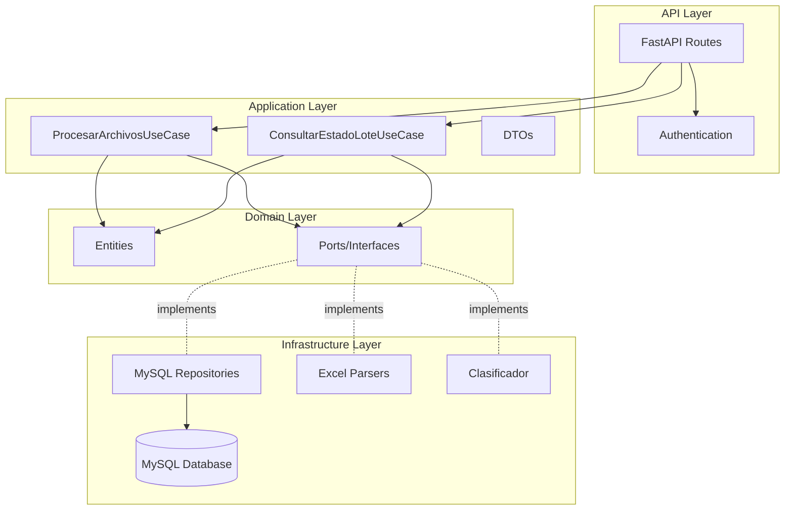
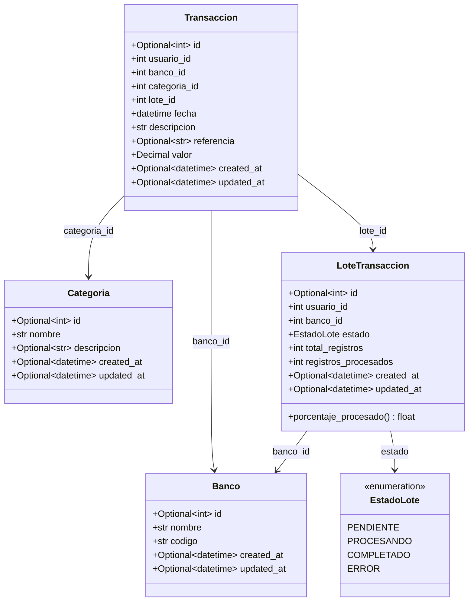
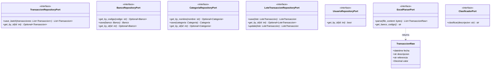
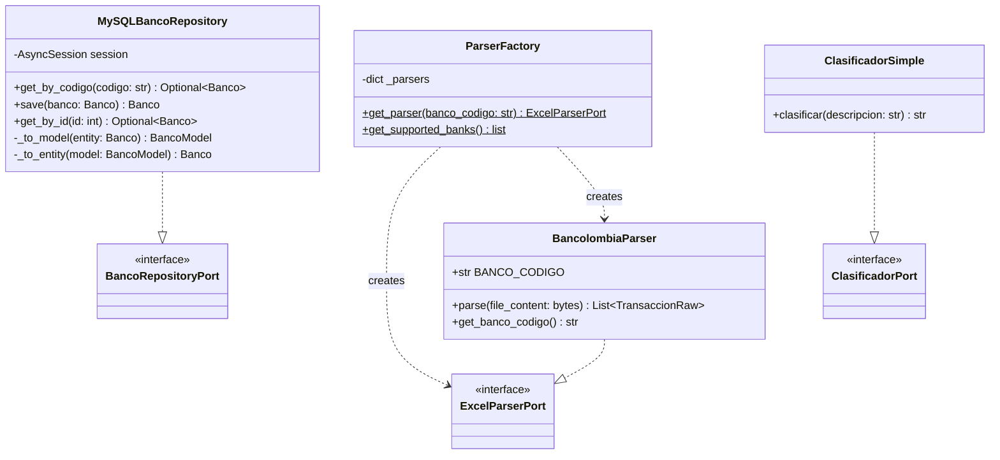
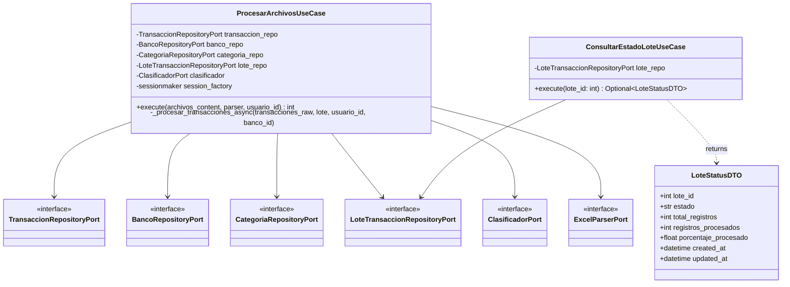
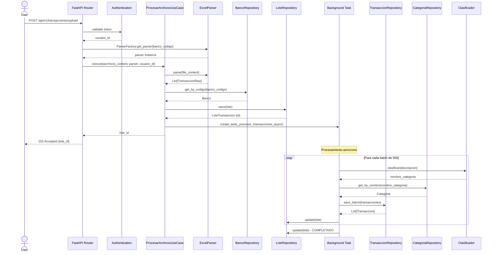
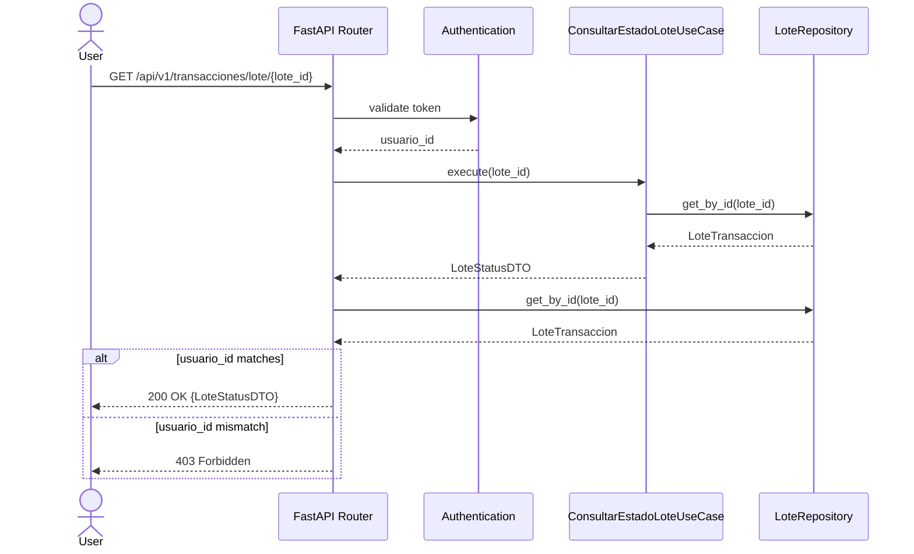
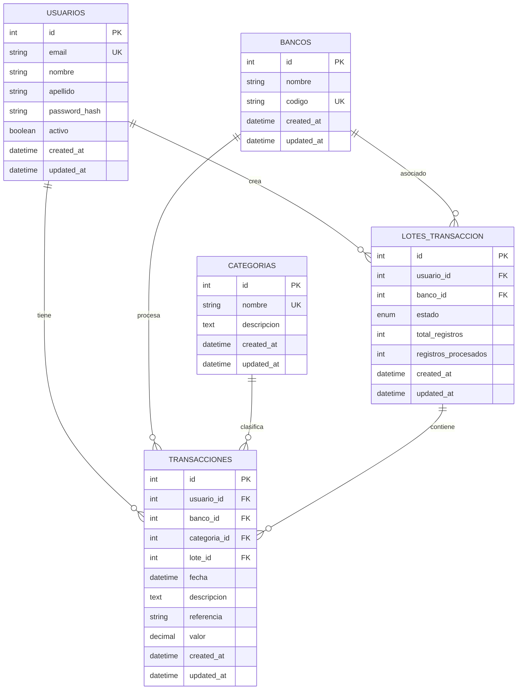

# Diagrama UML - Upload Service

## Arquitectura General del Sistema



## Diagrama de Clases - Capa de Dominio



## Diagrama de Clases - Puertos (Interfaces)



## Diagrama de Clases - Implementaciones de Infraestructura



## Diagrama de Clases - Casos de Uso



## Diagrama de Secuencia - Upload de Archivos



## Diagrama de Secuencia - Consultar Estado de Lote



## Diagrama de Componentes

```mermaid
graph TB
    subgraph Client
        C[Cliente HTTP]
    end

    subgraph "FastAPI Application"
        subgraph "API Routes"
            R1[/api/v1/transacciones/upload]
            R2[/api/v1/transacciones/lote/:id]
            R3[/health]
        end

        subgraph "Dependencies"
            D1[Auth Dependencies]
            D2[Service Dependencies]
        end

        subgraph "Application Layer"
            UC1[ProcesarArchivosUseCase]
            UC2[ConsultarEstadoLoteUseCase]
        end

        subgraph "Domain Layer"
            DOM[Entities & Ports]
        end

        subgraph "Infrastructure"
            REPO[MySQL Repositories]
            PARSE[Excel Parsers]
            CLAS[Clasificador]
        end
    end

    subgraph "External"
        DB[(MySQL Database)]
    end

    C -->|HTTP| R1
    C -->|HTTP| R2
    C -->|HTTP| R3

    R1 --> D1
    R1 --> D2
    R2 --> D1
    R2 --> D2

    R1 --> UC1
    R2 --> UC2

    UC1 --> DOM
    UC2 --> DOM

    DOM -.-> REPO
    DOM -.-> PARSE
    DOM -.-> CLAS

    REPO --> DB
```

## Modelo de Datos (Entidad-Relación)



## Patrones de Diseño Utilizados

### 1. Arquitectura Hexagonal (Ports & Adapters)
- **Puertos**: Interfaces en `domain/ports/`
- **Adaptadores**: Implementaciones en `infrastructure/`
- **Dominio**: Entidades en `domain/entities/`

### 2. Factory Pattern
- `ParserFactory`: Crea parsers según el código del banco

### 3. Repository Pattern
- Abstracción de acceso a datos mediante puertos
- Implementaciones específicas para MySQL

### 4. Use Case Pattern
- Casos de uso encapsulan la lógica de negocio
- `ProcesarArchivosUseCase`
- `ConsultarEstadoLoteUseCase`

### 5. Dependency Injection
- FastAPI dependencies para inyectar repositorios y servicios

### 6. DTO Pattern
- `LoteStatusDTO`: Transferencia de datos entre capas

## Notas de Arquitectura

1. **Separación de Responsabilidades**: El proyecto sigue una arquitectura hexagonal clara con separación entre dominio, aplicación e infraestructura.

2. **Inversión de Dependencias**: La capa de dominio define los puertos (interfaces) que son implementados por la capa de infraestructura.

3. **Extensibilidad**: El uso de Factory Pattern permite agregar fácilmente nuevos bancos sin modificar el código existente.

4. **Procesamiento Asíncrono**: Las transacciones se procesan en background usando asyncio.create_task, permitiendo respuestas rápidas al usuario.

5. **Procesamiento por Lotes**: Las transacciones se guardan en batches de 500 para optimizar el rendimiento.

6. **Clasificación**: Actualmente usa un clasificador simple que retorna "Otro", pero está diseñado para integrar un modelo de ML en el futuro.
